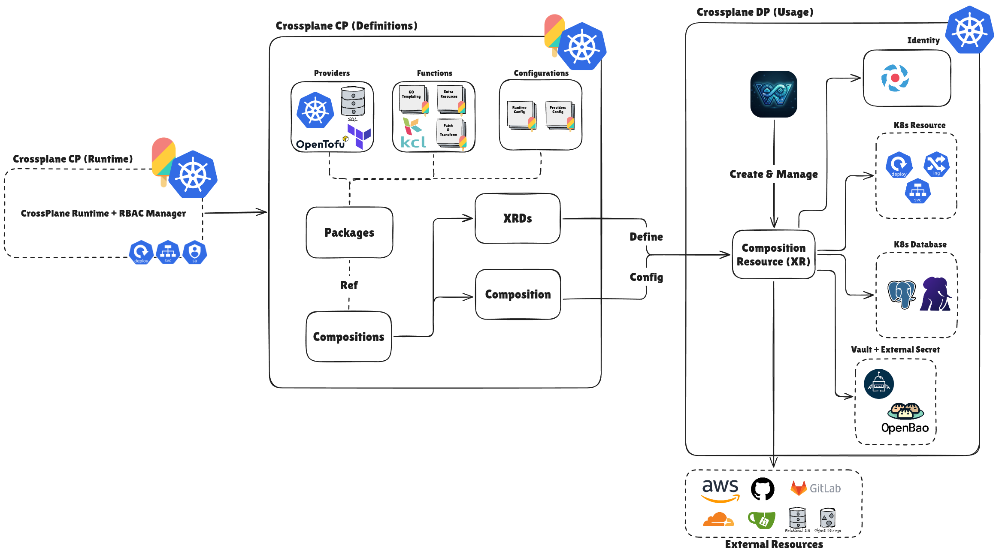

# W'xOps Core

***"Ask Kubernetes for a Gitea user, a PostgreSQL database, or a full application deployment — get a real one back."***

> [!NOTE]
> W'xOps Core is a library of [Crossplane v2](https://docs.crossplane.io/v2.3/) Configuration packages: each one defines a schema (an `XRD`) and the logic that
> turns it into real infrastructure (a `Composition`), so `kubectl apply -f my-app.yaml` provisions a Gitea account, a CloudNativePG database, or a
> Deployment/Service/IngressRoute stack — no custom controller, no platform UI required to use it.

## The problem this solves

Standing up a new tenant app or database today usually means: click through Gitea's UI to create a repo, hand-write Terraform for the database, copy-paste a
Deployment Service/Ingress from the last app that looked similar, and wire the secrets together by hand. Every step is a manual, undocumented, tribal-knowledge
operation.

W'xOps Core turns each of those into a Kubernetes object with a schema: `XGiteaUser`, `XTenantDatabase`, `XTenantApp`, and four more. Crossplane reconciles them
the same way it reconciles anything else — continuously, declaratively, with `status` fields you can poll instead of watching a Terraform apply scroll by. What
actually executes underneath (Terraform against a Gitea provider, or Kubernetes objects composed via KCL) is an implementation detail the schema hides.

This repo is **only the Configuration packages** — the schemas and the composition logic. It has no UI, no CLI, and no build pipeline; **see [Out of
scope](ROADMAP.md#out-of-scope--what-wxops-core-is-not) for the deliberate boundary.**

---
**Table of Contents**

- [W'xOps Core](#wxops-core)
  - [The problem this solves](#the-problem-this-solves)
  - [Packages](#packages)
  - [Documentation](#documentation)
  - [Why Crossplane + Terraform](#why-crossplane--terraform)
  - [Repository layout](#repository-layout)
  - [Quick start](#quick-start)
  - [Development](#development)
  - [KCL composition functions](#kcl-composition-functions)
  - [Versioning and releases](#versioning-and-releases)
  - [Reference stack](#reference-stack)
  - [Contributing](#contributing)
  - [License](#license)

---

## Packages

<!-- packages-table-start -->
| Package | Kind | Group | API Versions | Last changed in |
|---|---|---|---|---|
| [`gitea-user`](package/gitea-user/) | `XGiteaUser` | `platform.wxops.cloud` | `v1alpha1` | `v0.1.2` |
| [`gitea-org`](package/gitea-org/) | `XGiteaOrg` | `platform.wxops.cloud` | `v1alpha1` | `v0.1.2` |
| [`gitea-team`](package/gitea-team/) | `XGiteaTeam` | `platform.wxops.cloud` | `v1alpha1` | `v0.1.2` |
| [`gitea-repository`](package/gitea-repository/) | `XGiteaRepository` | `platform.wxops.cloud` | `v1alpha1` | `v0.1.1` |
| [`platform-database-clusters`](package/platform-database-clusters/) | `XPlatformDatabaseCluster` | `platform.wxops.cloud` | `v1alpha1` | `v0.1.5` |
| [`tenant-database`](package/tenant-database/) | `XTenantDatabase` | `platform.wxops.cloud` | `v1alpha1` | `v0.1.5` |
| [`tenant-app`](package/tenant-app/) | `XTenantApp` | `platform.wxops.cloud` | `v1alpha1` | `v0.2.5` |
<!-- packages-table-end -->

> [!TIP]
> `random-password` lives in `package/random-password/` as a utility composition and examples, and it will not published as OCI Artifact.

Served XRD API versions, and the release each package last changed in, are tracked in [`VERSIONS.yaml`](VERSIONS.yaml). Releases are named by date —
`release-YYYY-MM-DD` — and compatibility is the API version, not the release name; see [`docs/development/releasing.md`](docs/development/releasing.md).

---

## Documentation

Everything is linked from one hub, [`docs/README.md`](docs/README.md), which also holds the **development matrix**: every package, core idea and delivery
mechanism, where it stands, and what is next.

| Section | For | Start with |
|---|---|---|
| [API reference](docs/api-reference/README.md) | What each Kind accepts, what Core composes and keeps reconciled, what it reports | The reconcile loop from your side, then one page per Kind |
| [Core ideas](docs/README.md#core-ideas) | Darlane, Guardian, multi-cluster, observability, self-service operations, security | [Solution matrix](docs/core-ideas/solution-matrix.md) |
| [User guide](docs/README.md#user-guide) | Installing Core and building on it | [Setup](docs/user-guide/setup.md) · [App onboarding](docs/user-guide/app-onboarding.md) |
| [Development](docs/development/README.md) | Changing, testing, releasing and rolling out Core | [Development guide](docs/development/README.md) · [Releasing](docs/development/releasing.md) |

---

## Why Crossplane + Terraform



The shape above is what every package in this repo is an instance of — a `Configuration` package contributing an `XRD` + `Composition`, which a
`CompositeResourceDefinition` turns into a composite resource (XR) that Crossplane creates and reconciles against real infrastructure. It's a structural map,
not a substitute for [Crossplane's own docs](https://docs.crossplane.io/v2.3/) — read those for what each piece actually does.

The previous direction used `kubebuilder` to build a controller from scratch. That was **rejected** — too much complexity for the problem.

The current approach combines two tools with clear roles:

- **Crossplane** owns the platform API layer: `XRD`s define the schema, `Composition`s wire them to infrastructure, and the control loop reconciles desired state.
- **Terraform** (via `provider-terraform`) owns the infrastructure execution: each `Workspace` resource runs a plan/apply cycle in-cluster against a Gitea Terraform provider.

Composition functions may be written in Python, Go, CEL, KCL, or Go templating. The `kcl/` directory holds KCL-based composition logic for
`platform-database-clusters`, `tenant-database`, and `tenant-app` — see [KCL composition functions](#kcl-composition-functions) below.

---

## Repository layout

```
package/                      ← Crossplane Configuration packages
  gitea-user/
    xrd.yaml                  ← XCompositeResourceDefinition (schema)
    composition.yaml          ← Composition (inline HCL Workspace)
    crossplane.yaml           ← Package descriptor for xpkg build (meta.pkg.crossplane.io/v1)
    kustomization.yaml        ← dev kustomize root (xrd + composition only)
    README.md
  gitea-org/
  gitea-team/
  gitea-repository/
  random-password/            ← utility composition, no package metadata yet
  install/                    ← Production install: OCI registry-based (pkg.crossplane.io/v1)
    gitea-user.yaml           ← Configuration resource; spec.package pinned by `make release`
    gitea-org.yaml
    gitea-team.yaml
    gitea-repository.yaml
    kustomization.yaml        ← kubectl apply -k package/install/
  dev/
    kustomization.yaml        ← Development install: applies XRDs+Compositions directly
                              ← kubectl apply -k package/dev/
  kustomization.yaml          ← delegates to install/ (kubectl apply -k package/)
providers/                    ← shared Provider + Function installs + ProviderConfig
docs/                         ← documentation hub + development matrix (docs/README.md)
  api-reference/              ← the reconcile loop, one page per Kind, the status contract
  core-ideas/                 ← Darlane, Guardian, multi-cluster, observability, self-service, security
  user-guide/                 ← setup, app onboarding, portal integration
  development/                ← development guide, releasing
examples/                     ← minimal XR YAML to exercise each package
  gitea-user/
    credentials-secret.yaml
    xr.yaml
  gitea-org/xr.yaml
  gitea-team/xr.yaml
  gitea-repository/xr.yaml
  random-password/xr.yaml
  platform-database-clusters/xr.yaml
  tenant-database/xr.yaml
  tenant-database/xr-dedicated.yaml
  tenant-app/xr.yaml
kcl/                          ← KCL composition functions (source of truth, embedded via kcl-sync)
  platform-database-clusters/
    kcl.mod
    main.k
  tenant-database/
    kcl.mod
    main.k
  tenant-app/
    kcl.mod
    main.k
.github/workflows/
  publish-packages.yaml       ← CI: build + push changed packages on a release-* tag
  pr-validate.yaml            ← merge gate (mirrored in .gitea/workflows/ while PRs merge on Gitea)
tests/                        ← offline suite: XRD conformance, API compat, golden, invariants
release-notes/                ← hand-written notes; required for careful/breaking releases
```

---

## Quick start

```bash
make providers                                            # once per cluster
kubectl create secret generic gitea-credentials \
  --from-literal=credentials='gitea_token = "your-admin-token"' -n crossplane-system
make install                                              # packages from the OCI registry
kubectl apply -f examples/gitea-user/xr.yaml
kubectl get xgiteausers
```

Prerequisites, the platform dependencies each package needs, credential formats and uninstalling are in the [setup guide](docs/user-guide/setup.md). What each
resource does once it exists is in the [API reference](docs/api-reference/README.md).

---

## Development

```bash
pre-commit install --install-hooks
pre-commit install --hook-type pre-push --hook-type commit-msg
make test-deps && make test        # the offline merge gate — no cluster needed
```

Every hook, every make target and the rules that bite are in the [development guide](docs/development/README.md); the change loop and the new-package checklist
are in [CONTRIBUTING.md](CONTRIBUTING.md).

---

## KCL composition functions

`platform-database-clusters`, `tenant-database`, and `tenant-app` use [`function-kcl`](https://github.com/crossplane-contrib/function-kcl) instead of
`function-go-templating`, since their Compositions need real branching/looping across multiple optional resources (conditional resource sets, dict merges, list
comprehensions over arrays like `managedRoles[]`, and — for `tenant-app` — composing a nested `XTenantDatabase` XR). The other packages (`gitea-*`,
`random-password`) are simple enough that inline HCL / Go templating is sufficient.

`kcl/{pkg}/main.k` is the source of truth and is embedded into `package/{pkg}/composition.yaml` via `make kcl-sync` / `make kcl-check`.

See [`kcl/README.md`](kcl/README.md) for why KCL vs Go templating, the sync workflow, how to wire a new KCL module into an XRD, and the deferred OCI-modules
migration plan.

---

## Versioning and releases

Two axes, never mixed: the **XRD API version** (`platform.wxops.cloud/v1alpha1`) is the contract that dev XRs, prod XRs and the portal bind to, and it only ever
grows once released; the **release** (`release-YYYY-MM-DD`) is a dated snapshot of the packages that changed.

```bash
make release           # gate → pin changed packages → CHANGELOG.md → commit + tag release-YYYY-MM-DD
git push origin main && git push origin release-YYYY-MM-DD
```

The API rule, release notes, what CI publishes and the changelog are in [Releasing](docs/development/releasing.md).

---

## Reference stack

| Component | Version | Reference |
|---|---|---|
| Crossplane | v2.3 | https://docs.crossplane.io/v2.3/ |
| provider-terraform | v1.1.5 | https://marketplace.upbound.io/providers/upbound/provider-terraform/v1.1.5 |
| function-patch-and-transform | v0.10.7 | https://marketplace.upbound.io/functions/crossplane-contrib/function-patch-and-transform/v0.10.7 |
| function-go-templating | v0.12.2 | https://marketplace.upbound.io/functions/crossplane-contrib/function-go-templating/v0.12.2 |
| function-kcl | v0.12.1 | https://marketplace.upbound.io/functions/crossplane-contrib/function-kcl/v0.12.1 |
| function-extra-resources | v0.3.0 | https://marketplace.upbound.io/functions/crossplane-contrib/function-extra-resources/v0.3.0 |
| Gitea Terraform provider | ~> 0.7.0 | https://registry.terraform.io/providers/go-gitea/gitea/latest/docs |

---

## Contributing

See [CONTRIBUTING.md](CONTRIBUTING.md) for setup, the change loop, and the
checklist for adding a new package.

Every change is gated by an offline test suite — no cluster required:

```bash
make test-deps    # once
make test         # XRD conformance + API compat + golden render tests + invariants
```

`crossplane composition render` runs the real function images in Docker, so the unit under test is the composition itself. See
[tests/README.md](tests/README.md) for what that covers and, importantly, what it does not.

This project has a [Code of Conduct](CODE_OF_CONDUCT.md). Found a vulnerability? See [SECURITY.md](SECURITY.md) for how to report it privately.

---

## License

Licensed under the [Apache License, Version 2.0](LICENSE).

```
Copyright 2026 Xeus Nguyen (W'xOps)

Licensed under the Apache License, Version 2.0 (the "License");
you may not use this file except in compliance with the License.
You may obtain a copy of the License at

    http://www.apache.org/licenses/LICENSE-2.0

Unless required by applicable law or agreed to in writing, software
distributed under the License is distributed on an "AS IS" BASIS,
WITHOUT WARRANTIES OR CONDITIONS OF ANY KIND, either express or implied.
See the License for the specific language governing permissions and
limitations under the License.
```

Third-party components composed by this project are listed in [`NOTICE`](NOTICE), which redistributors must preserve under Section 4(d) of the License. The
W'xOps name and marks are not granted by the License — see Section 6.
