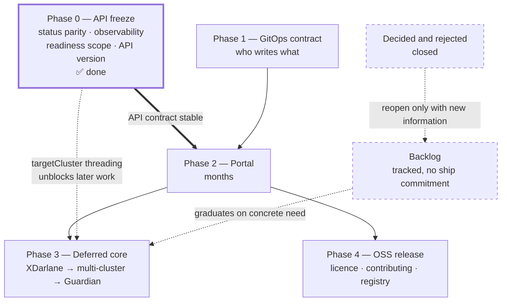
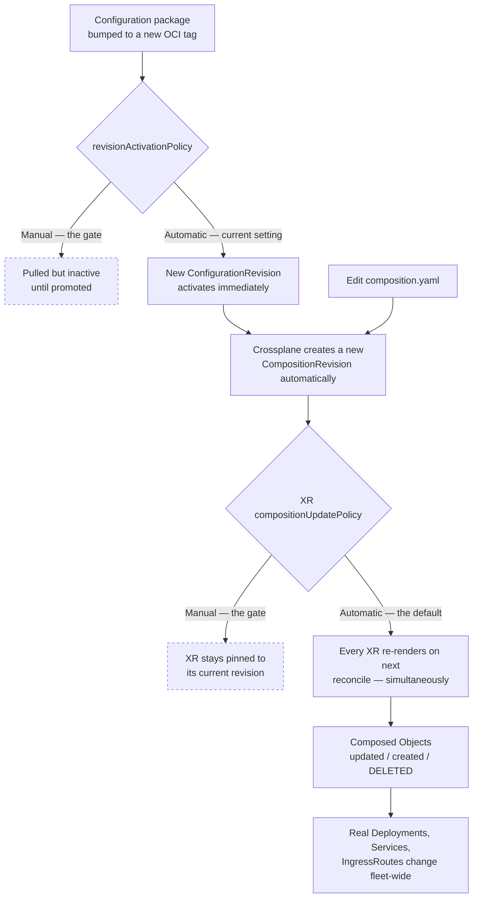
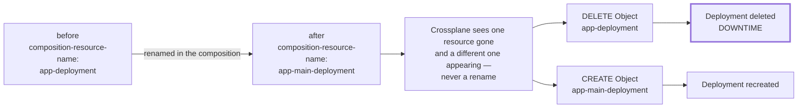
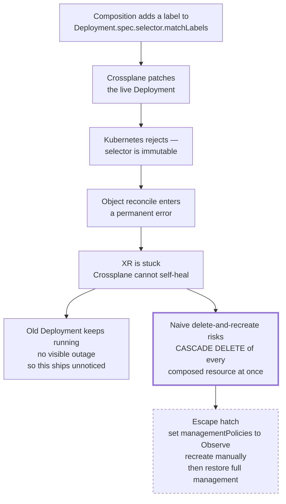

# W'xOps Core — Roadmap

Current release: **v0.3.4**. Seven Configuration packages published, CI building
and pushing on tag.

This document sequences the remaining core work, defines what "core is done"
means, and specifies the **safe deployment procedure** for releasing a refactor
against clusters that already run tenant workloads.

The organising thesis: **core is finished when its API contract is stable, not
when its feature list is complete.** The portal will bind to these XRD shapes;
everything that changes after that binding costs twice.

---

**Table of Contents**
- [Where core stands today](#where-core-stands-today)
- [The cut line](#the-cut-line)
- [Out of scope — what W'xOps Core is not](#out-of-scope--what-wxops-core-is-not)
- [Phase 0 — API freeze](#phase-0--api-freeze)
- [Safe deployment — releasing a Crossplane refactor](#safe-deployment--releasing-a-crossplane-refactor)
  - [The blast-radius model](#the-blast-radius-model)
  - [Current posture and its risks](#current-posture-and-its-risks)
  - [Change taxonomy](#change-taxonomy)
  - [The rename hazard](#the-rename-hazard)
  - [The immutable-field hazard](#the-immutable-field-hazard)
  - [Pre-flight — offline render diff](#pre-flight--offline-render-diff)
  - [Rollout procedure](#rollout-procedure)
  - [Rollback](#rollback)
  - [Making it enforceable](#making-it-enforceable)
  - [Release checklist](#release-checklist)
- [Phase 1 — GitOps contract](#phase-1--gitops-contract)
- [Phase 2 — Portal](#phase-2--portal)
- [Phase 3 — Deferred core](#phase-3--deferred-core)
- [Phase 4 — OSS release](#phase-4--oss-release)
- [Backlog](#backlog)
- [Decided and rejected](#decided-and-rejected)
- [Shipped](#shipped)
- [Where Darlane belongs](#where-darlane-belongs)
- [Open decisions](#open-decisions)

---

## Where core stands today

| Area | State |
|---|---|
| 7 Configuration packages, `v0.4.0` (API-freeze release), CI auto-publish on tag | ✅ |
| Darlane Tier 1 — `resources`, `securityContext`, `env`, `args` | ✅ |
| Darlane Tier 2 safety — `productionOverride`, `ttl` + Kyverno policy | ✅ |
| Darlane `fileSync` — including `initFromImage` | ✅ |
| Darlane traffic — `trafficWeight`, `stickySession`, `headerRouting` | ✅ |
| `telemetryPort`, `volumes`, `serviceAccount` | ✅ |
| Per-package API docs + 4 architecture guides | ✅ |
| **Status parity across all seven XRDs** | ✅ `created` + `ready` on every package — see [`docs/status-contract.md`](docs/status-contract.md) |
| **`tenant-app.status.ready` scope** | ✅ Split — `ready` (workload) + `dependenciesReady` (Certificate) |
| **Darlane status fields** | ✅ `ready`, `replicas`, `trafficMode`, `ttl`, `serviceAccountName` |
| **`darlane.rbac`** | ⛔ Dropped — RBAC belongs in the GitOps repo, not a composition |
| API version `v1alpha1` → `v1beta1` | ✅ Decided — stay on `v1alpha1` through portal v1, promote at Phase 4 |
| `spec.parameters.monitoring` (ServiceMonitor/PodMonitor) | ✅ Both kinds emit; `prometheus.io/*` annotations retired |
| `targetCluster` threading | ✅ 30 sites across 3 KCL packages (incl. the two monitor Objects); not yet consumed (no spoke exists) |
| Offline test suite (golden + invariants + XRD conformance) | ✅ 19 cases, 18 rules, 9 negative cases — [`tests/README.md`](tests/README.md) |
| Darlane `tunneling` (mirrord labels) | ⚪ Open, low value — the CLI works without it |

The functional surface is effectively complete. The **contract surface** —
Phase 0's entire purpose — is now complete too. What remains open is release
mechanics (tag + publish this batch) and everything from Phase 1 onward.

---

## The cut line

Core is done when a portal can be built against it without needing core to change
again. Concretely:

1. Every XRD reports machine-readable readiness.
2. Readiness means what a user would assume it means.
3. Every action the portal offers has an authorisation surface.
4. The served API version is the one we intend to keep.

Items 1–3 are Phase 0 below. Item 4 is a decision, not a task, and it is the only
genuinely irreversible one.

Everything after Phase 0 — `XDarlane`, Guardian, multi-cluster — is deferrable
without blocking portal work.



Phase 1 runs in parallel with early portal work. Phase 0 was the only item on
the critical path, and it's done — Phase 2 can start as soon as Phase 1 is
ready.

---

## Out of scope — what W'xOps Core is not

This project is a **Crossplane Configuration library**. It defines XRDs and
Compositions that render Kubernetes objects. That is the whole remit.

The list below is not a backlog. These are things W'xOps Core will **not** do,
and requests to add them should be redirected to the named alternative rather
than accepted. Keeping this boundary is what stops the repo becoming a platform
monolith.

### Not a controller

**No hand-written Go controllers.** A `kubebuilder` controller was built,
evaluated, and removed. Composition logic belongs in KCL or
patch-and-transform, run by Crossplane's own reconciler. If something cannot be
expressed as a composition, the answer is a new Crossplane *function*, not a
bespoke operator.

### Not a runtime

| Concern | Owner, not us |
|---|---|
| Running applications | Kubernetes. Core emits Deployments; it does not schedule, scale, or supervise them. |
| Building or testing code | Gitea Actions / CI. Core has no build pipeline for tenant code. |
| Deploying (the act) | Argo CD or Flux. Core produces desired state; something else applies it. |
| Container images | Tenant repos. Core references images by tag, never builds them. |

### Not an infrastructure implementation

Core **composes** other operators. It does not reimplement them.

| Domain | Delegated to |
|---|---|
| PostgreSQL lifecycle, backup, failover | CloudNativePG |
| Secret storage, rotation, leasing | Vault + External Secrets Operator |
| TLS issuance | cert-manager |
| North-south routing | Traefik |
| Policy enforcement, quota, NetworkPolicy | Kyverno |
| Cluster provisioning | Cluster API |
| Identity federation | Pinniped / native structured authentication |

`providers/policies/darlane-ttl.yaml` is the deliberate exception, and it is a
*reference* policy shipped alongside the composition it enforces — not the start
of a policy library.

### Not a networking layer

Traefik `IngressRoute` for north-south traffic only. **No service mesh, no
east-west routing, no cross-cluster data plane.** See
[`docs/multi-cluster.md`](docs/multi-cluster.md#layer-3--data-plane) — a mesh is
a Layer 3 concern the platform defers until a concrete workload needs it, and
Darlane traffic splitting is deliberately confined to a single cluster.

### Not the product surface

| Artifact | Where it lives |
|---|---|
| Portal / UI | Separate repository |
| `wxops` CLI (`darlane sync`, mutagen wrapper) | Separate repository |
| Guardian sidecar images | Separate repository |
| Tenant application code | Tenant repositories |

See [Where Darlane belongs](#where-darlane-belongs) for the reasoning — the seam
is artifact type, not feature.

### Not portable beyond Kubernetes + Crossplane

- **No Helm charts.** Distribution is Crossplane Configuration packages (OCI).
  `package/dev/` exists for local iteration, not as a second install path to
  support.
- **No non-Kubernetes targets.** Terraform appears only inside `Workspace`
  resources for the Gitea provider; core is not a general IaC wrapper.
- **No support for Crossplane v1.** v2 is the floor —
  namespaced/`spec.crossplane.*` semantics are assumed throughout.

### Not stable yet

All seven XRDs serve `v1alpha1`. **Breaking schema changes are permitted without
a deprecation cycle** until the promotion in [decision 1](#open-decisions).
Consumers pinning to `v1alpha1` should expect churn. This is a real constraint on
the portal and the reason API promotion is Phase 0 work rather than later.

---

## Phase 0 — API freeze

**Implemented.** §0.1, 0.2, 0.3, 0.6, 0.7 are done and tested (19 golden
cases, 18 invariants, 9 negative cases — see [`tests/README.md`](tests/README.md)).
§0.4 was dropped, not deferred. §0.5 is decided. Nothing in this phase is still
open. The full per-package field contract this work produced is
[`docs/status-contract.md`](docs/status-contract.md) — that is the page a
portal integration should read, not this section.

### 0.1 Status parity across all seven XRDs — ✅ done

Was:

```
tenant-app       → created, ready, url, namespace, image        ✅
tenant-database  → clusterRef, clusterNamespace, tier, dbName   ⚠️  no ready/created
platform-db      → clusterName, namespace, shared, environment  ⚠️  no ready/created
gitea-user / gitea-org / gitea-team / gitea-repository → no status schema at all  ❌
```

Now: all seven expose `created` + `ready`. `tenant-database` and
`platform-database-clusters` derive both from `_isReady()` over `ocds`, same
pattern as `tenant-app`. The four `gitea-*` packages went a different, simpler
route — `ToCompositeFieldPath` patches off `status.atProvider.outputs`, since
those outputs only exist after a successful `terraform apply`, so their
presence *is* the created/ready signal. One real behavioural difference worth
knowing: the gitea-* fields are **absent** until the first successful apply,
not `false` — documented per-package and in `status-contract.md`, since it's
the one place the contract isn't uniform.

### 0.2 Widen `tenant-app` readiness — ✅ done, split chosen

Was:

```python
_appReady = _deploymentReady and _serviceReady and _ingressReady
```

excluding the cert-manager `Certificate` (and the Darlane Deployment, which
was never actually part of the core app).

**Decision: split**, not widen. `status.dependenciesReady` now covers the
`Certificate`; `status.ready` stays scoped to the core workload. Verified with
a case that forces the cert unready while the workload is up —
`ready: true, dependenciesReady: false` renders exactly as intended, not a
blanket "not ready." (`XTenantApp` does not compose an `XTenantDatabase` —
`secretsFrom.database` only wires a Secret in by name — so database readiness
was never in scope for either field.)

### 0.3 Darlane status — ✅ done

```yaml
darlane:
  ready:              boolean   # the -darlane Deployment is Ready
  replicas:           integer   # OBSERVED, not desired — read from the Deployment
                                 # manifest provider-kubernetes writes back
  trafficMode:        string    # none | weighted | header | both
  ttl:                string    # the configured duration (e.g. "4h"), echoed as-is —
                                 # NOT an expiry timestamp (KCL has no clock)
  serviceAccountName: string    # the GitOps RBAC binding target — see §0.4
```

`ttlExpiresAt` from the original sketch was dropped in favour of echoing the
raw `ttl` duration — computing an expiry timestamp would have meant fabricating
a clock reference the composition doesn't have. The whole block is absent, not
an empty object, when `darlane.enabled` is `false`.

### 0.4 ~~Implement `darlane.rbac`~~ — dropped

**Moved to [Decided and rejected](#decided-and-rejected).** Compositions in this
repo do not emit RBAC, and provider-kubernetes is deliberately not granted
permission to create `Role`/`RoleBinding`.

What replaces it: the composition creates the Darlane ServiceAccount and now
publishes its name in `status.darlane.serviceAccountName`; the `Role` and
`RoleBinding` are authored in the GitOps repo against that name.

### 0.5 Decide the API version cut line — ✅ decided

All seven XRDs serve `v1alpha1` only. Promoting to `v1beta1` **after** the portal
binds means conversion webhooks or dual-serving, neither of which is pleasant.

| Choice | Consequence |
|---|---|
| Promote to `v1beta1` now | One migration, done before anything depends on it |
| **Stay `v1alpha1` through portal v1** ✅ | Accept that portal pins an alpha API; promote later with conversion |
| Serve both | Safest, most work — `served: [v1alpha1, v1beta1]`, storage `v1beta1` |

**Decided: stay on `v1alpha1`.** Every field this phase added is additive, so
nothing forced a bump — dual-serving now would duplicate 500+ lines of schema
per XRD for no present benefit. Recorded as a comment in
[`VERSIONS.yaml`](VERSIONS.yaml); promotion moves to Phase 4, the natural point
to make a stability commitment.

### 0.6 Thread `targetCluster` — ✅ done

Replaced the hardcoded `providerConfigRef = {name = "default"}` in all three
KCL packages — 30 sites total (`tenant-app` 14, including the two monitoring
Objects added in §0.7; `platform-database-clusters` 11; `tenant-database` 5) — with:

```python
targetCluster = _get(params, "cluster", "default")
...
providerConfigRef = {name = targetCluster}
```

Verified behaviour-neutral by diffing rendered output with `cluster` unset
(identical), and confirmed a `cluster: spoke-prod-sgn` value actually flows
through to every emitted `providerConfigRef`. One deliberate exception: the
provider-sql `Role` inside `tenant-database` keeps `providerConfigRef = {name =
clusterRef}` — that names a *SQL* ProviderConfig, not a Kubernetes one, and
threading `targetCluster` there would have been wrong. Unblocks
[`multi-cluster.md`](docs/multi-cluster.md) without a later rewrite of every
composition; not yet consumed by anything since no spoke `ProviderConfig`
exists yet.

### 0.7 Observability — `ServiceMonitor` and `PodMonitor` — ✅ done

Full design: [`docs/observability.md`](docs/observability.md) (status banner
updated — implemented, not design-only).

`XTenantApp` expressed monitoring as `prometheus.io/*` pod annotations, which
did nothing — a Prometheus convention requiring a scrape job that reads them,
and kube-prometheus-stack's `additionalScrapeConfigs` is empty. `spec.parameters.monitoring`
now emits a real Monitor CRD:

```yaml
monitoring:
  enabled: false          # master toggle
  kind: auto              # auto | ServiceMonitor | PodMonitor
  port: <int>             # no default — falls back to containerPort
  path: /metrics
  interval: 30s
  scrapeTimeout: 10s
  sampleLimit: 5000
  honorLabels: false
  metricRelabelings: []
```

**Both kinds implemented.** `auto` resolves on `service.enabled` — verified
both branches render (`ServiceMonitor` when a Service exists, `PodMonitor`
when `service.enabled: false`), and that setting `kind: ServiceMonitor`
without a Service is a hard render-time `assert` failure rather than a silent
no-op.

All four emission requirements landed and were mutation-tested — each was
confirmed to make a golden test fail when deliberately broken, not just
assumed to matter:

1. Label `release: kube-prometheus-stack` — present; removing it in a test
   broke 4 golden cases as expected.
2. `selector.matchLabels` carries `app.kubernetes.io/component: app` — the
   Darlane twin is excluded by construction, since `_selectorLabels` already
   carried that key before this work.
3. **The Service port was left unnamed.** Monitors target `targetPort` — the
   zero-risk option from the design doc. Naming the port (`careful` tier, an
   in-place edit of a live Service) was deliberately **not** done in this
   batch; it remains available as a follow-up, on its own commit.
4. `monitoring.coreos.com` added to `providers/rbac-provider-kubernetes.yaml`
   — requires a manual `kubectl apply` per cluster, since `providers/` isn't
   carried by a package bump.

Also closed while here: `tenant-app` added to `.gitea/scripts/validate-packages.sh`'s
`PACKAGES` array — it was the largest, most-changed package and had never
actually been `crossplane xpkg build`-validated by CI or pre-commit.

### Phase 0 checklist

- [x] `status.created` / `status.ready` on `tenant-database`
- [x] `status.created` / `status.ready` on `platform-database-clusters`
- [x] `status` schema + readiness on all four `gitea-*` packages
- [x] `tenant-app` readiness widened or split — **split**, decision recorded in `docs/tenant-app.md` and `docs/status-contract.md`
- [x] Darlane status block
- [x] ~~`darlane.rbac`~~ — dropped; XRD description corrected, GitOps seam documented
- [x] API version decision recorded in `VERSIONS.yaml`
- [x] `targetCluster` threaded through all KCL packages
- [x] `monitoring` XRD block + ServiceMonitor/PodMonitor emission — see [0.7](#07-observability--servicemonitor-and-podmonitor---done)
- [x] `monitoring.coreos.com` in provider RBAC; `tenant-app` added to `validate-packages.sh`
- [x] `make kcl-sync && make kcl-check && make render && make lint` — and `make test` (didn't exist when this line was written; the offline test suite built afterward now covers all of the above with 19 golden cases + 18 invariants)
- [x] One `VERSIONS.yaml` bump for the batch — done: `gitea-user/org/team` v0.1.1→v0.1.2, `gitea-repository` v0.1.0→v0.1.1, `platform-database-clusters`/`tenant-database` v0.1.4→v0.1.5, `tenant-app` v0.2.4→v0.2.5 (all relative to the last tag, `v0.3.4`). Not yet tagged/released — that's a release action, not a Phase 0 gap.

**Manual, per-cluster follow-up (not carried by any package bump):** apply the
updated `providers/rbac-provider-kubernetes.yaml` so `monitoring.coreos.com`
is actually granted — until then, every `ServiceMonitor`/`PodMonitor` emitted
by a live cluster fails `forbidden` at reconcile.

---

## Safe deployment — releasing a Crossplane refactor

A refactor release is the highest-risk operation this platform performs, because
a Composition change re-renders **every** existing XR at once. This section is the
procedure to follow for the Phase 0 release and every release after it.

### The blast-radius model

There is no staged rollout by default. One `kubectl apply` of a Composition
reaches every tenant in the cluster — and a package bump adds a second automatic
hop in front of it.



Both gates are currently wide open: all eight files in `package/install/` set
`revisionActivationPolicy: Automatic`, and no XR sets
`compositionUpdatePolicy`, so it defaults to `Automatic` too.

### Current posture and its risks

Two defaults in this repository make the blast radius maximal:

| Setting | Current | Risk |
|---|---|---|
| `revisionActivationPolicy` in `package/install/*.yaml` | `Automatic` (all 8 files) | A pushed package tag goes live with no gate |
| XR `spec.crossplane.compositionUpdatePolicy` | Unset → defaults to `Automatic` | Every XR adopts a new revision immediately |
| `revisionHistoryLimit` | Unset | Falls back to the default; verify before relying on rollback by revision |

Note the Crossplane **v2** field locations — these moved from where v1
documentation puts them:

```yaml
spec:
  crossplane:
    compositionRef:            { name: ... }
    compositionRevisionRef:    { name: ... }
    compositionUpdatePolicy:   Manual | Automatic
    resourceRefs:              [ ... ]
```

### Change taxonomy

Every change falls in one of three tiers. **Commit authors must classify their
change before merging**, and the tier determines the release procedure.

| Change | Tier | Effect on running tenants |
|---|---|---|
| Add optional field with a default | `safe` | None |
| Add a `status` field | `safe` | Status is written, never validated against existing XRs |
| Change pod template labels/annotations only | `safe` | Rolling update at most |
| Add a composed resource with conditional emit | `safe` | New object created on next reconcile |
| Change a composed resource's *contents* | `careful` | In-place patch; may restart pods. Risk depends on the field. |
| Change `providerConfigRef` | `careful` | Re-adoption; can orphan the previous object |
| Add a **required** field | `breaking` | Existing XRs fail validation |
| Remove a field, or narrow an `enum` | `breaking` | XRs using the old value fail |
| Remove a composed resource | `breaking` | Underlying Kubernetes object is deleted |
| Rename `composition-resource-name` | `breaking` | Delete + recreate — [see below](#the-rename-hazard) |
| **Change `Deployment.spec.selector` labels** | `breaking` | **Immutable — permanent reconcile failure.** [See below](#the-immutable-field-hazard) |
| Change PVC access mode or storage class | `breaking` | Immutable — same failure mode |
| XRD field type change with pruning | `breaking` | Existing values silently dropped |

Toggling a feature flag off is in the `breaking` tier too: setting
`darlane.enabled: false` removes the Darlane resources from the items list, and
Crossplane deletes the real Deployment. That is correct behaviour, but it means
flag flips are not free.

Maintain the per-package classification in a `BREAKING.md` section so the tier of
any given change is a lookup, not a judgement call under release pressure.

### The rename hazard

**This is the one that bites during a refactor.** Crossplane identifies a composed
resource by its `crossplane.io/composition-resource-name` annotation. Rename it
and Crossplane does not see a rename — it sees one resource gone and a different
one appearing:



For a tidy-up refactor that renames things for clarity, this converts a cosmetic
change into an outage across every tenant simultaneously.

**Rule: never rename a `composition-resource-name` in the same release as any
other change.** If a rename is genuinely required, do it as a dedicated release
with a maintenance window, and verify the underlying object is not deleted first —
or leave the annotation alone and rename only the KCL variable, which is invisible
to Crossplane.

### The immutable-field hazard

Worse than the rename hazard, because there is **no recovery path that
Crossplane can take on its own.**

Kubernetes rejects in-place updates to immutable fields —
`Deployment.spec.selector`, PVC `accessModes`, PVC `storageClassName`, and
others. When a composition changes one of them:



The old Deployment keeps running, so there is no immediate outage — which is
precisely why this ships unnoticed. But the XR is now frozen, and **any attempt
to fix it by deleting and recreating risks a cascade delete** of every composed
resource (Deployment, Service, IngressRoute) at once. Recovery is manual,
fleet-wide, and happens under pressure.

**Rule: once an app has reached `staging` or `prod`, the composition must never
add, remove, or change a label in `spec.selector.matchLabels`.** New labels go to
`spec.template.metadata.labels` — pod labels, never selector labels. The two look
almost identical in KCL and have completely different consequences.

The escape hatch, which should be documented and rehearsed *before* it is needed:

```bash
# 1. stop Crossplane reconciling the stuck resource
kubectl patch object <name> --type=merge \
  -p '{"spec":{"managementPolicies":["Observe"]}}'

# 2. perform the destructive change manually, in a controlled way
#    (delete + recreate the Deployment with the new selector)

# 3. hand control back
kubectl patch object <name> --type=merge \
  -p '{"spec":{"managementPolicies":["*"]}}'
```

`managementPolicies: [Observe]` prevents the cascade delete while still allowing
the operator to do the recreation deliberately.

### Pre-flight — offline render diff

The rename hazard is fully detectable before deploying. Render before and after,
then diff the resource names:

```bash
OUT=$(mktemp -d)
PKGS="tenant-app tenant-database platform-database-clusters"

# on main, before the refactor
git stash
for p in $PKGS; do
  crossplane composition render examples/$p/xr.yaml \
    package/$p/composition.yaml providers/function-kcl.yaml > "$OUT/$p.before.yaml"
done
git stash pop

# after the refactor
for p in $PKGS; do
  crossplane composition render examples/$p/xr.yaml \
    package/$p/composition.yaml providers/function-kcl.yaml > "$OUT/$p.after.yaml"
  echo "── $p resource-name diff"
  diff <(grep -o 'composition-resource-name: .*' "$OUT/$p.before.yaml" | sort) \
       <(grep -o 'composition-resource-name: .*' "$OUT/$p.after.yaml" | sort)
done
```

**An empty diff means no resource will be deleted.** Any line only in `before` is
a resource Crossplane will destroy. Treat a non-empty diff as a release blocker
until it is deliberate and understood.

Use `crossplane composition render` — this CLI has no top-level `render`
subcommand. Note that `make render` pipes stderr to `/dev/null` and appends
`|| true`, so it cannot fail; run the command directly when you need to trust the
result.

Also diff the full rendered output, not just names, to see content changes:

```bash
diff "$OUT/tenant-app.before.yaml" "$OUT/tenant-app.after.yaml" | head -100
```

### Rollout procedure

**1. Pin existing XRs before releasing.**

Set every production XR to `Manual` so the new revision does not auto-adopt:

```bash
kubectl get xtenantapp -o name | while read xr; do
  kubectl patch "$xr" --type=merge \
    -p '{"spec":{"crossplane":{"compositionUpdatePolicy":"Manual"}}}'
done
```

Pinned XRs stay on their current `compositionRevisionRef` until explicitly moved.

**2. Gate package activation.**

For the release, set `revisionActivationPolicy: Manual` in
`package/install/<pkg>.yaml`. The new ConfigurationRevision is pulled but stays
inactive until you activate it, which decouples "the image is in the registry"
from "the fleet is running it".

**3. Canary one namespace.**

Move a single non-production XR to the new revision:

```bash
kubectl patch xtenantapp <canary> --type=merge -p \
  '{"spec":{"crossplane":{"compositionUpdatePolicy":"Automatic"}}}'
kubectl get xtenantapp <canary> -o jsonpath='{.status}' | jq
```

Verify `status.ready`, then verify the real objects — Deployment replicas,
IngressRoute routes, certificate readiness. Status alone is not proof.

**4. Promote in waves.**

dev → staging → production, one wave per reconcile cycle, checking
`status.ready` across the wave before proceeding.

**5. Unpin.**

Return XRs to `Automatic` once the release is confirmed, so ordinary reconciles
resume.

### Rollback

Because every Composition edit produces a `CompositionRevision`, rollback is a
pointer change, not a redeploy:

```bash
kubectl get compositionrevision | grep xtenantapp
kubectl patch xtenantapp <name> --type=merge -p \
  '{"spec":{"crossplane":{"compositionRevisionRef":{"name":"<older-revision>"},
                          "compositionUpdatePolicy":"Manual"}}}'
```

Two caveats worth knowing before relying on this:

- **Rollback does not resurrect deleted resources on its own.** If the bad release
  removed a composed resource, reverting recreates it — as a *new* object. Data on
  a deleted PVC is gone.
- Revisions are garbage-collected. Confirm `revisionHistoryLimit` is set high
  enough on the packages that a rollback target still exists.

### Making it enforceable

Everything above is procedure — it holds only as long as everyone remembers it.
This is the work to make it mechanical.

**Why this matters more than a normal controller upgrade:** compositions are
applied fleet-wide and immediately. A broken revision affects every existing
tenant simultaneously, not just new deployments. The blast radius is the whole
platform, not one service. **Until Phase 1 lands, treat every change touching
`selector` fields as a major version bump and coordinate with all teams before
release.**

#### Phase 1 — classification and detection

- [ ] **Breaking-change taxonomy adopted** — the `safe` / `careful` / `breaking`
      tiers from [Change taxonomy](#change-taxonomy), with a `BREAKING.md`
      section per package. Commit authors classify before merging.
- [ ] **`make composition-diff`** — pre-flight tool comparing the incoming
      composition against live XR state, flagging any immutable-field conflict
      before apply. Catches selector label additions, resource renames, and type
      changes that would strand XRs.
- [ ] **Selector freeze pre-commit hook** — diff `spec.selector.matchLabels`
      against the previous composition version; fail the commit on any change.
      This is the single highest-value automation here, because the failure it
      prevents has no self-healing path.
- [ ] **Fix `make render`** — it currently pipes stderr to `/dev/null` and
      appends `|| true`, so it cannot fail and cannot be trusted as a gate.
- [ ] **Set `revisionHistoryLimit` explicitly** on all packages, so a rollback
      target is guaranteed to exist.

#### Phase 2 — controlled rollout

- [ ] **CompositionRevision channels** — label each published revision
      `channel: stable` or `channel: canary`. New XRs default to `stable` via
      `compositionRevisionSelector: matchLabels: {channel: stable}`, so they
      never receive a breaking update until explicitly migrated. CI publishes to
      `canary`; promotion to `stable` is a manual gate.
- [ ] **`revisionActivationPolicy: Manual`** for release windows — decouples
      "the image is in the registry" from "the fleet is running it". All eight
      files in `package/install/` are currently `Automatic`.
- [ ] **Per-XR revision pinning surfaced in the portal** — so operators can pin
      individual apps to a known-good revision before a fleet update, then
      migrate one at a time rather than all at once.

#### Phase 3 — migration playbook

- [ ] **`managementPolicies: [Observe]` escape hatch** — documented *and
      rehearsed*, not discovered during an incident. See
      [the immutable-field hazard](#the-immutable-field-hazard).
- [ ] **Blue/green composition migration** — scripted path for fleet-wide
      breaking changes: scale up the new Deployment alongside the old, shift the
      Service selector, scale down the old, patch the XR to match. Crossplane
      then adopts the new Deployment. No downtime window.
- [ ] **`status.compositionMigration`** — `pending | in-progress | complete |
      failed`, written to the XR during a managed migration so the portal can
      surface a banner telling operators which apps still need action after a
      breaking release.

### Release checklist

- [ ] Change classified `safe` / `careful` / `breaking` per the [taxonomy](#change-taxonomy)
- [ ] **`spec.selector.matchLabels` unchanged** — the one check with no recovery path
- [ ] `composition-resource-name` diff is empty (or the rename is deliberate and isolated)
- [ ] No other immutable field touched (PVC `accessModes`, `storageClassName`)
- [ ] Full render diff reviewed
- [ ] `make kcl-check` clean — KCL and composition in sync
- [ ] `make lint` and `pre-commit run --all-files` pass
- [ ] `VERSIONS.yaml` bumped once for the batch
- [ ] Production XRs pinned to `Manual`
- [ ] `revisionActivationPolicy: Manual` for this release
- [ ] Canary verified — status *and* underlying objects
- [ ] Promoted in waves
- [ ] XRs unpinned
- [ ] Release notes written in `release-notes/`

---

## Phase 1 — GitOps contract

Runs in parallel with early portal work.

`package/install/` (OCI, production) and `package/dev/` (direct apply) exist. The
**fleet layout does not**, and neither does the contract for who writes what.

The decision to make first, because it is the hardest to change later:

| Model | Portal writes | Git holds | Trade-off |
|---|---|---|---|
| **Portal → Git → Argo** | A commit | Every tenant XR | Full audit trail, PR review, slower feedback |
| **Portal → API** | The XR directly | Platform config only | Immediate feedback, weaker audit |
| **Hybrid** | API for dev, Git for prod | Prod XRs | Best UX/safety split, two code paths |

Also in scope: repository layout for tenant XRs, ApplicationSet patterns for
per-environment promotion, and where `package/install` sits relative to tenant
state.

## Phase 2 — Portal

Unblocked by Phase 0. Items 0.1–0.4 are precisely what portal screens read and
write; building against the current status surface means writing polling logic for
fields that do not exist, then rewriting it.

## Phase 3 — Deferred core

In priority order, all post-portal:

1. **`XDarlane` standalone XRD** — see [Where Darlane belongs](#where-darlane-belongs)
2. **Multi-cluster prototype** — now fully specified in
   [`multi-cluster-proposal.md`](docs/multi-cluster-proposal.md) (CAPI + one spoke +
   scoped `ProviderConfig` + structured authn, with exit criteria); the v0.4.0
   `cluster` threading is its completed prerequisite. The connection-security
   options for item 4, and the answer for spokes CAPI did not provision, are in
   [`multi-cluster-connectivity.md`](docs/multi-cluster-connectivity.md)
3. **Guardian Phase 1** — [`guardian.md`](docs/guardian.md)
4. **Self-service operations track** — sequenced in
   [`self-service-operations.md`](docs/self-service-operations.md#what-to-build--sequenced)
   and [`knowledge-architecture.md`](docs/knowledge-architecture.md#adoption--sequenced-each-step-useful-alone);
   the small core pieces live in the Backlog below

Unscheduled ideas live in the [Backlog](#backlog); closed ones in
[Decided and rejected](#decided-and-rejected).

---

## Phase 4 — OSS release

Preparing the repository to be published and consumed by people outside the
platform team.

### Gap audit

| Missing | Impact |
|---|---|
| ~~`LICENSE`~~ | ✅ **Done** — Apache-2.0, with `NOTICE` and a README section |
| ~~`CONTRIBUTING.md`~~ | ✅ **Done** — workflow, commit convention, `make kcl-sync` requirement, the new-package test checklist |
| `SECURITY.md` | No disclosure channel for vulnerabilities |
| `CODE_OF_CONDUCT.md` | Expected for community projects |
| ~~`.github/`~~ | ✅ **Done** — `pr-validate.yaml` mirrors the Gitea gate; `publish-packages.yaml` builds/pushes/releases on the mirrored tag |

### Internal references to scrub

| Location | Problem |
|---|---|
| ~~`package/install/*.yaml` (8 files)~~ | ✅ **Fixed** — repointed at `ghcr.io/wxops/platform-wxops-*`, versions caught up to `VERSIONS.yaml` |
| ~~`Makefile`~~ | ✅ Already agreed with the fix above — `ghcr.io/wxops` is now the one registry both sides use |
| `cliff.toml` | Links Gitea only — **deliberate, through v0.4.0**, see [Decisions required](#decisions-required) below |
| `CHANGELOG.md` | Regenerated and current as of `v0.4.0`; still Gitea-linked. Repointing to GitHub is a `v0.5.0` change, not yet made. |

### Checklist

- [x] Choose and add a `LICENSE` — **Apache-2.0**, matching the Crossplane/CNCF
      ecosystem and granting an explicit patent licence (§3) plus trademark
      reservation (§6). `NOTICE` added for §4(d) attribution.
- [x] `CONTRIBUTING.md` — conventional commits, `make kcl-sync` requirement,
      `VERSIONS.yaml` bump policy, pre-commit setup, the Python venv step
- [ ] `SECURITY.md` with a disclosure address — the content basis now exists
      in [`docs/security-threat-model.md`](docs/security-threat-model.md)
- [ ] `CODE_OF_CONDUCT.md`
- [x] Decide the public registry and make `Makefile` and `package/install/`
      agree on it — **`ghcr.io/wxops`**
- [ ] Repoint `cliff.toml`'s repository links from Gitea to GitHub — **scheduled
      for `v0.5.0`, not before.** `v0.4.0` ships with Gitea links, matching every
      release before it; a dual-link version was tried and deliberately reverted
      (see [Decisions required](#decisions-required)) to keep one release's
      changelog internally consistent rather than switching mid-stream.
- [ ] Decide the public package naming — repo is `wxops-core`, packages are
      `platform-wxops-*`; the mismatch is confusing to newcomers
- [x] Decide whether to mirror to GitHub — **superseded**: Gitea was primary
      through `v0.4.0`; from `v0.5.0`, GitHub is primary and Gitea is archived
      (frozen, read-only, kept for internal reference and on-request demos).
- [ ] README rewritten for an audience with no platform context — what problem
      this solves, install, one working example
- [ ] Verify `examples/` contain no real hostnames (`wxops.local` and
      `rocket-team` read as placeholders — confirm that is intentional)
- [ ] Decide whether `CLAUDE.md` ships publicly or is excluded

### Decisions required

| Decision | Note |
|---|---|
| ~~Licence~~ | ✅ Apache-2.0 chosen — patent grant, trademark reservation, ecosystem-compatible |
| ~~Public registry~~ | ✅ `ghcr.io/wxops` — `package/install/*.yaml` and the `Makefile` now agree |
| ~~Mirror strategy~~ | ✅ **Superseded at the `v0.5.0` cutover.** Gitea primary through `v0.4.0`; GitHub primary from `v0.5.0`, Gitea archived (frozen, permission-gated, no further pushes). The `.github/workflows/publish-packages.yaml` `update-configurations` job (package/install/CHANGELOG bump-and-commit) still needs to be added before the first post-cutover release — see the comment header in that file. |
| CHANGELOG link target | **Gitea through `v0.4.0`; GitHub from `v0.5.0` on.** A dual-link version (every entry carrying both hosts) was built and reverted — decided against, to keep one release's changelog pointing at one consistent host rather than two. The cutover happens once, at `v0.5.0`, not gradually. |
| Gitea hostname visibility | **Deliberately public** — the instance is permission-gated (internal work + on-request demos), so the hostname alone is not considered sensitive. The exact SSH port is not published anywhere, on the same reasoning that access control is the real gate, not obscurity, but a non-default port is a cheap scan-reduction measure not worth giving up for free. |
| Governance | Single-maintainer vs open contribution changes how much of the remaining checklist is needed |

---

## Backlog

**Tracked, not scheduled.** Nothing here has a commitment to ship or a target
release. Items graduate into a phase when a concrete need appears — they are not
worked through in order, and an item sitting here for a year is a normal outcome,
not a slipped deadline.

### Core follow-ups from the architecture docs (2026-08)

Safe-tier, additive package changes argued in the docs family — see
[`docs/solution-matrix.md`](docs/solution-matrix.md) for the full picture:

- [ ] **`status.notReady` reasons** on all seven packages — the composition
      already computes per-resource readiness and discards it; exposing it is
      the cheapest, highest-leverage diagnostics change
      ([self-service-operations.md](docs/self-service-operations.md#whats-missing))
- [ ] **`scheduling:` block** (`nodeSelector`, `tolerations`, spread) on
      `tenant-app` + `platform-database-clusters` — verified gap; prerequisite
      for any arm64/edge/GPU node pool
      ([multi-cluster-scale.md](docs/multi-cluster-scale.md#the-verified-wxops-gaps))
- [ ] **Widen `resources.requests/limits`** to accept extended-resource keys
      (`nvidia.com/gpu`) — today's schema silently prunes them despite the
      "passed through verbatim" description (same doc)
- [ ] **`monitoring.alerts`** — `PrometheusRule` emission with `runbook_url`,
      same pattern/tier as the monitor emission; needs `prometheusrules` in
      provider RBAC
      ([self-service-operations.md](docs/self-service-operations.md#pillar-2--runbooks-as-platform-contract))
- [ ] **`ingress.gslb` block** — blocked on the k8gb↔Traefik-IngressRoute
      spike; do the spike first
      ([multi-cluster-scale.md](docs/multi-cluster-scale.md#gslb-implementations--three-options-one-field-tested))
- [ ] **Runbooks + `docs/incidents/` convention** — knowledge-architecture
      adoption steps 2–3; docs-only, no code

### Vault Database Secrets Engine

Dynamic credential management via Vault's Database Secrets Engine. The current
static flow — CNPG creates credentials → ESO `PushSecret` → Vault KV2 — **remains
the default**. This would layer on top as an opt-in path, not replace it.

- [ ] **Design mount/path topology** — single mount per cluster vs. per-tenant
      mounts. The deciding question: does ESO read once and fan out, or do
      tenants read directly? The latter generates a new lease on every read.
- [ ] **`SecretBackendConnection` on `XPlatformDatabaseCluster`** — per-cluster
      Vault connection using a restricted PostgreSQL role (`CREATEROLE` only).
      Gated behind `vaultDatabaseBackend.enabled`.
- [ ] **`SecretBackendRole` on `XTenantDatabase`** — per-database dynamic
      credential template, with creation and revocation SQL scoped to that
      tenant's database.
- [ ] **ESO lease lifecycle** — `refreshInterval` triggers new leases and revokes
      old ones. This is a behavioural change from the static flow, where CNPG
      credentials never change unless rotated manually. Applications must
      tolerate credential rotation before this is enabled.
- [ ] **Optional: compose `vault.vault.upbound.io/v1alpha1 Mount`** on
      `XPlatformDatabaseCluster` (requires `provider-vault`) so platform admins
      do not need to pre-create Vault mounts out of band.

Interacts with [Vault path conventions](docs/multi-cluster.md#decisions-to-make-before-building):
if a cluster dimension is ever added to Vault paths, settle it before this ships,
not after.

---

## Decided and rejected

Evaluated and closed. **Do not re-litigate without new information** — if
something here comes up again, the burden is to say what changed.

| Rejected | Why |
|---|---|
| `darlane.rbac` — composition-emitted `Role`/`RoleBinding` for developer access | Granting provider-kubernetes write access to RBAC makes it a privilege-escalation vector: Kubernetes' escalation check only blocks granting permissions the creator lacks, and that ServiceAccount already holds broad grants. RBAC also deserves human review on a diff, which it gets in the GitOps repo and not when generated from KCL. And `pods/exec` cannot be name-restricted by RBAC at all, so the "scoped to one Deployment" grant was never as scoped as it read. Core creates the ServiceAccount and publishes `status.darlane.serviceAccountName`; GitOps binds it. |
| **ArgoCD ApplicationSet (matrix generator: apps × environments)** | Correct pattern for multi-env fan-out, but it lives in the GitOps repo, not here. The `environment` label is `tenant-app`'s contribution to making it work. |
| **Kyverno for defaulting/mutating `XTenantApp`** | Creates a second source of truth alongside the KCL Composition. Kyverno's place is validation, guardrails, and `generate` policies keyed off `appFlavor` / `environment` — not defaulting. |
| **`partOf` label / `catalog-info.yaml` templates** | IDP/Backstage concern. `tenant-app` already provides the building blocks (`appName`, `environment`, status fields); the IDP layer consumes them. Revisit only if the IDP repo needs something `tenant-app` genuinely cannot provide. |
| **`tenant-app.databaseRef` for end-to-end credential wiring** | The bridging `ExternalSecret` is deliberately the platform layer's responsibility. `tenant-app` stays focused on the workload; `tenant-database` on provisioning and the Vault push. |
| **Gateway API `HTTPRoute` as an Ingress alternative** | A real option, but it belongs in a separate XRD (`XTenantHTTPRoute`), not a `tenant-app` field. Parked until a concrete need appears that Ingress cannot satisfy — cross-namespace routing, or traffic splitting beyond what Traefik gives us. |
| **`platform-tenant` / `tenant-namespace` package** | Already covered by the existing GitOps setup. Dual ownership — two controllers reconciling the same `Namespace` / `RoleBinding` / `Quota` — is worse than the current pattern. Crossplane's value is dynamic parameterised resource graphs with cross-resource outputs, not static namespace scaffolding. |
| **`externalSecrets` / `database` toggles in `tenant-app`** | Removed. `tenant-app` stays focused on Deployment / Service / Ingress / Darlane. Vault-backed secrets and databases are provisioned separately and consumed via `envFrom.secretRef`. |
| **Matrix permissions for Gitea team XRs** | Not adopted for `XGiteaTeam` org setup. |
| **Darlane `tunneling` XRD block** | Removed — the mirrord CLI needs no manifest configuration, so the labels bought nothing. |
| **`debugPort`, VS Code docs, ephemeral DB branch, W'xOps CLI** | Not rejected — moved to `XDarlane` XRD scope. See [Where Darlane belongs](#where-darlane-belongs). |

---

## Shipped

Release history. Legend: `[ ]` open · `[~]` in progress · `[x]` shipped · `[-]` decided not to pursue.

### v0.1.0 / v0.1.1 - Gitea XRD Baseline

- [x] Support 4 XR cluster scope, inc `gitea-org`, `gitea-repository`, `gitea-team` and `gitea-user`

### v0.2.0 / v0.2.1 / v0.2.5 / v0.2.6 — XTenantApp baseline + SSO Middle Integration

- [x] `ingress.className` default `traefik`
- [x] `envFrom[]`, `podAnnotations`, `reloader.enabled` (Stakater Reloader)
- [x] `appFlavor` label (`webapp`, `ai`, `ai-webapp`, `geo-webapp`, `search-webapp`)
- [x] `environment` label (`dev`/`staging`/`prod`) — pure metadata
- [x] `probes.{liveness,readiness,startup}` — golden-path `/healthz`/`/readyz` defaults
- [x] `darlane` debug-twin Deployment (`<appName>-darlane`, replicas 0, no Service/Ingress, shares env/envFrom)
- [x] Docs: Golden Path Contract
- [x] Support SSO Middileware reference using `traefik` with `cross-namespace` convention
- [x] Support ImagePullSecrets, ServiceAccount and Security Context. Also flag image string for easier updated by `kustomize`

### v0.2.2 / v0.2.4 — XTenantDatabase dynamic tier resolution

- [x] Replace hardcoded `_clusterTierMap` with dynamic discovery via `function-extra-resources`
- [x] `XPlatformDatabaseCluster.shared` toggle + `status` subresource for pool discovery
- [x] `tier: shared` — pool-based auto-assignment: least-loaded cluster, environment isolation, sticky assignment via status writeback
- [x] `tier: dedicated` — child `XPlatformDatabaseCluster` XR inline, sized via `dedicatedCluster` parameters
- [x] Vault path restructure: `{owner}/{dbName}/...` → `{owner}/databases/{dbName}/...`
- [x] Bug fixes (v0.2.4): extra-resources context key, unwrapped resources, `_get` guard, `matchLabels` required

### v0.2.7 — Gitea XRD additions

- [x] `gitea-user`: `allowCreateOrganization` boolean (default `false`)
- [x] `gitea-team`: `enableActions` / `actionsReadOnly` / `enablePackages` / `packagesReadOnly` via `null_resource` + Gitea API PATCH
- [x] `gitea-org`: `repoAdminChangeTeamAccess` boolean (default `false`)
- [x] Docs: updated parameters tables for all three XRDs

### v0.3.0 — Darlane + IngressRoute + KCL readiness fix

**`XTenantApp` — Darlane developer workspace**

- [x] `devSpace` renamed to `darlane` throughout XRD, KCL, and docs
- [x] `IngressRoute` (Traefik CRD) replaces standard Kubernetes `Ingress` for all apps — enables zero-downtime A/B weight switching without resource type changes
- [x] `ingress.tls.clusterIssuer` — auto-emits `cert-manager.io/v1 Certificate` CR; cert-manager provisions the TLS Secret into `tls.secretName`
- [x] `darlane.fileSync` — writable `emptyDir` volume at `mountPath`; `initContainer` pre-populates from image (`cp -rp /app/.`) including dotfiles; works with `readOnlyRootFilesystem: true`
- [x] `darlane.trafficWeight` (0–100) — Traefik `TraefikService` weighted split; `IngressRoute` backend switches in-place (same Object, no deletion gap)
- [x] `darlane.stickySession` — per-session cookie pinning on the weighted split
- [x] `darlane.telemetryPort` — dedicated `ClusterIP` Service for OTEL/Prometheus on the darlane pod
- [x] `darlane.productionOverride` + `darlane.ttl` — double opt-in gate for prod; Kyverno `ClusterCleanupPolicy` auto-scales down expired pods
- [ ] ~~`darlane.rbac` — scoped `Role`/`RoleBinding` for developer access to the darlane Deployment only~~
      **Corrected 2026-08-14: never implemented.** No `rbac` block exists in `package/tenant-app/xrd.yaml`
      or `kcl/tenant-app/main.k`. Tracked as [Phase 0 item 0.4](#04-implement-darlanerbac--dropped).
- [x] `darlane.serviceAccount` — dedicated SA with optional workload identity annotations
- [x] `volumes[]` and `darlane.volumes[]` expanded: `configMapName` and `secretName` sources alongside `claimName` (PVC); optional `items[]` key-to-path projections
- [x] provider-kubernetes RBAC: added `traefik.io` (IngressRoute, TraefikService) and `cert-manager.io` (Certificate) rules; retained `networking.k8s.io/ingresses` for migration

**KCL readiness fix — all packages**

- [x] `platform-database-clusters`: `_isReady` / `krm.kcl.dev/ready: "True"` applied to all composed `Object` resources — fixes Crossplane v2.3 + function-kcl v0.12.1 `type: Ready` always-False bug
- [x] `tenant-database`: same fix applied to all composed `Object` resources

### v0.3.1 — Darlane header routing

- [x] `darlane.headerRouting` — caller-controlled header pinning: a higher-priority `IngressRoute` rule routes requests carrying the configured header directly to darlane, bypassing `trafficWeight` and cookie assignment entirely
- [x] Composes freely with `trafficWeight` and `stickySession` — use `trafficWeight: 0` for pure explicit opt-in with no random traffic spill, or combine with a weighted canary for a developer/QA escape hatch alongside live A/B traffic
- [x] Darlane `ClusterIP` Service emitted whenever header routing is active, independent of `trafficWeight`

---

## Where Darlane belongs

Splitting Darlane out is right, but the seam should be **artifact type, not
feature**.

| Artifact | Home | Why |
|---|---|---|
| `XDarlane` XRD + Composition | **`wxops-core`**, as `package/darlane/` | It is a Crossplane Configuration like the other seven — same `make kcl-sync`, same `VERSIONS.yaml`, same CI, same pre-commit gates |
| `wxops` CLI (`darlane sync`, mutagen wrapper) | **Separate repo** | A Go/Rust binary with its own release cadence. Not a composition. |
| Guardian sidecar images | **Separate repo** | Container images, not YAML |
| Portal Darlane UI | **Portal repo** | Obviously |

The reasoning: this repo's entire toolchain — KCL embedding, `xpkg build`, the
drift check, the version-bump gate — exists to build Configuration packages. An
`XDarlane` XRD gets all of it for free. A CLI gets none of it and pays the
overhead of a YAML-shaped repo.

There is also a coupling argument. `XDarlane` will need to reference the app it
shadows — its namespace, secrets, Service, and Traefik routes. Today those are
`XTenantApp` internals. Cross-repo coordination between two Crossplane
Configurations that must agree on label and annotation conventions is a real cost
with no offsetting benefit at seven packages.

**Recommendation: do not split now.** Keep `darlane.*` on `XTenantApp` through
portal v1. Extract `package/darlane/` in Phase 3, once the portal has shown which
Darlane operations are actually used. Move the CLI and Guardian images out
whenever they are written — those never belonged here.

This also matches the current direction of travel: `providers/policies/darlane-ttl.yaml`
already lives here as platform policy, and it belongs with the composition it
enforces.

---

## Open decisions

| # | Decision | Deadline | Blocks |
|---|---|---|---|
| 1 | `v1alpha1` → `v1beta1` promotion | Phase 0 | Portal binding; irreversible after |
| 2 | `ready` widened vs. split into `dependenciesReady` | Phase 0 | Portal status rendering |
| 3 | Portal → Git vs. Portal → API | Phase 1 | Portal architecture |
| 4 | Target cluster as XR parameter vs. hub-side boundary | Phase 3 | [`multi-cluster.md`](docs/multi-cluster.md#decisions-to-make-before-building) |
| 5 | Vault path cluster dimension | Before first spoke | Breaking change to every `remoteKey` |

---

## References

- [`docs/multi-cluster.md`](docs/multi-cluster.md) — hub-spoke architecture and options
- [`docs/multi-cluster-connectivity.md`](docs/multi-cluster-connectivity.md) — securing the
  hub→spoke API connection, for new and pre-existing clusters
- [`docs/darlane.md`](docs/darlane.md) — Darlane workflows and the `XDarlane` vision
- [`docs/guardian.md`](docs/guardian.md) — Guardian Framework design
- [`docs/tenant-app.md`](docs/tenant-app.md) — `XTenantApp` API reference
- [`VERSIONS.yaml`](VERSIONS.yaml) — package and API version history
