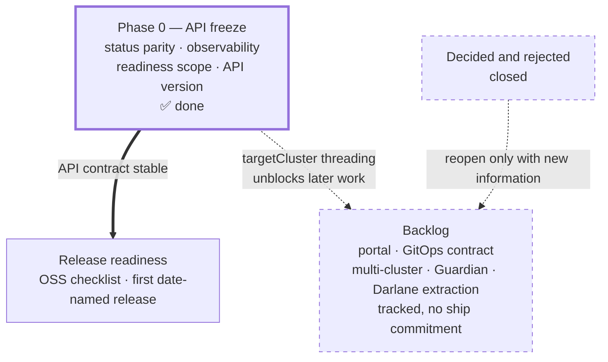

# W'xOps Core — Roadmap

Latest release: **v0.4.0**. Seven Configuration packages published. From the next release on, releases are named by date — `release-YYYY-MM-DD` — and
compatibility is carried by the XRD API version, held additive-only by `tests/api_compat.py`; see [`release-notes/README.md`](release-notes/README.md).

This document sequences the remaining core work and defines what "core is done" means.

The organising thesis: **core is finished when its API contract is stable, not when its feature list is complete.** The portal will bind to these XRD shapes;
everything that changes after that binding costs twice.

---

**Table of Contents**
- [W'xOps Core — Roadmap](#wxops-core--roadmap)
  - [Where core stands today](#where-core-stands-today)
  - [Notes and warnings](#notes-and-warnings)
  - [The cut line](#the-cut-line)
  - [Out of scope — what W'xOps Core is not](#out-of-scope--what-wxops-core-is-not)
    - [Not a controller](#not-a-controller)
    - [Not a runtime](#not-a-runtime)
    - [Not an infrastructure implementation](#not-an-infrastructure-implementation)
    - [Not a networking layer](#not-a-networking-layer)
    - [Not the product surface](#not-the-product-surface)
    - [Not portable beyond Kubernetes + Crossplane](#not-portable-beyond-kubernetes--crossplane)
    - [Not stable yet](#not-stable-yet)
  - [Release readiness](#release-readiness)
    - [Checklist](#checklist)
    - [Decided](#decided)
    - [Still open](#still-open)
  - [Backlog](#backlog)
    - [Portal and GitOps contract](#portal-and-gitops-contract)
    - [Deferred core (post-release)](#deferred-core-post-release)
    - [Core follow-ups from the architecture docs (2026-08)](#core-follow-ups-from-the-architecture-docs-2026-08)
    - [Vault Database Secrets Engine](#vault-database-secrets-engine)
  - [Decided and rejected](#decided-and-rejected)
  - [Shipped](#shipped)
  - [Where Darlane belongs](#where-darlane-belongs)
  - [Open decisions](#open-decisions)
  - [References](#references)

---

## Where core stands today

| Area | State |
|---|---|
| 7 Configuration packages, `v0.4.0` (API-freeze release), CI auto-publish on tag | ✅ |
| Darlane Tier 1 — `resources`, `securityContext`, `env`, `args` | ✅ |
| Darlane Tier 2 safety — `productionOverride`, `ttl` + Kyverno policy | ✅ |
| Darlane `fileSync` — including `initFromImage` | ✅ |
| Darlane traffic — `trafficWeight`, `stickySession`, `headerRouting` | ✅ |
| `telemetryPort`, `volumes`, `serviceAccount` | ✅ |
| Per-package API docs + architecture guides | ✅ |
| Phase 0 — API contract stable across all seven XRDs | ✅ [full contract](docs/api-reference/status-contract.md) |
| `darlane.rbac` | ⛔ Dropped — RBAC belongs in the GitOps repo, not a composition |
| API version `v1alpha1` → `v1beta1` | ✅ Decided — stay on `v1alpha1` through portal v1, promote at [Release readiness](#release-readiness) |
| `spec.parameters.monitoring` (ServiceMonitor/PodMonitor) | ✅ Both kinds emit; `prometheus.io/*` annotations retired |
| `targetCluster` threading | ✅ 30 sites across 3 KCL packages; not yet consumed (no spoke exists) |
| Offline test suite (golden + invariants + XRD conformance) | ✅ 19 cases, 18 rules, 9 negative cases — [`tests/README.md`](tests/README.md) |
| Release mechanism — date-named releases, API-compat gate, pins written by `make release` | 🔶 Built; `package/install/` still pins the legacy Gitea registry until `make release ALL=1` runs — [Release readiness](#release-readiness) |
| Darlane `tunneling` (mirrord labels) | ⚪ Open, low value — the CLI works without it |

Core's functional and contract surface is done — Phase 0 closed that out (shipped as `v0.4.0`, see [Shipped](#shipped)). What's open now is getting the release
mechanism actually used ([Release readiness](#release-readiness)). Everything past that — portal, GitOps contract, multi-cluster, Guardian, Darlane extraction —
lives in the [Backlog](#backlog): real work, tracked, but not scheduled against this repo's own critical path.

---

## Notes and warnings

Things Phase 0 shipped that are easy to forget later, because nothing fails loudly when they're missed.

- **`monitoring.coreos.com` RBAC is a manual, per-cluster step.** Shipped in `v0.4.0`, but no
  package bump carries it: apply the updated `providers/rbac-provider-kubernetes.yaml` on every
  cluster, or every `ServiceMonitor`/`PodMonitor` a live cluster emits fails `forbidden` at
  reconcile.
- **`darlane.rbac` was dropped, not deferred.** The composition publishes
  `status.darlane.serviceAccountName`; the GitOps repo is responsible for binding a `Role` to it.
  Nothing enforces that the binding exists — a missing one means the Darlane pod boots with no
  permissions and fails silently on whatever it tries to do first.
- **API version promotion is a label, not a migration.** Crossplane XRDs can serve several
  versions, but "the schema of each version can't change any existing fields", and breaking changes
  between versions need a conversion webhook — a custom server, which
  [Not a controller](#not-a-controller) excludes. So promoting `v1alpha1` → `v1beta1` (planned at
  [Release readiness](#release-readiness), [open decision 1](#open-decisions)) only works because
  the schema is already identical; it's a stability commitment, not a schema change.
  `tests/api_compat.py` enforces additive-only against the last release tag either way.

---

## The cut line

Core is done when a portal can be built against it without needing core to change again. Concretely:

1. Every XRD reports machine-readable readiness.
2. Readiness means what a user would assume it means.
3. Every action the portal offers has an authorisation surface.
4. The served API version is the one we intend to keep.

Items 1–3 were Phase 0's scope, shipped as `v0.4.0` — see [Shipped](#shipped) for what landed and [Notes and warnings](#notes-and-warnings) for what to watch.
Item 4 is a decision, not a task, and it is the only genuinely irreversible one.

Everything after Phase 0 — `XDarlane`, Guardian, multi-cluster — is deferrable without blocking portal work.

Phase 0 was the only item on core's own critical path, and it's done — everything below is either in progress (release readiness) or deferred to the Backlog.

---

## Out of scope — what W'xOps Core is not

This project is a **Crossplane Configuration library**. It defines XRDs and Compositions that render Kubernetes objects. That is the whole remit.

The list below is not a backlog. These are things W'xOps Core will **not** do, and requests to add them should be redirected to the named alternative rather
than accepted. Keeping this boundary is what stops the repo becoming a platform monolith.

### Not a controller

**No hand-written Go controllers.** A `kubebuilder` controller was built, evaluated, and removed. Composition logic belongs in KCL or patch-and-transform, run
by Crossplane's own reconciler. If something cannot be expressed as a composition, the answer is a new Crossplane *function*, not a bespoke operator.

### Not a runtime

| Concern | Owner, not us |
|---|---|
| Running applications | Kubernetes. Core emits Deployments; it does not schedule, scale, or supervise them. |
| Building or testing code | Gitea Actions / CI. Core has no build pipeline for tenant code. |
| Deploying (the act) | Argo CD or Flux. Core produces desired state; something else applies it. |
| Container images | Tenant repos. Core references images by tag, never builds them. |

### Not an infrastructure implementation

Core **composes** other operators. It does not reimplement them.

| Domain | Delegated to |
|---|---|
| PostgreSQL lifecycle, backup, failover | CloudNativePG |
| Secret storage, rotation, leasing | Vault + External Secrets Operator |
| TLS issuance | cert-manager |
| North-south routing | Traefik |
| Policy enforcement, quota, NetworkPolicy | Kyverno |
| Cluster provisioning | Cluster API |
| Identity federation | Pinniped / native structured authentication |

`providers/policies/darlane-ttl.yaml` is the deliberate exception, and it is a *reference* policy shipped alongside the composition it enforces — not the start
of a policy library.

### Not a networking layer

Traefik `IngressRoute` for north-south traffic only. **No service mesh, no east-west routing, no cross-cluster data plane.** See
[`docs/core-ideas/multi-cluster.md`](docs/core-ideas/multi-cluster.md#layer-3--data-plane) — a mesh is a Layer 3 concern the platform defers until a concrete
workload needs it, and Darlane traffic splitting is deliberately confined to a single cluster.

### Not the product surface

| Artifact | Where it lives |
|---|---|
| Portal / UI | Separate repository |
| `wxops` CLI (`darlane sync`, mutagen wrapper) | Separate repository |
| Guardian sidecar images | Separate repository |
| Tenant application code | Tenant repositories |

See [Where Darlane belongs](#where-darlane-belongs) for the reasoning — the seam is artifact type, not feature.

### Not portable beyond Kubernetes + Crossplane

- **No Helm charts.** Distribution is Crossplane Configuration packages (OCI).
  `package/dev/` exists for local iteration, not as a second install path to
  support.
- **No non-Kubernetes targets.** Terraform appears only inside `Workspace`
  resources for the Gitea provider; core is not a general IaC wrapper.
- **No support for Crossplane v1.** v2 is the floor —
  namespaced/`spec.crossplane.*` semantics are assumed throughout.

### Not stable yet

All seven XRDs serve `v1alpha1`. **Breaking schema changes are permitted without a deprecation cycle** until the promotion in [decision 1](#open-decisions).
Consumers pinning to `v1alpha1` should expect churn. This is a real constraint on the portal and the reason API promotion is Phase 0 work rather than later.

---

## Release readiness

**Done.** Phase 0 closed the functional and contract work; this closed out repository readiness for outside contributors, including the first date-named
release (`release-2026-09-16`, cut with `make release ALL=1`). Pushing the tag and letting CI publish the images is the one remaining, separate step.

### Checklist

- [x] `LICENSE` — Apache-2.0, matching the Crossplane/CNCF ecosystem: explicit patent licence (§3),
      trademark reservation (§6). `NOTICE` added for §4(d) attribution.
- [x] `CONTRIBUTING.md` — conventional commits, `make kcl-sync` requirement, `VERSIONS.yaml` bump
      policy, pre-commit setup, the Python venv step
- [x] `SECURITY.md` — GitHub Security Advisories as the private disclosure channel, scope, and a
      pointer to [`docs/core-ideas/security-threat-model.md`](docs/core-ideas/security-threat-model.md)
      for the full model
- [x] `CODE_OF_CONDUCT.md` — Contributor Covenant v2.1, reports via the same private advisory channel
- [x] `.github/` — `pr-validate.yaml` mirrors the Gitea gate; `publish-packages.yaml`
      builds/pushes/releases on a `release-*` tag
- [x] Public registry decided — `ghcr.io/wxops/wxops-core`; `Makefile` and `release-state.py` agree
- [x] `cliff.toml` repointed from Gitea to GitHub, for the whole changelog at once
- [x] **Public package naming decided and done** — `platform-wxops-<pkg>` → `wxops-core-<pkg>` →
      scoped by registry path instead: `ghcr.io/wxops/wxops-core/<pkg>`, plain `<pkg>` everywhere
      else (`crossplane.yaml` `metadata.name`, `package/install/*.yaml`, `Makefile`,
      `.gitea/scripts/{release-state.py,validate-packages.sh}`,
      `.github/workflows/publish-packages.yaml`, every package `README.md`). Verified:
      `make test-xrd test-api-compat test-invariants`, `make readme-check`, and
      `release-state.py check` all still pass.
- [x] Mirror strategy decided — Gitea primary through `v0.4.0`; GitHub primary from the first
      date-named release, Gitea archived (frozen, read-only, kept for internal reference and
      on-request demos)
- [x] README rewritten for an audience with no platform context — opens with the problem this solves
      and what it isn't, ahead of the packages table
- [x] `examples/` hostname check — confirmed intentional: `rocket-team` is a placeholder tenant name,
      `*.example.com` is the RFC 2606 reserved placeholder domain. No real hostname in any example.
      Migrating examples to a resolvable placeholder domain (`nip.io`, `traefik.me`) is a real future
      improvement, deliberately **not done now** — tracked below, not blocking this release.
- [x] `CLAUDE.md` ships publicly — decided. Audited for anything sensitive first: no Gitea hostname,
      no SSH port, no personal information anywhere in the file.
- [x] **Run `make release ALL=1`** — done, `release-2026-09-15`. Moved all seven
      `package/install/*.yaml` pins from the Gitea registry to `ghcr.io/wxops/wxops-core` in one
      release. The tag is cut locally; pushing it (`git push origin release-2026-09-15`) and letting
      `publish-packages.yaml` build and push the images is the next, separate step.

### Decided

| Decision | Outcome |
|---|---|
| Licence | Apache-2.0 — patent grant, trademark reservation, ecosystem-compatible |
| Public registry | `ghcr.io/wxops/wxops-core` |
| Public package naming | Plain `<pkg>`, scoped by the registry path (`ghcr.io/wxops/wxops-core/<pkg>`) |
| Mirror strategy | GitHub primary from the first date-named release; Gitea archived, no further pushes |
| CHANGELOG link target | GitHub, for the whole file — every entry from `v0.1.0` through `v0.4.0` links there |
| Release naming | Date-named — `release-YYYY-MM-DD[.N]`, UTC. Compatibility lives in the XRD API version, not the release name — `tests/api_compat.py` holds it additive-only. See [`release-notes/README.md`](release-notes/README.md). |
| Gitea hostname visibility | Deliberately public — the instance is permission-gated, so the hostname alone isn't sensitive. The exact SSH port is never published, on the same access-control reasoning, as a cheap scan-reduction measure. `package/install/*.yaml`'s legacy registry pins were the only place it appeared, and `make release ALL=1` (`release-2026-09-15`) has since replaced them all. |
| `CLAUDE.md` publication | Ships publicly, unedited — audited clean of hostnames, ports, and personal information |

### Still open

| Item | Note |
|---|---|
| Governance | Single-maintainer vs. open contribution — changes how much process the repo needs beyond what's here |
| Example hostnames → `nip.io`/`traefik.me` | Deliberately deferred, not blocking — see the checklist above |

---

## Backlog

**Tracked, not scheduled.** Nothing here has a commitment to ship or a target release. Items graduate into a phase when a concrete need appears — they are not
worked through in order, and an item sitting here for a year is a normal outcome, not a slipped deadline.

### Portal and GitOps contract

The portal is a separate repository ([Not the product surface](#not-the-product-surface)) and is unblocked by Phase 0: the status fields it polls and the
authorisation surface it needs already exist. What it writes, and where, is the open question:

| Model | Portal writes | Git holds | Trade-off |
|---|---|---|---|
| **Portal → Git → Argo** | A commit | Every tenant XR | Full audit trail, PR review, slower feedback |
| **Portal → API** | The XR directly | Platform config only | Immediate feedback, weaker audit |
| **Hybrid** | API for dev, Git for prod | Prod XRs | Best UX/safety split, two code paths |

Also in scope once this starts: repository layout for tenant XRs, ApplicationSet patterns for per-environment promotion, and where `package/install` sits
relative to tenant state. Tracked as [open decision 3](#open-decisions).

### Deferred core (post-release)

In priority order, all post-portal:

1. **`XDarlane` standalone XRD** — see [Where Darlane belongs](#where-darlane-belongs)
2. **Multi-cluster prototype** — now fully specified in
   [`multi-cluster-proposal.md`](docs/core-ideas/multi-cluster-proposal.md) (CAPI + one spoke +
   scoped `ProviderConfig` + structured authn, with exit criteria); the v0.4.0
   `cluster` threading is its completed prerequisite. The connection-security
   options for item 4, and the answer for spokes CAPI did not provision, are in
   [`multi-cluster-connectivity.md`](docs/core-ideas/multi-cluster-connectivity.md). Tracked as
   [open decision 4](#open-decisions).
3. **Guardian Phase 1** — [`guardian.md`](docs/core-ideas/guardian.md)
4. **Self-service operations track** — sequenced in
   [`self-service-operations.md`](docs/core-ideas/self-service-operations.md#what-to-build--sequenced)
   and [`knowledge-architecture.md`](docs/core-ideas/knowledge-architecture.md#adoption--sequenced-each-step-useful-alone);
   the small core pieces live in the section below

### Core follow-ups from the architecture docs (2026-08)

Safe-tier, additive package changes argued in the docs family — see [`docs/core-ideas/solution-matrix.md`](docs/core-ideas/solution-matrix.md) for the full
picture:

- [ ] **`status.notReady` reasons** on all seven packages — the composition
      already computes per-resource readiness and discards it; exposing it is
      the cheapest, highest-leverage diagnostics change
      ([self-service-operations.md](docs/core-ideas/self-service-operations.md#whats-missing))
- [ ] **`scheduling:` block** (`nodeSelector`, `tolerations`, spread) on
      `tenant-app` + `platform-database-clusters` — verified gap; prerequisite
      for any arm64/edge/GPU node pool
      ([multi-cluster-scale.md](docs/core-ideas/multi-cluster-scale.md#the-verified-wxops-gaps))
- [ ] **Widen `resources.requests/limits`** to accept extended-resource keys
      (`nvidia.com/gpu`) — today's schema silently prunes them despite the
      "passed through verbatim" description (same doc)
- [ ] **`monitoring.alerts`** — `PrometheusRule` emission with `runbook_url`,
      same pattern/tier as the monitor emission; needs `prometheusrules` in
      provider RBAC
      ([self-service-operations.md](docs/core-ideas/self-service-operations.md#pillar-2--runbooks-as-platform-contract))
- [ ] **`ingress.gslb` block** — blocked on the k8gb↔Traefik-IngressRoute
      spike; do the spike first
      ([multi-cluster-scale.md](docs/core-ideas/multi-cluster-scale.md#gslb-implementations--three-options-one-field-tested))
- [ ] **Runbooks + `docs/incidents/` convention** — knowledge-architecture
      adoption steps 2–3; docs-only, no code

### Vault Database Secrets Engine

Dynamic credential management via Vault's Database Secrets Engine. The current static flow — CNPG creates credentials → ESO `PushSecret` → Vault KV2 — **remains
the default**. This would layer on top as an opt-in path, not replace it.

- [ ] **Design mount/path topology** — single mount per cluster vs. per-tenant
      mounts. The deciding question: does ESO read once and fan out, or do
      tenants read directly? The latter generates a new lease on every read.
- [ ] **`SecretBackendConnection` on `XPlatformDatabaseCluster`** — per-cluster
      Vault connection using a restricted PostgreSQL role (`CREATEROLE` only).
      Gated behind `vaultDatabaseBackend.enabled`.
- [ ] **`SecretBackendRole` on `XTenantDatabase`** — per-database dynamic
      credential template, with creation and revocation SQL scoped to that
      tenant's database.
- [ ] **ESO lease lifecycle** — `refreshInterval` triggers new leases and revokes
      old ones. This is a behavioural change from the static flow, where CNPG
      credentials never change unless rotated manually. Applications must
      tolerate credential rotation before this is enabled.
- [ ] **Optional: compose `vault.vault.upbound.io/v1alpha1 Mount`** on
      `XPlatformDatabaseCluster` (requires `provider-vault`) so platform admins
      do not need to pre-create Vault mounts out of band.

Interacts with [Vault path conventions](docs/core-ideas/multi-cluster.md#decisions-to-make-before-building): if a cluster dimension is ever added to Vault
paths, settle it before this ships, not after.

---

## Decided and rejected

Evaluated and closed. **Do not re-litigate without new information** — if something here comes up again, the burden is to say what changed.

| Rejected | Why |
|---|---|
| `darlane.rbac` — composition-emitted `Role`/`RoleBinding` for developer access | Granting provider-kubernetes write access to RBAC makes it a privilege-escalation vector: Kubernetes' escalation check only blocks granting permissions the creator lacks, and that ServiceAccount already holds broad grants. RBAC also deserves human review on a diff, which it gets in the GitOps repo and not when generated from KCL. And `pods/exec` cannot be name-restricted by RBAC at all, so the "scoped to one Deployment" grant was never as scoped as it read. Core creates the ServiceAccount and publishes `status.darlane.serviceAccountName`; GitOps binds it. |
| **ArgoCD ApplicationSet (matrix generator: apps × environments)** | Correct pattern for multi-env fan-out, but it lives in the GitOps repo, not here. The `environment` label is `tenant-app`'s contribution to making it work. |
| **Kyverno for defaulting/mutating `XTenantApp`** | Creates a second source of truth alongside the KCL Composition. Kyverno's place is validation, guardrails, and `generate` policies keyed off `appFlavor` / `environment` — not defaulting. |
| **`partOf` label / `catalog-info.yaml` templates** | IDP/Backstage concern. `tenant-app` already provides the building blocks (`appName`, `environment`, status fields); the IDP layer consumes them. Revisit only if the IDP repo needs something `tenant-app` genuinely cannot provide. |
| **`tenant-app.databaseRef` for end-to-end credential wiring** | The bridging `ExternalSecret` is deliberately the platform layer's responsibility. `tenant-app` stays focused on the workload; `tenant-database` on provisioning and the Vault push. |
| **Gateway API `HTTPRoute` as an Ingress alternative** | A real option, but it belongs in a separate XRD (`XTenantHTTPRoute`), not a `tenant-app` field. Parked until a concrete need appears that Ingress cannot satisfy — cross-namespace routing, or traffic splitting beyond what Traefik gives us. |
| **`platform-tenant` / `tenant-namespace` package** | Already covered by the existing GitOps setup. Dual ownership — two controllers reconciling the same `Namespace` / `RoleBinding` / `Quota` — is worse than the current pattern. Crossplane's value is dynamic parameterised resource graphs with cross-resource outputs, not static namespace scaffolding. |
| **`externalSecrets` / `database` toggles in `tenant-app`** | Removed. `tenant-app` stays focused on Deployment / Service / Ingress / Darlane. Vault-backed secrets and databases are provisioned separately and consumed via `envFrom.secretRef`. |
| **Matrix permissions for Gitea team XRs** | Not adopted for `XGiteaTeam` org setup. |
| **Darlane `tunneling` XRD block** | Removed — the mirrord CLI needs no manifest configuration, so the labels bought nothing. |
| **`debugPort`, VS Code docs, ephemeral DB branch, W'xOps CLI** | Not rejected — moved to `XDarlane` XRD scope. See [Where Darlane belongs](#where-darlane-belongs). |
| **A heavier, guardrail-and-automation-based Composition rollout system** | Rejected before anything was built — too complex to operate or explain to a future contributor on a single-maintainer project. Replaced by a plain `channel` label + native Crossplane selector fields — see [ADR-001](docs/adr/001-package-channel-label.md). |

---

## Shipped

Release history from `v0.1.0` through `v0.4.0` (the Phase 0 / API-freeze release). Full commit-level detail is in [`CHANGELOG.md`](CHANGELOG.md); this table is
what shipped, not how.

| Release | Theme | Highlights |
|---|---|---|
| `v0.1.0` / `v0.1.1` | Gitea XRD baseline | `gitea-user`, `gitea-org`, `gitea-team`, `gitea-repository` — four cluster-scoped XRDs |
| `v0.2.0` / `v0.2.1` / `v0.2.5` / `v0.2.6` | `XTenantApp` baseline + SSO | Traefik `IngressRoute`, `envFrom`/`podAnnotations`/Reloader, `appFlavor`/`environment` labels, probes, Darlane debug-twin, SSO middleware reference, ImagePullSecrets/ServiceAccount/securityContext |
| `v0.2.2` / `v0.2.4` | `XTenantDatabase` dynamic tier resolution | Shared-pool auto-assignment via `function-extra-resources` (least-loaded, environment-isolated, sticky), dedicated child-XR composition, Vault path restructure |
| `v0.2.7` | Gitea XRD additions | `allowCreateOrganization`; team Actions/Packages toggles via `null_resource` + Gitea API PATCH; org team-access toggle |
| `v0.3.0` | Darlane + IngressRoute + KCL readiness fix | `devSpace`→`darlane` rename; `IngressRoute` replaces `Ingress` fleet-wide; `fileSync`, `trafficWeight`, `stickySession`, `productionOverride`+`ttl`; the `_isReady()`/`ocds` fix for Crossplane v2.3 + function-kcl v0.12.1's always-`False` native readiness |
| `v0.3.1` – `v0.3.4` | Darlane header routing, hardened | `headerRouting` shipped in `v0.3.1`, then three fix releases: priority calculation, a separate `IngressRoute` object per rule, syntax correctness |
| `v0.4.0` | **Phase 0 — API freeze** | Status parity (`created`/`ready`) on all seven XRDs, `tenant-app` readiness split, Darlane status block, `targetCluster` threaded through all three KCL packages, `monitoring` block emitting real `ServiceMonitor`/`PodMonitor` |

`darlane.rbac` was sketched in the `v0.3.0` design but never implemented in the XRD or KCL — see [Decided and rejected](#decided-and-rejected).

---

## Where Darlane belongs

Splitting Darlane out is right, but the seam should be **artifact type, not feature**.

| Artifact | Home | Why |
|---|---|---|
| `XDarlane` XRD + Composition | **`wxops-core`**, as `package/darlane/` | It is a Crossplane Configuration like the other seven — same `make kcl-sync`, same `VERSIONS.yaml`, same CI, same pre-commit gates |
| `wxops` CLI (`darlane sync`, mutagen wrapper) | **Separate repo** | A Go/Rust binary with its own release cadence. Not a composition. |
| Guardian sidecar images | **Separate repo** | Container images, not YAML |
| Portal Darlane UI | **Portal repo** | Obviously |

The reasoning: this repo's entire toolchain — KCL embedding, `xpkg build`, the drift check, the API-compat gate — exists to build Configuration packages. An
`XDarlane` XRD gets all of it for free. A CLI gets none of it and pays the overhead of a YAML-shaped repo.

There is also a coupling argument. `XDarlane` will need to reference the app it shadows — its namespace, secrets, Service, and Traefik routes. Today those are
`XTenantApp` internals. Cross-repo coordination between two Crossplane Configurations that must agree on label and annotation conventions is a real cost with no
offsetting benefit at seven packages.

**Recommendation: do not split now.** Keep `darlane.*` on `XTenantApp` through portal v1. Extract `package/darlane/` once the portal has shown which Darlane
operations are actually used. Move the CLI and Guardian images out whenever they are written — those never belonged here.

This also matches the current direction of travel: `providers/policies/darlane-ttl.yaml` already lives here as platform policy, and it belongs with the
composition it enforces.

---

## Open decisions

| # | Decision | Deadline | Blocks |
|---|---|---|---|
| 1 | `v1alpha1` → `v1beta1` promotion | [Release readiness](#release-readiness) | Portal binding; irreversible after |
| 2 | `ready` widened vs. split into `dependenciesReady` | Phase 0 | Portal status rendering — ✅ resolved, split chosen |
| 3 | Portal → Git vs. Portal → API | Before portal work begins | [Backlog → Portal and GitOps contract](#portal-and-gitops-contract) |
| 4 | Target cluster as XR parameter vs. hub-side boundary | Before the multi-cluster prototype | [`multi-cluster.md`](docs/core-ideas/multi-cluster.md#decisions-to-make-before-building) |
| 5 | Vault path cluster dimension | Before first spoke | Breaking change to every `remoteKey` |

---

## References

- [`docs/core-ideas/multi-cluster.md`](docs/core-ideas/multi-cluster.md) — hub-spoke architecture and options
- [`docs/core-ideas/multi-cluster-connectivity.md`](docs/core-ideas/multi-cluster-connectivity.md) — securing the
  hub→spoke API connection, for new and pre-existing clusters
- [`docs/core-ideas/darlane.md`](docs/core-ideas/darlane.md) — Darlane workflows and the `XDarlane` vision
- [`docs/core-ideas/guardian.md`](docs/core-ideas/guardian.md) — Guardian Framework design
- [`docs/api-reference/tenant-app.md`](docs/api-reference/tenant-app.md) — `XTenantApp` API reference
- [`VERSIONS.yaml`](VERSIONS.yaml) — served API versions, and the release each package last changed in
- [`release-notes/README.md`](release-notes/README.md) — release naming, the API-compat gate, when notes are required
