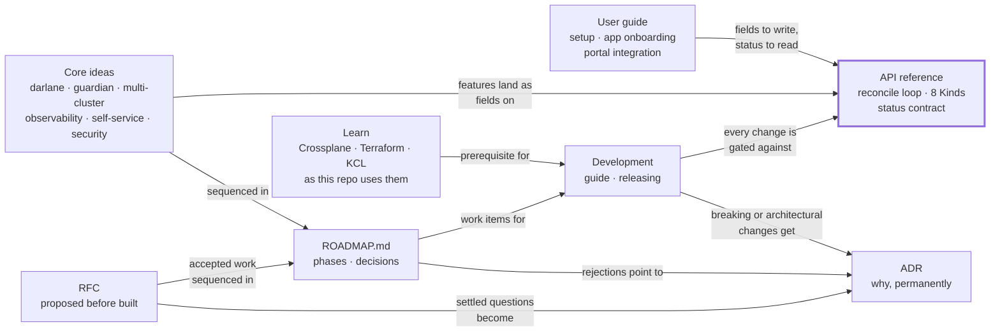

# W'xOps Core Documentation

W'xOps Core publishes platform APIs as Crossplane v2 composite resources: Gitea identities and
repositories, PostgreSQL clusters and databases, and tenant applications with Darlane workspaces.
You declare one resource, and Crossplane keeps everything behind it reconciled. These docs are
organised by what you came to do.

**Table of Contents**
- [Find your way](#find-your-way)
- [The seven sections](#the-seven-sections)
  - [Learn](#learn)
  - [API reference](#api-reference)
  - [Core ideas](#core-ideas)
  - [User guide](#user-guide)
  - [Development](#development)
  - [ADR](#adr)
  - [RFC](#rfc)
- [How the sections connect](#how-the-sections-connect)
- [Development matrix](#development-matrix)
- [Where new docs go](#where-new-docs-go)

---

## Find your way

| I want to… | Start here |
|---|---|
| Learn Crossplane, Terraform or KCL well enough to read this repo | [Learn](learn/README.md) |
| Install W'xOps Core on a cluster | [Setup](user-guide/setup.md) |
| Ship an application end to end | [App onboarding](user-guide/app-onboarding.md) |
| Know what a resource does, which fields it takes, and what the reconcile loop does for me | [API reference](api-reference/README.md) |
| Build a portal or a tool against the API | [Portal integration](user-guide/portal-integration.md) · [Status contract](api-reference/status-contract.md) |
| Understand where the platform is heading | [Core ideas](#core-ideas) · [Solution matrix](core-ideas/solution-matrix.md) |
| Change a composition or add a package | [Learn](learn/README.md) if this is your first time, then [Development guide](development/README.md) |
| Cut a release | [Releasing](development/releasing.md) |
| See what is built, what is planned, and what is next | [Development matrix](#development-matrix) · [`ROADMAP.md`](../ROADMAP.md) |
| Find or record the reasoning behind a decision | [ADR](adr/README.md) |
| Propose a design or a new capability before it is built | [RFC](rfc/README.md) |

---

## The seven sections

### Learn

Contributor onboarding for someone who hasn't used Crossplane, Terraform or KCL before — four short
pages, each teaching one concept against a real file in this repo rather than a generic tutorial.
Read only the pages you're missing.

| Doc | What it covers |
|---|---|
| [**Start here**](learn/README.md) | Which of the four pages to read, mapped to the package you're about to touch |
| [Crossplane in five minutes](learn/01-crossplane-in-5-minutes.md) | XRD, XR, Composition, composed resource — walked through `gitea-user` end to end |
| [Terraform, the way this repo uses it](learn/02-terraform-here.md) | The inline-HCL `Workspace` pattern every `gitea-*` package and `random-password` use |
| [KCL, the way this repo uses it](learn/03-kcl-here.md) | This repo's KCL idioms (`_get`, ternary chains, conditional composition) on a real slice of code |
| [Your first change](learn/04-your-first-change.md) | A guided edit to `gitea-team`, start to finish: schema, template, test, PR |

### API reference

What each Kind accepts, what Core composes and keeps reconciled for it, and what it reports back.
The schema source is `package/<name>/xrd.yaml`; every Kind serves `platform.wxops.cloud/v1alpha1`.

| Doc | Kind | What it covers |
|---|---|---|
| [**Start here** — the reconcile loop and every Kind](api-reference/README.md) | all | What you can do with an XR (create, change, pause, hold, delete), how to read status, and a catalogue of every Kind |
| [gitea-user](api-reference/gitea-user.md) | `XGiteaUser` | A Gitea user and its generated password |
| [gitea-org](api-reference/gitea-org.md) | `XGiteaOrg` | A Gitea organisation with visibility and metadata |
| [gitea-team](api-reference/gitea-team.md) | `XGiteaTeam` | A team inside an organisation, including membership |
| [gitea-repository](api-reference/gitea-repository.md) | `XGiteaRepository` | A repository owned by an organisation |
| [platform-database-clusters](api-reference/platform-database-clusters.md) | `XPlatformDatabaseCluster` | A CloudNativePG cluster with poolers, backups and Vault-seeded credentials |
| [tenant-database](api-reference/tenant-database.md) | `XTenantDatabase` | A tenant database on a shared or dedicated cluster, credentials pushed to Vault |
| [tenant-app](api-reference/tenant-app.md) | `XTenantApp` | Deployment, Service, ingress with TLS and SSO, monitoring, and the Darlane twin |
| [random-password](api-reference/random-password.md) | `XRandomPassword` | Utility composition, not published as a package |
| [status-contract](api-reference/status-contract.md) | all | Every package's `status` fields on one page: the absent-vs-`false` split, `ready` vs `dependenciesReady` |

### Core ideas

The ideas and features the platform is built around, from shipped to researched. Each doc opens
with a status banner that says how settled it is.

| Doc | Maturity | What it covers |
|---|---|---|
| [solution-matrix](core-ideas/solution-matrix.md) | Index | **The idea map.** 44 problems across observability, multi-cluster and AI self-service: the chosen tool, what current packages already solve, and the industry practice to study |
| [darlane](core-ideas/darlane.md) | Shipped in `XTenantApp`; `XDarlane` designed | The in-cluster developer twin: file sync, traffic mirroring, A/B and header routing, SRE-agent workflows |
| [guardian](core-ideas/guardian.md) | Vision | Platform-injected scanning, audit and AI code-review sidecars for Darlane sessions |
| [multi-cluster](core-ideas/multi-cluster.md) | Design | Hub-and-spoke architecture: control, identity and data planes, two reference architectures, and the migration path from one cluster |
| [multi-cluster-proposal](core-ideas/multi-cluster-proposal.md) | Proposal | The chosen path: CAPI + ArgoCD hub-spoke + structured authn, k8gb + ExternalDNS, and a prototype with exit criteria |
| [multi-cluster-connectivity](core-ideas/multi-cluster-connectivity.md) | Options analysis | Securing the hub→spoke API connection, across three independent trust paths, for new and existing clusters |
| [multi-cluster-scale](core-ideas/multi-cluster-scale.md) | Research | Regions, tenancy tiers, heterogeneous hardware (arm64 edge, GPU), and the XRD gaps each exposes |
| [observability](core-ideas/observability.md) | Part 1 shipped, Part 2 options | Metrics emission from `XTenantApp`, then collection at single-cluster, fleet and multi-cluster scale |
| [self-service-operations](core-ideas/self-service-operations.md) | Research + direction | The operability ladder, status as a diagnosis graph, runbooks, and the agent→PR loop behind the test gate |
| [knowledge-architecture](core-ideas/knowledge-architecture.md) | Research + direction | ADRs, runbooks, knowledge graph and Agent Skills under the SRE agent, with golden incidents as evals |
| [security-threat-model](core-ideas/security-threat-model.md) | Consolidation | Assets, trust boundaries, threats mapped to mitigations, and the honest gap list |

### User guide

Running W'xOps Core and building on it.

| Doc | What it covers |
|---|---|
| [setup](user-guide/setup.md) | Prerequisites and platform dependencies, providers, credentials, installing packages, and a first resource |
| [app-onboarding](user-guide/app-onboarding.md) | The golden path from picking a template to a running `XTenantApp`, through `XGiteaRepository` |
| [portal-integration](user-guide/portal-integration.md) | The consumer side of the API: screen-by-screen field map, health cards, error-to-runbook wiring, and what a portal must never do |

### Development

Changing, testing and releasing W'xOps Core. The canonical detail stays next to the code it
describes; these pages put it in order.

| Doc | What it covers |
|---|---|
| [**Development guide**](development/README.md) | Where every piece of contributor detail lives, the change loop, hooks and make targets, and the rules that bite |
| [releasing](development/releasing.md) | The two version axes, why a released XRD only grows, `make release`, CI publishing, and the changelog |
| [`CONTRIBUTING.md`](../CONTRIBUTING.md) | Setup, the change loop, commit messages, and the checklist for a new package |
| [`tests/README.md`](../tests/README.md) | The offline test suite: what each check catches, how to add a case, what it cannot catch |
| [`kcl/README.md`](../kcl/README.md) | Why KCL, the sync workflow, and wiring a KCL module into a package |
| [`release-notes/README.md`](../release-notes/README.md) | When release notes are required and how to write them |
| [`CLAUDE.md`](../CLAUDE.md) | Architecture, KCL conventions, the working model, and the reference stack |

### ADR

One committed file per decision of lasting consequence — context, decision, consequences,
alternatives considered. Breaking or architectural changes get one, so the reasoning stays
discoverable without depending on anyone's memory of the conversation that produced it.

| Doc | What it covers |
|---|---|
| [**ADR index**](adr/README.md) | The lifecycle (proposed → accepted → superseded) and every ADR so far |
| [`TEMPLATE.md`](adr/TEMPLATE.md) | Copy this to start a new one |
| [001 — Package channel label](adr/001-package-channel-label.md) | `stable`/`nightly` over a guardrailed rollout system, and why |

### RFC

One committed file per proposal — a design argued before it is built. Community intake is the RFC issue; the file
is what tracks the proposal through review, acceptance and rollout, and links to the ADRs it produces.

| Doc | What it covers |
|---|---|
| [**RFC index**](rfc/README.md) | When to write one, the lifecycle (draft → in review → accepted → implemented), and every RFC so far |
| [`TEMPLATE.md`](rfc/TEMPLATE.md) | Copy this to start a new one |
| [002 — Terraform → OpenTofu](rfc/002-migrate-terraform-to-opentofu.md) | Swap the Workspace engine so the whole runtime stack is open source, and the orphan-first procedure that keeps existing Gitea resources safe — *draft* |
| [003 — Vendor repos and OAuth applications](rfc/003-vendor-repos-and-oauth-applications.md) | Gitea/GitHub/GitLab behind one API, OAuth applications with Vault-tracked, rotatable credentials — *draft* |
| [004 — Dex identity and Portal authentication](rfc/004-dex-identity-and-portal-authentication.md) | Dex as the OIDC issuer, `XOIDCClient` with OpenBao-held rotated secrets, the claim contract the authorization RFC keys on — *draft* |
| [005 — Git-mapped authorization](rfc/005-git-mapped-authorization.md) | RBAC for who may act, Kyverno ABAC keyed on a `wxops.cloud/owner` label mapped one-to-one to Git teams, and the namespaced-XR alternative — *draft* |
| [006 — Cloudflare R2](rfc/006-cloudflare-r2-object-storage-and-backup.md) | The first third-party service: R2 buckets and scoped credentials for backup and tenant object storage, and the pattern a second service follows — *draft* |

---

## How the sections connect

The API reference sits in the middle on purpose. A core idea becomes real when it lands as a field on
a Kind. A user guide is a path through those fields. Learn is prerequisite reading for Development,
not a section of it — it teaches the underlying tools, not this repo's workflow. Every development
change is checked against the released API. An ADR is the one thing that never moves once accepted —
everything else can change around a decision, but the record of why it was made stays put.

---

## Development matrix

One page for developing the project: every package, core idea and delivery mechanism, where it
stands, where to read about it, and what is next. **Kept current by hand:** update the row in the
same pull request that changes its state. Where this table and [`ROADMAP.md`](../ROADMAP.md)
disagree, the ROADMAP wins.

| Symbol | Meaning |
|---|---|
| ✅ | Shipped |
| 🔶 | Partial — the mechanism exists, a named piece is missing |
| 📋 | Designed or planned, not built |
| ❌ | Not started |
| ⛔ | Deliberately rejected |

### Platform APIs

| Package | Kind | You get | State | Reference | Related | Next |
|---|---|---|---|---|---|---|
| `gitea-user` | `XGiteaUser` | A Gitea user and generated password, via Terraform | ✅ | [ref](api-reference/gitea-user.md) | [Setup](user-guide/setup.md#2--create-a-credentials-secret) | `status.notReady` reasons ([backlog](../ROADMAP.md#core-follow-ups-from-the-architecture-docs-2026-08)) |
| `gitea-org` | `XGiteaOrg` | A Gitea organisation | ✅ | [ref](api-reference/gitea-org.md) | [App onboarding](user-guide/app-onboarding.md) | `status.notReady` reasons |
| `gitea-team` | `XGiteaTeam` | A team and its membership | ✅ | [ref](api-reference/gitea-team.md) | — | `status.notReady` reasons |
| `gitea-repository` | `XGiteaRepository` | A repository | ✅ | [ref](api-reference/gitea-repository.md) | [App onboarding §3](user-guide/app-onboarding.md#3-create-the-application-repository--xgitearepository) | `status.notReady` reasons |
| `platform-database-clusters` | `XPlatformDatabaseCluster` | A CNPG cluster, poolers, backups, Vault-seeded credentials | ✅ | [ref](api-reference/platform-database-clusters.md) | [Multi-cluster data](core-ideas/multi-cluster-scale.md#the-data-layer-decides-the-region-strategy-not-the-other-way-round) | `scheduling:` block; `status.notReady` reasons |
| `tenant-database` | `XTenantDatabase` | A database and role on a shared or dedicated cluster, credentials in Vault | ✅ | [ref](api-reference/tenant-database.md) | [App onboarding §9](user-guide/app-onboarding.md#9-optional-wire-database-secrets) | `status.notReady` reasons; Vault path cluster dimension ([open decision 5](../ROADMAP.md#open-decisions)) |
| `tenant-app` | `XTenantApp` | Workload, ingress with TLS and SSO, monitors, the Darlane twin | ✅ | [ref](api-reference/tenant-app.md) | [Darlane](core-ideas/darlane.md) · [Observability](core-ideas/observability.md) · [Portal](user-guide/portal-integration.md) | `monitoring.alerts`, `scheduling:`, GPU `resources` keys, `ingress.gslb` (blocked on a spike) |
| `random-password` | `XRandomPassword` | A random password, via Terraform | 🔶 composition only, not published as a package | [ref](api-reference/random-password.md) | — | — |
| *API contract* | all | `status.created`/`ready` on every package; `v1alpha1`, additive-only | ✅ | [Status contract](api-reference/status-contract.md) | [A released XRD only grows](development/releasing.md#a-released-xrd-only-grows) | Promotion is an identical-schema stability label, at the OSS release ([Notes and warnings](../ROADMAP.md#notes-and-warnings)) |

### Core ideas

| Idea | What it is | State | Concept doc | Lives in today | Next |
|---|---|---|---|---|---|
| **Darlane** | A debug twin beside a running app: file sync, traffic mirroring, weighted and header routing | ✅ inside `XTenantApp` · 📋 standalone `XDarlane` | [darlane](core-ideas/darlane.md) | `XTenantApp.spec.parameters.darlane` | `XDarlane` XRD — [Where Darlane belongs](../ROADMAP.md#where-darlane-belongs) |
| **Guardian** | Platform-injected scanning, audit and AI-review sidecars for Darlane sessions | 📋 vision | [guardian](core-ideas/guardian.md) | — (needs `XDarlane`) | Guardian Phase 1 — [Backlog](../ROADMAP.md#deferred-core-post-release) |
| **Multi-cluster** | Hub and spokes: CAPI provisions, ArgoCD delivers, structured authn joins | 🔶 `cluster` threaded through three KCL packages; no spoke yet | [multi-cluster](core-ideas/multi-cluster.md) → [proposal](core-ideas/multi-cluster-proposal.md) → [connectivity](core-ideas/multi-cluster-connectivity.md) → [scale](core-ideas/multi-cluster-scale.md) | `spec.parameters.cluster` | Prototype — [Backlog](../ROADMAP.md#deferred-core-post-release); [open decisions 4–5](../ROADMAP.md#open-decisions) |
| **Observability** | Metrics emission from the app, then collection across clusters | ✅ Part 1 (monitors) · ❌ Part 2 (collection is platform infrastructure) | [observability](core-ideas/observability.md) | `XTenantApp.spec.parameters.monitoring` | `monitoring.alerts`; push-based collection and event export ([matrix O7, O11](core-ideas/solution-matrix.md#domain-1--observability)) |
| **Self-service operations** | Status as a diagnosis graph, runbooks keyed to status, agent-suggested PRs through the gate | 🔶 the diagnosis graph and the PR gate exist; the agent side is 📋 | [self-service-operations](core-ideas/self-service-operations.md) | Status contract, `pr-validate` | `status.notReady` reasons — [Backlog](../ROADMAP.md#core-follow-ups-from-the-architecture-docs-2026-08) |
| **Knowledge architecture** | ADRs, runbooks, Agent Skills and golden incidents for humans and agents | 🔶 issue templates, `docs/adr/`, and the ROADMAP decisions table exist | [knowledge-architecture](core-ideas/knowledge-architecture.md) | `.github/ISSUE_TEMPLATE/`, [`docs/adr/`](adr/README.md), `ROADMAP.md` | Runbooks and `docs/incidents/` — [Backlog](../ROADMAP.md#core-follow-ups-from-the-architecture-docs-2026-08) |
| **Security** | Threat model, mitigations and gaps | ✅ threat model · ✅ `SECURITY.md` | [security-threat-model](core-ideas/security-threat-model.md) | Invariants (no RBAC in compositions) | Image digests + signing — [Release readiness gaps](core-ideas/security-threat-model.md#gaps--ordered-honest) |
| *Composition-emitted RBAC* | Roles and bindings created by a composition | ⛔ rejected | [`ROADMAP.md`](../ROADMAP.md#decided-and-rejected) | — | The composition publishes the ServiceAccount; GitOps binds it |

### Delivery and development

| Mechanism | What it guarantees | State | Doc | Enforced by | Next |
|---|---|---|---|---|---|
| **Offline test suite** | Compositions render what you expect; XRs conform to their XRDs | ✅ 19 cases, 18 invariants, 9 negative cases | [`tests/README.md`](../tests/README.md) | `make test`, pre-commit, `pr-validate` | — |
| **API-compat gate** | A released XRD only grows | ✅ | [Releasing](development/releasing.md#a-released-xrd-only-grows) | `make test-api-compat`, `make release` | — |
| **Date-named releases** | A dated snapshot; only changed packages rebuilt; notes required when not `safe` | ✅ `release-2026-09-15` cut, tag not yet pushed | [Releasing](development/releasing.md) | `make release`, `publish-packages` workflow | `git push origin release-2026-09-15` — lets CI build and push the `ghcr.io/wxops/wxops-core/*` images |
| **In-cluster tests** | Provider RBAC, installed CRD versions, real reconciliation | ❌ | [What the suite cannot catch](../tests/README.md#what-this-suite-cannot-catch) | — | No plan yet |
| **GitOps contract** | Who writes tenant XRs, and where they live | ❌ undecided | [`ROADMAP.md` Backlog](../ROADMAP.md#portal-and-gitops-contract) | — | [Open decision 3](../ROADMAP.md#open-decisions) |
| **Portal** | The product surface over these APIs (lives outside this repo) | 📋 | [Portal integration](user-guide/portal-integration.md) | — | [Backlog](../ROADMAP.md#portal-and-gitops-contract) |
| **OSS release** | The repository is ready for outside contributors | 🔶 licence, `CONTRIBUTING.md`, `SECURITY.md`, `CODE_OF_CONDUCT.md`, GitHub CI, package naming, README all done | [`ROADMAP.md` Release readiness](../ROADMAP.md#release-readiness) | — | `make release ALL=1` — the one remaining, user-triggered action |

---

## Where new docs go

| You are writing… | Put it in | Also update |
|---|---|---|
| A concept newcomers need before they can read this repo (not this repo's own workflow) | `learn/` | The table in [`learn/README.md`](learn/README.md), and the *Learn* table above |
| Reference for a new Kind | `api-reference/<package>.md` | The Kind catalogue in [`api-reference/README.md`](api-reference/README.md), the [status contract](api-reference/status-contract.md), and a *Platform APIs* row above |
| A design, proposal or piece of research | `core-ideas/` | A `> **Status: …**` banner at the top, a *Core ideas* row above, and [solution-matrix](core-ideas/solution-matrix.md) rows if it adds problems |
| A how-to for people running or consuming the platform | `user-guide/` | The *User guide* table |
| How to build, test or release | `development/` | The *Development* table, and a *Delivery and development* row if it adds a mechanism |
| A decision of lasting consequence — breaking, architectural, a rejection | `adr/` | Copy [`TEMPLATE.md`](adr/TEMPLATE.md), add a row to [`adr/README.md`](adr/README.md)'s index and the *ADR* table above |
| A proposal to argue before building — new capability, new package, a schema or tooling change | `rfc/` | Copy [`TEMPLATE.md`](rfc/TEMPLATE.md), add a row to [`rfc/README.md`](rfc/README.md)'s index |

These seven folders are the whole layout; do not add another. Prose wraps at about 160 characters
(see [`CLAUDE.md`](../CLAUDE.md#documentation-conventions)).
