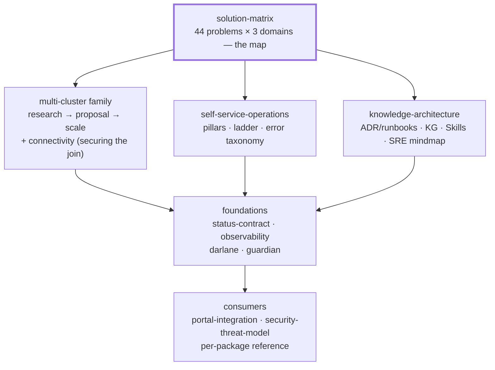

# API Reference

Per-resource API reference for every XRD published by W'xOps Core. Each doc
covers the Kind, group/version, and `spec.parameters` schema as defined in
`package/<name>/xrd.yaml`.

| Doc | Kind | Package |
|---|---|---|
| [gitea-user](gitea-user.md) | `XGiteaUser` | [`package/gitea-user/`](../package/gitea-user/) |
| [gitea-org](gitea-org.md) | `XGiteaOrg` | [`package/gitea-org/`](../package/gitea-org/) |
| [gitea-team](gitea-team.md) | `XGiteaTeam` | [`package/gitea-team/`](../package/gitea-team/) |
| [gitea-repository](gitea-repository.md) | `XGiteaRepository` | [`package/gitea-repository/`](../package/gitea-repository/) |
| [platform-database-clusters](platform-database-clusters.md) | `XPlatformDatabaseCluster` | [`package/platform-database-clusters/`](../package/platform-database-clusters/) |
| [tenant-database](tenant-database.md) | `XTenantDatabase` | [`package/tenant-database/`](../package/tenant-database/) |
| [tenant-app](tenant-app.md) | `XTenantApp` | [`package/tenant-app/`](../package/tenant-app/) |
| [random-password](random-password.md) | `XRandomPassword` | [`package/random-password/`](../package/random-password/) |

For package/API version history see [`VERSIONS.yaml`](../VERSIONS.yaml). For
release notes see [`CHANGELOG.md`](../CHANGELOG.md) (generated via `make
changelog`). For a single-page summary of every package's `status` fields —
the thing a portal integration binds to — see
[`status-contract.md`](status-contract.md).

## The map

How the library fits together — start at the matrix, descend to the layer you
need:

## Guides

| Doc | Description |
|---|---|
| [solution-matrix](solution-matrix.md) | **Start here for the big picture** — one matrix over AI Intelligence × Multi-Cluster × Observability: every problem, its tool, what current packages solve vs. what must be introduced, links to each detail doc, and the industry practice to study per row. |
| [app-onboarding](app-onboarding.md) | Golden path from picking a template to a running `tenant-app` — ties together the templates catalog, `gitea-repository`, and `tenant-app`. |
| [darlane](darlane.md) | In-cluster developer workspace — file sync, traffic mirroring (mirrord), A/B testing, SRE agent workflows, and the `XDarlane` XRD vision. |
| [guardian](guardian.md) | Guardian Framework vision — platform-injected scanning, audit, and AI code review sidecars for Darlane sessions. Long-term architecture document. |
| [multi-cluster](multi-cluster.md) | Hub-and-spoke multi-cluster architecture — control plane / identity / data plane layers, two adoptable reference architectures (Git-centric vs. ArgoCD hub-spoke with CAPI), and the migration path from today's single cluster. Design document. |
| [multi-cluster-proposal](multi-cluster-proposal.md) | The chosen path — CAPI + ArgoCD hub-spoke + structured authn, Pinniped narrowed to the human path, k8gb + ExternalDNS for multi-region routing, and a concrete prototype with exit criteria. Proposal, not implemented. |
| [multi-cluster-connectivity](multi-cluster-connectivity.md) | Securing the hub→spoke `kube-apiserver` connection — the five properties "secure" decomposes into, the three independent trust paths (Crossplane, ArgoCD, CAPI), and the join procedure for **new** CAPI clusters vs. **existing** ones (cloud workload identity, managed OIDC association, Vault-issued dynamic tokens), plus alternatives and five verification drills. Options analysis. |
| [multi-cluster-scale](multi-cluster-scale.md) | Beyond the prototype — the three scale axes (regions, tenancy tiers, heterogeneous hardware incl. arm64 edge and GPU pools), tooling per axis (Capsule/vCluster/Kamaji, k3s/KubeEdge/Talos, GSLB options), worked use cases incl. EV charging, and the verified XRD gaps each axis exposes. Research. |
| [self-service-operations](self-service-operations.md) | Breaking the infra-team troubleshooting bottleneck — the operability ladder, XR status as diagnosis graph, runbooks keyed to status shapes, AI diagnosis grounded on the platform's own contracts, and the agent→PR loop gated by the existing test suite. Research + direction. |
| [knowledge-architecture](knowledge-architecture.md) | The knowledge substrate under the SRE agent — document taxonomy (RFC/ADR/runbook/reference) mapped to existing artifacts, knowledge representations (RAG, knowledge graph, Agent Skills, memory tiers), golden incidents as agent evals, and the Darlane SRE-agent skill mindmap. Research + direction. |
| [portal-integration](portal-integration.md) | The consumer side of the API — screen-by-screen field map, three-state health cards, the gitea absent-vs-false code path, error-card → runbook wiring, and what the portal must never do. Reference for the portal team. |
| [security-threat-model](security-threat-model.md) | Assets, trust boundaries, threats mapped to existing mitigations (ADRs, invariants, Guardian), and the honest gap list — the content basis for SECURITY.md and the OSS-release review. |
| [observability](observability.md) | Two halves. **Part 1 (shipped)** — how `XTenantApp` exposes metrics: why Monitor CRDs replace `prometheus.io/*` annotations, ServiceMonitor vs PodMonitor, the four silent-failure requirements, cardinality guardrails. **Part 2 (options)** — collection at single-cluster / fleet / multi-cluster scale: the push-vs-pull topology fork, eight signal classes, the eBPF/kernel plane (flows + runtime security), a detailed tool matrix, the `externalLabels` contract, the cardinality ladder, and what an SRE agent needs beyond dashboards. |
| [status-contract](status-contract.md) | Every package's `status` fields on one page — what a portal integration polls, the absent-vs-`false` split, and the `tenant-app` dependenciesReady/darlane sub-status shape. |

## Contributing

| Doc | Description |
|---|---|
| [CONTRIBUTING](../CONTRIBUTING.md) | Setup, the change loop, commit conventions, and the full checklist for adding a new package — including the test cases it owes. |
| [tests/README](../tests/README.md) | Test harness — what the offline suite covers, how a case is structured, and what it cannot catch. |
| [CLAUDE.md](../CLAUDE.md) | Architecture, KCL conventions, the reference stack, and the working model. |

