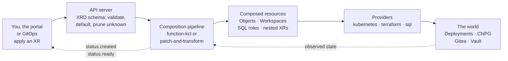

# API Reference — what you declare, what Core reconciles

> Every W'xOps Core API is a Crossplane composite resource (XR) in `platform.wxops.cloud/v1alpha1`,
> and every Kind is cluster-scoped. This page explains what the reconcile loop does for you and lists
> every Kind. Each Kind's own page has the full `spec.parameters` and `status` reference.

**Table of Contents**
- [The reconcile loop, from your side](#the-reconcile-loop-from-your-side)
- [What you can do with an XR](#what-you-can-do-with-an-xr)
- [Reading status](#reading-status)
- [Kinds](#kinds)
- [Schema, examples and versions](#schema-examples-and-versions)

---

## The reconcile loop, from your side

You never create the Deployment, the CloudNativePG cluster or the Terraform run yourself. You declare
one XR, and Crossplane does the rest, **continuously, not once**:
1. It validates the XR against the Kind's schema and fills in defaults.
2. It runs the Composition's function pipeline to decide which resources should exist.
3. Providers make the world match those resources.
4. It writes what it observed back into the XR's `status`.



Two consequences shape everything below:
- **The XR is the only thing you should edit.** Anything beneath it is re-rendered from the XR.
- **The schema is enforced before any of this runs.** A required field that is missing rejects the XR.
  A field the schema does not know is **silently dropped** by the API server: it is never stored and
  never reaches the composition.

## What you can do with an XR

| You want to | Do this | What Core does | Watch out |
|---|---|---|---|
| **Create** | `kubectl apply -f xr.yaml`, or let the portal or GitOps write it | Renders every resource the parameters ask for. `status.created` becomes true once each has been observed; `status.ready` once they are ready. | Check field names before applying (`kubectl explain`, below). A typo is not an error; the value just never arrives. |
| **Change** | Edit `spec.parameters` and re-apply | Re-renders, and patches the composed resources in place on the next reconcile | Turning an optional block off **deletes** what it created. For example, `darlane.enabled: false` deletes the twin Deployment. Treat names, namespaces and `cluster` as identity: changing them on a live XR does not move existing objects cleanly, so create a new XR instead. |
| **Rely on it staying as declared** | Nothing; this is the loop | A composed object that is edited or deleted by hand is put back on the provider's next reconcile | Change the XR, never the objects beneath it. See [portal integration](../user-guide/portal-integration.md#ground-rules). |
| **Watch progress** | `kubectl get <plural>`, `kubectl describe <kind> <name>`, `crossplane resource trace <kind> <name>` | Reports `status.created`, `status.ready` and the Kind's own fields. `trace` walks the tree from the XR to every composed resource. | Read `status.ready`, not the `Ready` condition: on Crossplane v2.3 with function-kcl v0.12.1 the condition is unreliable. `Synced: False` means Crossplane could not reconcile the XR at all; read its message first. |
| **Pause** | `kubectl annotate <kind> <name> crossplane.io/paused=true` | Stops checking or changing the resources behind the XR until the annotation is removed | Drift is not corrected while paused |
| **Stay on today's composition** | Set `spec.crossplane.compositionUpdatePolicy: Manual` | Keeps the XR on the composition revision it runs, even when a new package is installed | A pin is easy to forget — nothing reminds you it's there. See [Channels](../development/releasing.md#channels) for `stable`/`nightly` and why `Manual` is the recommended default. |
| **Delete** | `kubectl delete <kind> <name>` | Removes the resources it composed | Kinds that hold data decide what survives. `XTenantDatabase` keeps the database and its credentials unless `databaseReclaimPolicy: delete`, and Vault entries follow their own rules. Read the Kind's page before deleting. |

Discover a Kind's fields on a cluster where the package is installed:

```bash
kubectl explain xtenantapps.spec.parameters            # one level
kubectl explain xtenantapps.spec.parameters --recursive # the whole tree
```

## Reading status

Every published Kind exposes the same two fields, so a consumer can use the same polling logic for all
of them:

| Field | Meaning |
|---|---|
| `status.created` | Every composed resource has been observed in the cluster at least once |
| `status.ready` | Readiness derived from the observed composed resources, not from the `Ready` condition |

Three details catch integrations out:
- **The four Gitea Kinds leave both fields absent until the first apply.** Treat absent as not ready.
- **`XTenantApp` splits readiness.** `ready` covers the workload; `dependenciesReady` covers the TLS
  certificate.
- **Every Kind adds its own fields** (IDs, URLs, the resolved tier).

All of it is on one page: [status contract](status-contract.md).

## Kinds

| Kind | Package | You declare (key fields) | Core composes and keeps reconciled | Status beyond `created` and `ready` |
|---|---|---|---|---|
| [`XGiteaUser`](gitea-user.md) | `gitea-user` | `giteaUrl`, `username`, `email`, `admin`, `visibility`, `credentialsSecretRef` | A Terraform `Workspace` that manages the Gitea user and generates its password | `userId`, `username` |
| [`XGiteaOrg`](gitea-org.md) | `gitea-org` | `giteaUrl`, `orgName`, `visibility`, `description`, `credentialsSecretRef` | A Terraform `Workspace` that manages the organisation | `orgId`, `orgName` |
| [`XGiteaTeam`](gitea-team.md) | `gitea-team` | `orgName`, `teamName`, `permission`, `units`, `members`, `credentialsSecretRef` | A Terraform `Workspace` that manages the team and its membership | `teamId`, `teamName` |
| [`XGiteaRepository`](gitea-repository.md) | `gitea-repository` | `orgName`, `repoName`, `private`, `autoInit`, `defaultBranch`, `credentialsSecretRef` | A Terraform `Workspace` that manages the repository | `repoId`, `cloneUrl`, `sshUrl`, `htmlUrl` |
| [`XPlatformDatabaseCluster`](platform-database-clusters.md) | `platform-database-clusters` | `clusterName`, `namespace`, `instances`, `postgresVersion`, `storageSize`, `shared`, `environment`, plus pooler, backup, replica and managed-role blocks | CloudNativePG `Cluster`, RW and RO `Pooler`s, `ScheduledBackup`, generated credentials pushed to Vault (`Password`, `ExternalSecret`, `PushSecret`), and a provider-sql `ProviderConfig` | `clusterName`, `namespace`, `shared`, `environment` |
| [`XTenantDatabase`](tenant-database.md) | `tenant-database` | `tier` (`shared` or `dedicated`), `environment`, `dbName`, `owner`, `extensions`, `databaseReclaimPolicy` | On a discovered shared cluster, or a dedicated `XPlatformDatabaseCluster` it creates: a CNPG `Database`, a provider-sql `Role`, a generated password with a connection-creds `ExternalSecret`, and a `PushSecret` to Vault | `clusterRef`, `clusterNamespace`, `tier`, `dbName` |
| [`XTenantApp`](tenant-app.md) | `tenant-app` | `appName`, `namespace`, `image`, `replicas`, `resources`, `env`/`secretsFrom`, `volumes`, `service`, `probes`, `ingress` (TLS, SSO), `monitoring`, `darlane` | `Deployment`, `Service`, `ServiceAccount`, PVCs, cert-manager `Certificate`, Traefik `IngressRoute`/`TraefikService`, `ServiceMonitor`/`PodMonitor`, and the Darlane twin `Deployment` with its Services | `dependenciesReady`, `url`, `namespace`, `image`, `darlane.*` |
| [`XRandomPassword`](random-password.md) | `random-password` (utility, not published) | `length`, `special`, `overrideSpecial` | A Terraform `Workspace` that generates a random password | No status fields |

Each composed resource appears only when its parameters ask for it. The *Composed resources* list at
the top of each `kcl/<package>/main.k` records the exact condition for every one.

## Schema, examples and versions

| You need | Where |
|---|---|
| The schema itself | `package/<package>/xrd.yaml` |
| A minimal working XR | `examples/<package>/` |
| Every branch exercised, with rendered output | `tests/cases/<package>/` |
| Which API versions each Kind serves | [`VERSIONS.yaml`](../../VERSIONS.yaml) |
| What may change in a released API | [A released XRD only grows](../development/releasing.md#a-released-xrd-only-grows) |
| How a portal should consume all of this | [Portal integration](../user-guide/portal-integration.md) |
