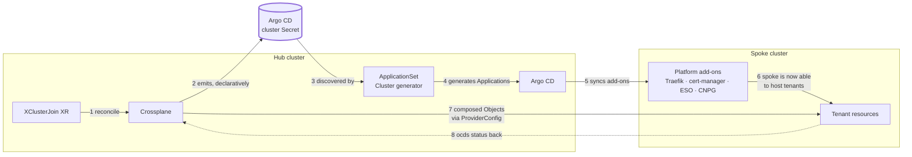
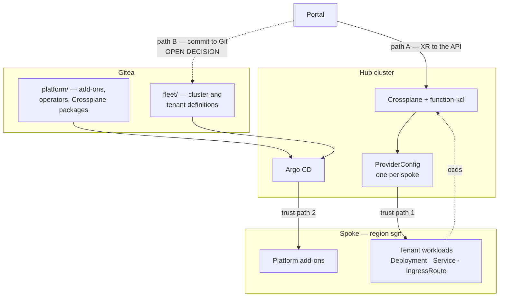
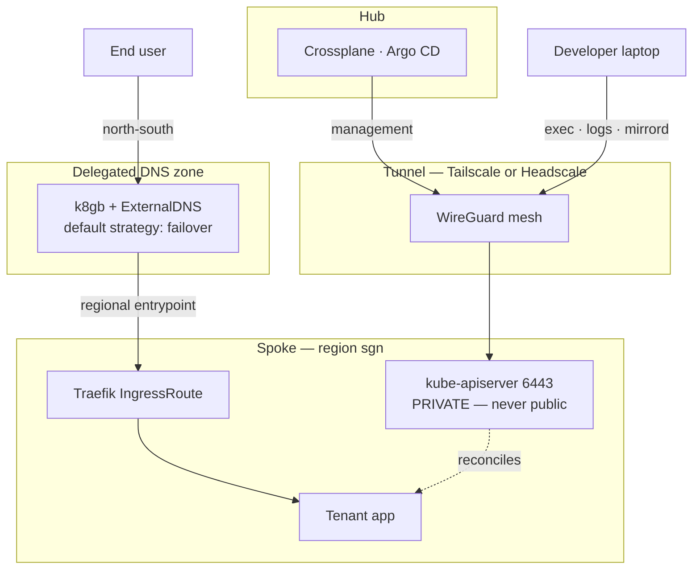
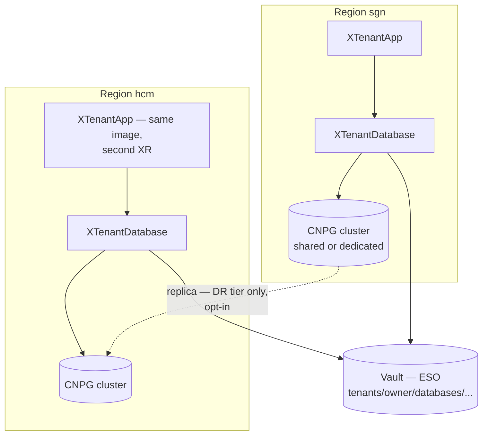
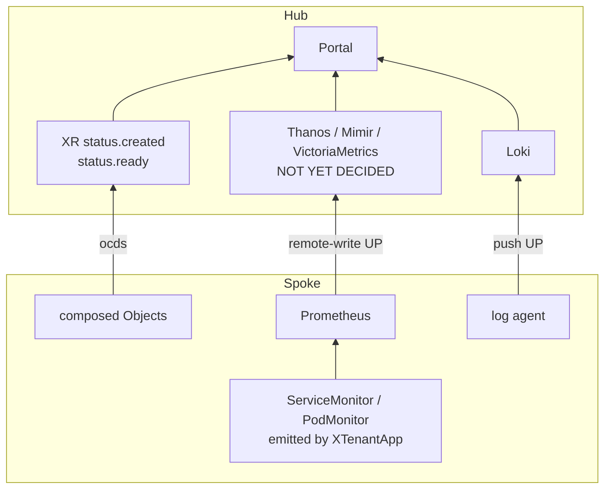

# Hub→Spoke API Connectivity — securing the join, for new and existing clusters

> **Status: options analysis, nothing implemented.** The other three multi-cluster documents answer
> *which architecture* ([multi-cluster.md](multi-cluster.md) surveys, [multi-cluster-proposal.md](multi-cluster-proposal.md)
> prescribes) and *how far it stretches* ([multi-cluster-scale.md](multi-cluster-scale.md)). This one answers a
> narrower question they only touch in passing: **when the hub opens a connection to a spoke's
> `kube-apiserver`, what exactly makes that connection safe — and how does the answer change when the
> spoke is a cluster you did not create?**
>
> That last clause is the reason this document exists separately. The proposal assumes CAPI-provisioned
> spokes and inherits apiserver flag control from that assumption. Every real fleet eventually absorbs a
> cluster it did not provision, and at that moment the proposal's machine-identity answer is unavailable.

---

**Table of contents**
- [What "secure" actually decomposes into](#what-secure-actually-decomposes-into)
- [The three trust paths (the thing most designs miss)](#the-three-trust-paths-the-thing-most-designs-miss)
- [How Argo CD and Crossplane combine — natively, across four planes](#how-argo-cd-and-crossplane-combine--natively-across-four-planes)
  - [The loop that makes it native](#the-loop-that-makes-it-native-rather-than-glued) ·
    [Control](#control-plane) · [Network](#network-plane) · [Data](#data-plane) ·
    [Observability](#observability-plane)
- [The fork that decides everything: who controls the apiserver](#the-fork-that-decides-everything-who-controls-the-apiserver)
- [Path N — new clusters, provisioned by CAPI](#path-n--new-clusters-provisioned-by-capi)
- [Path E — existing clusters](#path-e--existing-clusters)
- [Packaging the join — provision and enroll are different problems](#packaging-the-join--provision-and-enroll-are-different-problems)
- [Where ArgoCD, Pinniped and CAPI actually combine](#where-argocd-pinniped-and-capi-actually-combine)
- [Reachability and serving-certificate trust](#reachability-and-serving-certificate-trust)
- [Alternatives worth exploring deeply](#alternatives-worth-exploring-deeply)
- [Proving it — five drills](#proving-it--five-drills)
- [Open questions](#open-questions)

---

## What "secure" actually decomposes into

"Secure the hub→spoke connection" is five separate properties wearing one coat. They fail
independently, and a design can be excellent at one while silently absent on another.

| | Property | The question it answers | Fails as |
|---|---|---|---|
| **P1** | **Authentication** | How does the spoke know this caller is the hub? | Forged or replayed credential |
| **P2** | **Authorization** | What may that identity do once authenticated? | A 15-minute credential that maps to `cluster-admin` |
| **P3** | **Transport & server trust** | Is the endpoint reachable, and is it really the spoke? | MITM, or a silent outage when the spoke's CA rotates |
| **P4** | **Credential lifetime** | How long is a stolen credential useful? | Standing tokens that outlive the laptop they leaked from |
| **P5** | **Revocation & attribution** | Can you cut off one spoke, and does the audit log name the caller? | Every action logged as "the platform" |

Two observations that shape the rest of this document.

**Most published designs argue P1 and P4 and go quiet on P5.** The industry conversation about
multi-cluster auth is overwhelmingly about eliminating standing tokens — which is P4 — and
short-lived credentials genuinely are better. But a short-lived credential that still maps to one
shared `wxops:hub-controllers` identity gives a spoke audit log that cannot distinguish Crossplane
reconciling a `tenant-app` from ArgoCD syncing an Application from an operator debugging by hand.
For W'xOps that matters more than usual, because [`guardian.md`](guardian.md)'s entire audit
premise and [`self-service-operations.md`](self-service-operations.md)'s diagnosis story both
assume the platform can say *who did what, where*.

**P2 is where W'xOps is unusually well positioned, and it is free.** The spoke-side ClusterRole is
not a design exercise —
[`providers/rbac-provider-kubernetes.yaml`](../../providers/rbac-provider-kubernetes.yaml) already
enumerates exactly the API groups compositions emit, because the single-cluster deployment needed
the same list. Copying that file to a spoke produces a correctly scoped grant on the first try,
including its deliberate omission of `rbac.authorization.k8s.io`. That omission is mechanically
protected by the `no-rbac-emitted` invariant in `tests/invariants.py`, so the property "the hub
cannot mint privilege on any spoke" is enforced by the merge gate rather than by reviewer memory —
see [`security-threat-model.md`](security-threat-model.md) B3. Very little of a multi-cluster
security posture is normally this cheap; this part is, and it should be claimed rather than
redesigned.

---

## The three trust paths (the thing most designs miss)

A hub does not have *a* connection to a spoke. In the architecture the proposal selects, it has up
to three, established by different components, using different credential mechanisms, and hardened
independently. Securing one and not the others buys nothing — the attacker uses whichever is
weakest.

```
                          ┌──────────────── HUB ────────────────┐
                          │                                     │
   ①  Crossplane ─────────┤ provider-kubernetes                 │
      composed Objects    │   ProviderConfig.spec.credentials   │
                          │   (+ optional .spec.identity)       │
                          │                                     │
   ②  ArgoCD ─────────────┤ cluster Secret                      │
      Applications        │   bearerToken | execProviderConfig  │
                          │                                     │
   ③  CAPI ───────────────┤ <cluster>-kubeconfig Secret         │
      lifecycle           │   ** cluster-admin, by construction **│
                          └──────────────────┬──────────────────┘
                                             │
                                             ▼
                                   spoke kube-apiserver
```

| Path | Owner | Credential mechanism | Hardened by |
|---|---|---|---|
| ① Composed resources | provider-kubernetes | `ProviderConfig.spec.credentials` (`Secret`/`InjectedIdentity`/`Filesystem`/`Environment`), optionally supplemented by `spec.identity` | This document, Path N or E |
| ② GitOps delivery | ArgoCD | cluster Secret: inline `bearerToken`, or `execProviderConfig` | [multi-cluster.md §A2](multi-cluster.md#option-a2--push-with-brokered-just-in-time-credentials) |
| ③ Cluster lifecycle | CAPI | `<cluster>-kubeconfig` Secret, minted from the spoke CA at bootstrap | Not hardenable — only *accepted* or *split* ([§CAPI trust root](multi-cluster.md#the-capi-trust-root-problem)) |

### The constraint that stops you sharing one mechanism across ① and ②

The natural instinct is one credential mechanism for the whole hub. The CRDs do not permit it, and
the difference is worth stating precisely because it is easy to design past.

**ArgoCD's cluster Secret** takes `bearerToken` as inline static text — there is no
`bearerTokenFile` — which is why a rotating, per-audience projected token cannot be expressed
there, and why `execProviderConfig` is required even in designs with no broker at all. That
analysis is already written up in [multi-cluster.md
§A2](multi-cluster.md#why-an-exec-plugin-is-needed-even-without-a-broker).

**provider-kubernetes has no equivalent escape hatch.** Its `ProviderConfig.spec.identity.type` is
a closed enum — `GoogleApplicationCredentials`, `AzureServicePrincipalCredentials`,
`AzureWorkloadIdentityCredentials`, `AWSWebIdentityCredentials`, `UpboundTokens`,
`NebiusServiceAccountCredentials` — with **no generic exec or command type**. The CRD describes
`identity` as supplementing the kubeconfig, "for example by configuring a bearer token source such
as OAuth", while `credentials` supplies the kubeconfig itself (endpoint and CA).

Two consequences:

1. **For managed spokes this is a gift** — those enum values are exactly cloud workload identity, so
   path ① has a first-class no-standing-credential option that needs no broker and no custom binary.
   See [Path E1](#e1--managed-spokes-cloud-workload-identity-the-best-brownfield-answer).
2. **For self-managed spokes it is a gap.** There is no enum value meaning "run this plugin". The
   remaining option is a kubeconfig whose `users[].user.exec` block invokes a binary that must exist
   inside the provider pod — which is standard client-go behaviour but has not been verified against
   provider-kubernetes v1.2.1's client construction. **Treat this as a prototype spike, not an
   assumption**; the proposal's item 4 ("per-spoke `ProviderConfig`, credentials via projected-token
   exec form") rests on it, and if it fails, path ① falls back to a Vault-issued short-TTL token
   ([E3](#e3--scoped-serviceaccount-tokens-made-dynamic-the-honest-stopgap)).

### One more W'xOps-specific control on path ①

Since v0.4.0 the target cluster is `spec.parameters.cluster`, threaded to `providerConfigRef` at
30 sites. That makes the **`ProviderConfig` name a security boundary**: a typo does not fail
closed, it silently resolves to a different `ProviderConfig` or lands tenant resources on the hub.
Validating `cluster` at the XRD boundary — an `enum` of known clusters, or a
`x-kubernetes-validations` CEL rule — is therefore an access control, not an ergonomics nicety,
and belongs in the same review as the credential work.

---

## How Argo CD and Crossplane combine — natively, across four planes

"Argo CD or Crossplane?" is the same category error as "CAPI or Crossplane", and worth dismantling
once because the answer is the architecture. They are not alternatives:

- **Crossplane is the tenant-facing API.** It turns a request — one XR — into resources, with
  per-tenant parameters, and reports back through XR status.
- **Argo CD is the platform delivery engine.** It turns Git into cluster state, identically on every
  cluster, with drift detection and history.

The boundary that keeps them from overlapping is a single rule: **if it is identical on every
cluster, it belongs to Argo CD; if it is parameterised per tenant, it belongs to Crossplane.**
Traefik, cert-manager, ESO, CNPG's *operator* and the Crossplane packages themselves are Argo CD's.
A tenant's `Deployment`, `IngressRoute`, `Certificate`, `ExternalSecret` and CNPG `Cluster` are
Crossplane's.

### The loop that makes it native rather than glued

The combination is not two tools pointed at the same clusters. Each produces the input the other
consumes, which closes into a single self-extending loop — and it is the reason cluster registration
needs no third-party glue:



Step 2 is the hinge. Because a composition emits the Argo CD cluster Secret, **registration is a
reconciled resource rather than an operator action** — which is what turns "never run
`argocd cluster add`" from a rule people must remember into something the system cannot easily do
wrong. Step 3 then means adding a cluster requires no change to any `ApplicationSet`: the generator
discovers it.

### The four planes

| Plane | The question it answers | Argo CD's job | Crossplane's job | State today |
|---|---|---|---|---|
| **Control** | What should exist, and who makes it so? | Platform state from Git, on every cluster | Tenant state from XRs, per cluster via `providerConfigRef` | ✅ single-cluster; ❌ no spoke yet |
| **Network** | Can it be reached — by the hub, and by users? | Delivers the tunnel client and k8gb charts | Emits per-tenant `IngressRoute`, and a future `ingress.gslb` block | ❌ tunnel and GSLB both unbuilt |
| **Data** | Where does tenant state live, and what crosses a region? | Delivers the CNPG operator | Composes `XTenantDatabase` → CNPG `Cluster`/`Database`, Vault paths via ESO | ✅ single-cluster; region dimension undecided |
| **Observability** | Did it actually work? | Delivers kube-prometheus-stack, Loki agents | Emits `ServiceMonitor`/`PodMonitor`; publishes `status.created`/`ready` | ✅ per-cluster (v0.4.0); ❌ no fleet aggregation |

**Identity is not a fifth plane — it cuts across all four**, and it is what the rest of this
document specifies. P1–P5 apply to the control plane's two trust paths, to the network plane's
tunnel, and to the human path into any of them.

> **Terminology reconciliation — read this before cross-referencing.**
> [`multi-cluster.md`](multi-cluster.md#the-distinction-that-decides-everything) uses a three-layer
> model, and the words do **not** map one-to-one onto the planes above:
>
> | Here | There | Relationship |
> |---|---|---|
> | Control plane | **Layer 1 — control plane** | Same thing |
> | Identity (cross-cutting) | **Layer 2 — identity** | Same thing, promoted to cross-cutting |
> | Network plane | *(no equivalent)* | New — covers hub→spoke reachability (P3) and user→app GSLB |
> | Data plane | **⚠ NOT Layer 3** | Layer 3 there means *cross-cluster pod-to-pod service mesh*, which stays deferred. "Data plane" here means where tenant state lives and what crosses a region boundary. |
>
> When in doubt, cite the layer numbers for connectivity arguments and the plane names for
> architecture presentation.

### Control plane

Two independent delivery paths reach the same spoke — trust paths ① and ② from
[above](#the-three-trust-paths-the-thing-most-designs-miss), which is exactly why both must be
hardened:



The dotted **path B** is a genuinely open decision — *Portal → Git vs. Portal → API*, tracked in
`ROADMAP.md`'s open-decisions table. Both work with this architecture; path A gives immediate
status, path B gives a Git audit trail for tenant intent. Nothing in this document depends on which
wins.

### Network plane

Two directions that are easy to conflate. Management traffic runs hub→spoke and is what this
document secures; user traffic runs north-south into a region and never touches the hub:



The arrow into `API` shows traffic direction *after* the tunnel exists; the tunnel itself is
established by the spoke dialling **outbound**, which is what keeps 6443 unexposed. That property
is the strongest thing this shape buys — and it is P3 only. The hub still presents a credential
through the tunnel, and the spoke still authenticates and authorises it.

### Data plane

The default is **region-pinned**: an app talks to a database in its own region, and nothing crosses
a region boundary unless a tier explicitly opts in.



Two rules this diagram encodes. **One XR targets one cluster** — running in two regions is two XRs,
never composition-side fan-out. And **the Vault path has no cluster segment today**, which is the
open decision that must be settled before a second spoke writes a colliding `remoteKey`.

### Observability plane

Everything reports **up**. Nothing on the hub queries down into a spoke on a user's critical path —
the same rule the edge-fleet guidance states, and the reason a hub outage degrades visibility rather
than availability:



The left branch is the one already working: `Object` status flows to `status.ready` regardless of
which cluster the resource landed on, so **the portal's polling contract survives multi-cluster
unchanged** — the single largest thing v0.4.0 bought for this architecture. The right branch is
unbuilt and is a platform-infrastructure decision, not a package change.

For these same components viewed through the P1–P5 security lens rather than the architecture lens,
see [Where ArgoCD, Pinniped and CAPI actually combine](#where-argocd-pinniped-and-capi-actually-combine).

---

## The fork that decides everything: who controls the apiserver

Every machine-identity option below reduces to one question, and it is not "cloud or on-prem" or
"new or old" — it is **can you set `--authentication-config` on that apiserver?**

| Spoke kind | Apiserver flags? | Machine-path answer | Standing secret on hub? |
|---|---|---|---|
| **New, CAPI-provisioned** | ✅ via `KubeadmControlPlane` | Structured authn, trusting the hub's SA issuer | No |
| **Existing, self-managed** (kubeadm, k3s, Talos, RKE2) | ✅ but requires a control-plane change on a live cluster | Structured authn, retrofitted | No |
| **Existing, managed** (EKS/GKE/AKS) | ❌ never | Cloud workload identity, or managed OIDC association, or Pinniped Concierge | Depends — see E1/E2 |
| **Existing, opaque** (someone else's cluster, no admin) | ❌ | Scoped SA token, made dynamic via Vault | Yes, one, short-lived |

Note the second row: an existing self-managed cluster is *not* automatically a brownfield problem.
If you can edit the static pod manifest or the k3s server flags and restart the control plane, it
becomes a Path N cluster with a maintenance window attached. The genuinely constrained case is
managed and opaque clusters.

---

## Path N — new clusters, provisioned by CAPI

This is the proposal's path, stated here as an enrollment procedure rather than an architecture,
because the ordering has a trap in it.

### The apiserver side, baked in at provision time

CAPI's control over `KubeadmControlPlane` means the trust relationship is declared before the
cluster first boots, so there is never a window in which the spoke exists without it:

```yaml
apiVersion: controlplane.cluster.x-k8s.io/v1beta1
kind: KubeadmControlPlane
spec:
  kubeadmConfigSpec:
    files:
      - path: /etc/kubernetes/authn.yaml
        permissions: "0600"
        content: |
          apiVersion: apiserver.config.k8s.io/v1beta1   # v1 once the spoke is on K8s ≥1.35
          kind: AuthenticationConfiguration
          jwt:
            - issuer:
                url: https://hub.wxops.cloud
                audiences: ["spoke-prod-sgn"]           # ← per-spoke, never shared
              claimMappings:
                username:
                  expression: '"hub:" + claims.sub'
                groups:
                  expression: '["wxops:hub-controllers"]'
              claimValidationRules:
                - expression: 'claims.sub == "system:serviceaccount:crossplane-system:provider-kubernetes-runtime"'
                  message: only provider-kubernetes-runtime may authenticate as a hub controller
    clusterConfiguration:
      apiServer:
        extraArgs:
          authentication-config: /etc/kubernetes/authn.yaml
```

Three details carry most of the security value:

- **`audiences` is per-spoke.** A shared audience means a token minted for one spoke replays against
  every other. This single line is the difference between "short-lived credential" and "short-lived
  fleet-wide credential", and it is the reason ArgoCD needs `execProviderConfig` rather than an
  inline token (see above).
- **`claimValidationRules` pins the exact ServiceAccount**, so trusting the hub's issuer does not
  trust *every* workload on the hub. Without it, any pod on the hub that can mint a token for that
  audience authenticates as a hub controller. Note the subject above matches this repo's fixed
  `provider-kubernetes-runtime` ServiceAccount, established in
  [`providers/runtimeconfig-provider-kubernetes.yaml`](../../providers/) precisely so the name is
  stable and not package-hash-derived — that decision pays off here.
- **`groups` is a constant, not a claim passthrough.** The spoke decides what group the hub lands in;
  the hub does not get to assert it.

Then bind `wxops:hub-controllers` to the scoped ClusterRole — the copy of
`rbac-provider-kubernetes.yaml` — via `ClusterResourceSet`, which is where P2 gets satisfied.

### Enrollment order, and the chicken-and-egg

```
1. Hub publishes its SA issuer discovery documents        ← do this ONCE, before any spoke
     /.well-known/openid-configuration  +  JWKS
2. CAPI creates the spoke, apiserver boots already trusting the hub issuer
3. ClusterResourceSet lands: CNI, scoped ClusterRole + ClusterRoleBinding,
     Pinniped Concierge (human path), Traefik/cert-manager/ESO/CNPG
4. Hub mints a projected token, audience = <spoke>            ← per-spoke volume or broker
5. ProviderConfig named <spoke> created on the hub
6. ArgoCD cluster Secret written declaratively (execProviderConfig form)
7. First XR with cluster: <spoke> applied — end to end
```

**Step 1 is the real work item and it is easy to under-scope.** Structured authn requires the
spoke to fetch the hub's OIDC discovery document and JWKS. On a private hub those two endpoints
must be published or mirrored somewhere every spoke can reach, which is a small piece of
public-facing infrastructure with its own availability and rotation story. It is also a hard
dependency at spoke *boot*, not just at first sync — a spoke that cannot reach the JWKS cannot
authenticate the hub at all.

**Steps 3 and 4 are the chicken-and-egg.** The `ClusterRoleBinding` that makes the hub's identity
useful must reach the spoke *before* the hub can authenticate to it. `ClusterResourceSet` resolves
this cleanly because CAPI applies it with the bootstrap kubeconfig, not the hub's scoped identity
— which is also a precise restatement of why trust path ③ cannot be eliminated on this path, only
contained.

---

## Path E — existing clusters

Ordered by preference. E1 is genuinely good, E2 is good with caveats, E3 is a stopgap that can be
made respectable.

### E1 — managed spokes: cloud workload identity (the best brownfield answer)

This is the finding that most changes the picture for existing clusters, and it is not mentioned
in the other multi-cluster documents.

`provider-kubernetes`'s `ProviderConfig.spec.identity` accepts `AWSWebIdentityCredentials`,
`GoogleApplicationCredentials`, and `AzureWorkloadIdentityCredentials` — supplementing a
kubeconfig that carries only the endpoint and CA. So for a managed spoke, trust path ① has a
**built-in, no-standing-credential mechanism that requires no broker, no custom binary, and no
apiserver access**:

```
ProviderConfig (spoke-prod-eks)
├── spec.credentials  →  kubeconfig with server + CA only, NO token
└── spec.identity     →  AWSWebIdentityCredentials
                            ↓
                      hub SA projected token → STS AssumeRoleWithWebIdentity
                            ↓
                      IAM role → EKS access entry → K8s group
                            ↓
                      scoped ClusterRole on the spoke
```

The credential is minted per call by the cloud provider, the root of trust is the cloud IAM system
rather than anything the hub stores, and authorization still lands on the same scoped ClusterRole
— so P1, P2 and P4 are all satisfied without W'xOps operating any of the machinery. This is
[multi-cluster.md §A2](multi-cluster.md#option-a2--push-with-brokered-just-in-time-credentials)'s
broker implementation **(c)** — the one it rates ✅ — arriving for free on path ① because the
provider implements it natively.

Caveats worth carrying:

- It solves path ① only. ArgoCD still needs its own answer for path ②, which for EKS is the vendor
  plugin (`aws eks get-token`) via `execProviderConfig` — a different mechanism reaching the same
  IAM root. Two mechanisms, one trust root, and that is the best available outcome here.
- The authorization mapping is cloud-specific: EKS access entries (or the legacy `aws-auth` ConfigMap),
  GKE IAM plus RBAC, AKS Entra ID role assignments. Budget for learning one per cloud.
- It ties the platform to that cloud's IAM. For a fleet spanning providers, each cloud is a separate
  integration; there is no portable version of E1.

### E2 — managed OIDC association: structured-authn-shaped, without the flags

Where the cloud lets you register an external OIDC issuer, you can get close to Path N's shape on
a cluster you cannot flag.

| Platform | Mechanism | Reality check |
|---|---|---|
| **EKS** | `AssociateIdentityProviderConfig` — up to 10 external OIDC providers per cluster | **The issuer URL must be *publicly* reachable** so EKS can fetch signing keys — a stronger constraint than structured authn's "reachable from the spoke". Association is a cluster update taking minutes. |
| **GKE** | GKE Identity Service — `ClientConfig` CRD, multiple OIDC/LDAP/SAML | A GKE Enterprise capability; confirm entitlement before designing on it. |
| **AKS** | Entra ID integration | Arbitrary third-party OIDC issuers are not the supported path; expect to use Entra, i.e. fall back to E1. |
| **Anything else** | **Pinniped Concierge** `JWTAuthenticator` | The portable substitute. This is Concierge's actual reason to exist, and the one place in this document where Pinniped is the right answer for machines. |

That last row deserves emphasis because it inverts the proposal's stance without contradicting it.
The proposal narrows Pinniped to the human path — correctly, **for CAPI spokes**, where structured
authn already provides everything Concierge would. On an opaque or managed spoke that reasoning
simply does not apply, and Concierge becomes the machine-path answer too. The proposal already
anticipates this ("the design degrades gracefully; nothing to pre-build"); this document is where
the degraded mode gets its specification.

The cost, unchanged from
[multi-cluster.md](multi-cluster.md#pinnipeds-supported-cicd-flow-and-what-it-costs): the
`cli_password` flow needs an IdP supporting password grant, which **Gitea cannot provide** — the
same OAuth 2.0 limitation that makes Pinniped exclude `GitHubIdentityProvider`. Adding a
password-grant-capable IdentityProvider to the *same* `FederationDomain` is the documented fix,
not a second Pinniped deployment.

**Dex closes this gap concretely.** Dex supports the resource-owner password grant when configured
with `oauth2.grantTypes: ["password"]` plus a `passwordConnector` (and `enablePasswordDB` with
static or gRPC-managed users). So a stack running Dex in front of Gitea already has the missing
piece: Gitea keeps the `authorization_code` human path, Dex supplies the password-grant machine
path, and both register against one `FederationDomain` as distinct Kubernetes groups. Two caveats
worth carrying — Dex's own documentation discourages password grant for production
service-to-service auth, and the credential is still standing, so this is E2's fallback for
*managed* spokes rather than a reason to prefer it over [E1](#e1--managed-spokes-cloud-workload-identity-the-best-brownfield-answer)
or [Path N](#path-n--new-clusters-provisioned-by-capi).

### E3 — scoped ServiceAccount tokens, made dynamic (the honest stopgap)

When none of the above is available — someone else's cluster, admin access limited to "here is a
kubeconfig" — the answer is a scoped ServiceAccount, and the goal shifts from eliminating the
standing credential to **bounding it**.

Plain long-lived SA tokens are the thing every other option exists to avoid. But Vault's
Kubernetes secrets engine turns them into dynamic secrets: it generates SA tokens (and optionally
the ServiceAccount, Role and RoleBinding) against a configured role, with `token_default_ttl` /
`token_max_ttl`, and revokes them automatically when the Vault lease expires. Objects Vault
created are deleted on expiry.

That is a genuinely different security posture from a static token — P4 becomes "minutes", P5
becomes "revoke the lease" — and W'xOps already runs Vault as the platform secret store with ESO
materialising Secrets, so the operational surface is one new secrets engine rather than a new
system. The residual is real and should be stated plainly: Vault now holds a credential that can
mint spoke access, so the blast radius moves to Vault, and Vault must be at least as well
protected as the fleet it fronts.

**Do not skip the scoping** because the token is short-lived. A 10-minute `cluster-admin` is still
`cluster-admin` for 10 minutes — the same point made about brokered credentials in
[multi-cluster.md §Mandatory hardening](multi-cluster.md#mandatory-hardening) item 9.

### Summary — brownfield decision table

| Situation | Path ① (Crossplane) | Path ② (ArgoCD) | Standing secret |
|---|---|---|---|
| EKS/GKE/AKS with cloud IAM available | `spec.identity` cloud type (**E1**) | vendor exec plugin | None |
| Managed, external OIDC allowed | Hub-issued JWT via association (**E2**) | `execProviderConfig` | None |
| Managed/opaque, no OIDC, no IAM | Vault-issued short-TTL SA token (**E3**) | same token | One, in Vault, TTL-bounded |
| Self-managed, control-plane change possible | Retrofit structured authn → **Path N** | `execProviderConfig` | None |
| Untrusted network, no inbound path | — switch delivery model entirely: OCM `ManifestWork` or Git-pull ([Arch 1](multi-cluster.md#reference-architecture-1--git-centric)) | — | None |

That last row is the escape hatch worth remembering: **for a spoke where none of P1–P5 can be
satisfied acceptably, the answer is not a better credential — it is to stop pushing.** A
pull-based delivery model removes the hub→spoke connection instead of securing it, which is why
OCM stays the planned second step rather than a rejected option.

---

## Packaging the join — provision and enroll are different problems

Everything above describes *what* must be true for a spoke to be safely reachable. A separate
question is *what runs those steps*, and it is where the CAPI-versus-Crossplane debate usually goes
wrong.

The useful decomposition is that joining a cluster has two halves with very different properties:

| | **Provision** | **Enroll** |
|---|---|---|
| What it does | Machines exist, control plane runs, cluster is healthy | Cluster becomes reachable and trusted by the hub |
| New vs existing cluster | **Entirely different** — skipped outright for an existing cluster | **Identical** — an adopted cluster and a fresh one need the same steps |
| Day-2 burden | Heavy: rolling upgrades, machine health, etcd membership | Light: credential rotation, CA refresh |
| Failure mode | Cluster is broken | Cluster is fine but invisible |
| Natural owner | CAPI, or the cloud, or Terraform | **A composition** |

**Enroll is the half worth packaging first, and it is genuinely well-suited to a Crossplane
composition.** Its steps are the same regardless of how the cluster came to exist, which is exactly
the property that makes an abstraction pay: one XR handles a cluster you just provisioned and a
cluster that has been running for two years, with the provisioning step simply absent in the second
case. Concretely, an enrollment composition emits:

| Emitted | Serves | Notes |
|---|---|---|
| Tunnel client (via `provider-helm` or a wrapped `Object`) | P3 | Subject to the [Headscale caveat](#-the-headscale-caveat--verify-before-designing-on-it) |
| Scoped `ClusterRole` + `ClusterRoleBinding` on the spoke | P2 | The copy of `rbac-provider-kubernetes.yaml`; **note this is the one place the platform legitimately emits RBAC — onto a spoke, from outside a tenant composition** — see the caveat below |
| ArgoCD cluster `Secret`, declaratively | P1 on path ② | This is how "never `argocd cluster add`" becomes mechanical rather than a rule people remember |
| `ProviderConfig` named for the cluster | P1 on path ① | Closes the loop with `spec.parameters.cluster`, already threaded since v0.4.0 |
| Identity config (spoke `AuthenticationConfiguration`, or Concierge `JWTAuthenticator`) | P1 | The Path N / Path E fork lives here as a conditional branch |

That list is a strong argument, and it is worth stating plainly: **the enrollment package removes
the main way this design gets compromised in practice, which is a human performing steps 1–5 by
hand and quietly taking the convenient shortcut on one of them.**

> **The RBAC caveat is not a technicality.** `ROADMAP.md` §Decided and rejected forbids compositions
> from emitting RBAC, and the `no-rbac-emitted` invariant enforces it. An enrollment composition
> emitting a spoke `ClusterRole` either needs that invariant scoped to tenant-facing packages only,
> or the grant must be delivered by `ClusterResourceSet`/GitOps instead. **Decide this before
> writing the package, not during review** — the rejection's reasoning (provider-kubernetes holding
> RBAC write is a privilege-escalation vector) applies with *more* force across a cluster boundary,
> not less.

### The category error worth avoiding

Comparing "CAPI vs OCM vs Crossplane Compositions" as three options for the same job produces
confident conclusions from a false premise. They are not peers:

- **CAPI is provisioning and node lifecycle.** It has nothing to say about tunnels, OIDC federation,
  or ArgoCD registration — not because it is weak there, but because that is not its scope.
- **OCM is delivery and fleet governance.** Its registration handshake happens to solve enrollment,
  which is why it looks like a competitor.
- **A Crossplane composition is an API layer.** It is defined by what it composes, and it can
  compose CAPI objects.

The consequence that matters: **"we want a clean `XCluster` API" is not an argument against CAPI**,
because the XRD sits *above* whatever the composition emits. You get the custom domain API either
way. The real question is narrower and more answerable — *what does the provisioning half of
`XCluster` compose?* CAPI `Cluster`/`MachineDeployment` objects, a `provider-terraform` `Workspace`,
or nothing at all for an adopted cluster.

### The three-way comparison, corrected

With that premise fixed, the comparison is still worth keeping — it is the right set of dimensions,
and it is the table to expand as the design firms up. Rows marked **⟳** are where the original
framing changed under verification; the last three rows were missing and are the ones that most
affect the answer.

| Dimension | **CAPI** | **OCM** | **Crossplane Compositions** |
|---|---|---|---|
| Primary scope | Declarative infra & node lifecycle | Fleet governance, placement, policy | **API abstraction** — composes the other two rather than replacing them ⟳ |
| Adopting existing clusters | ❌ No supported import path | ✅ `klusterlet` registers any cluster | ✅ Uniform: enroll step is identical for new and existing |
| Tunnel / overlay setup | ❌ Out of scope | ⚠️ `cluster-proxy` addon, hub-only (not laptops) | ✅ Composes a tunnel chart — **subject to the [Headscale caveat](#-the-headscale-caveat--verify-before-designing-on-it)** ⟳ |
| Spoke footprint | ~zero (providers run on the hub, not the spoke) ⟳ | `klusterlet` registration + work agents | A tunnel client — lighter than a klusterlet, **not zero** ⟳ |
| GitOps integration | Needs glue to register cluster Secrets | ✅ Composes with ArgoCD via `argocd-pull-integration`; does **not** replace it ⟳ | ✅ Emits the ArgoCD cluster Secret directly |
| IDP API control | — not an API layer; irrelevant to the comparison ⟳ | — same ⟳ | ✅ 100% custom (`XCluster`) — but **available above CAPI too**, so not a differentiator against it ⟳ |
| **Day-2 node lifecycle** | ✅ Rolling upgrades, `MachineHealthCheck`, etcd membership | — not its job | ❌ **You own all of it** — the dominant long-run cost |
| **Deletion blast radius** | Cluster/machine deletion are separate concerns | Unregistering ≠ destroying | ⚠️ XR delete cascades — an enroll-only XR is safe, a provisioning XR can delete a live cluster |
| **Status feedback** | `Cluster` conditions | ✅ Per-resource via `ManifestWork` | ✅ Native `Object` status → `status.ready`, already the repo's contract |

Read the three columns as layers, not candidates: the realistic end states are *composition over
CAPI*, *composition over Terraform*, or *composition over nothing* (enroll-only) — and OCM is a
delivery-model change that can arrive later under any of them.

### What owning provisioning actually costs

If the answer is "not CAPI", the cost is not the initial provisioning — a Terraform workspace that
stands up k3s is genuinely straightforward. The cost is day-2, and it is the part CAPI exists for:
rolling node upgrades with surge and drain, `MachineHealthCheck` auto-remediation, controlled
control-plane upgrades, and etcd membership management. None of that is visible in month one and
all of it is load-bearing by year two.

Two further hazards specific to expressing clusters as XRs:

1. **Deletion semantics.** Deleting an XR cascades to its composed resources. If the composition
   owns the infrastructure, `kubectl delete xcluster prod-sgn` deletes a production cluster, with
   none of CAPI's separation between machine deletion and cluster deletion. This needs deliberate
   guarding — and it is a stronger reason for the provision/enroll split than any of the above,
   because **deleting an enrollment XR should only ever disconnect a cluster, never destroy one.**
2. **The no-custom-controllers rule cuts both ways.** `CLAUDE.md` rejects hand-written Go
   controllers, and compositions are the sanctioned alternative — but reimplementing node lifecycle
   in KCL is writing a controller with extra steps. The rule's *intent* argues for composing CAPI,
   not for replacing it.

### The graduation this suggests

The repo already anticipates the shape: `XPlatformCluster` is recorded as out of scope in
[multi-cluster.md](multi-cluster.md#out-of-scope), graduating "when manual provisioning is stable",
and [solution-matrix.md](solution-matrix.md) M2/M10 tracks it as composing CAPI clusters. Splitting
it in two makes that graduation concrete and lets the valuable half ship years earlier:

```
Step 1  XClusterJoin  — enroll only. Works on existing AND new clusters.
                        Composes: tunnel, ArgoCD Secret, ProviderConfig, identity config.
                        No infrastructure ownership ⇒ deletion is always safe.
                        Ships now; useful even with zero provisioning automation.

Step 2  XCluster      — provision + enroll, by composing XClusterJoin.
                        Composes CAPI objects OR a Terraform Workspace — a decision
                        deferred to when it must be made, not made up front.
```

Step 1 is worth building regardless of how the provisioning question resolves, which is the
strongest thing that can be said about any piece of this design. Step 2's open question is
genuinely open, and nothing about choosing Crossplane for the API forecloses CAPI underneath it.

---

## Where ArgoCD, Pinniped and CAPI actually combine

The three are frequently discussed as a stack, which invites the assumption that they overlap or
compete. They do not — they occupy three different layers, and the combination works precisely
because each covers a property the others cannot.

| Component | Layer | Properties it serves | What it does **not** do |
|---|---|---|---|
| **CAPI** | Lifecycle | P1 (makes structured authn possible), P2 (`ClusterResourceSet` lands the ClusterRole) | Nothing at runtime; and it *creates* the ③ trust-root problem |
| **ArgoCD** | Delivery (path ②) | P2 via `namespaces`/`clusterResources` guardrails, P5 via Application-level history | Not a credential system — its cluster Secret merely holds whatever you put there |
| **Pinniped** | Identity | P1 + P5 for humans everywhere; P1 for machines **only on non-CAPI spokes** | Not needed for machines on CAPI spokes; cannot use Gitea for the machine flow |
| *(implicit)* **Crossplane** | Delivery (path ①) | The XR remains the fleet API; status flows back for P5 | Its `ProviderConfig` is a separate credential path from ArgoCD's |

The honest one-line summary: **CAPI makes the secure option available, structured authn or cloud
IAM makes the machine path safe, Pinniped makes the human path attributable, and ArgoCD is a
consumer of whatever credential the first three produced — not a source of one.**

### Anti-patterns, in the order people hit them

1. **`argocd cluster add`.** Creates `argocd-manager` bound to `cluster-admin` and stores the token on
   the hub. It is the documented default and it defeats every property above except P3. Write the
   cluster Secret declaratively instead ([multi-cluster.md §Hardening
   push](multi-cluster.md#hardening-push)).
2. **Pinniped for machines on CAPI spokes.** Buys an extra IdP and a standing `PINNIPED_PASSWORD` to
   obtain what `AuthenticationConfiguration` gives free. Correct on managed spokes (E2), wasteful
   here.
3. **Hardening path ② while ignoring path ①** — or vice versa. Two independent doors.
4. **Treating the hub as low-trust while it holds CAPI kubeconfigs.** The
   [CAPI trust-root problem](multi-cluster.md#the-capi-trust-root-problem) demands an explicit
   accept-or-split decision; drifting into the middle is the bad outcome.
5. **A shared machine identity across all controllers.** Satisfies P1 and P4, quietly fails P5. If
   Crossplane and ArgoCD authenticate as the same subject, no spoke audit log can separate them.

---

## Reachability and serving-certificate trust

P3 gets less attention than it deserves, mostly because it usually works until it abruptly does
not.

**Server identity is pinned by `caData`, and pinned data goes stale.** Both the ArgoCD cluster
Secret and the provider-kubernetes kubeconfig embed the spoke's CA bundle. When a spoke's serving
CA rotates — a CAPI certificate rotation, a managed control-plane upgrade — every hub-side
connection to that spoke fails at TLS with an error that reads like a network problem. Prefer
referencing a CA bundle that ESO keeps synced from a source of truth over pasting base64 into a
manifest, and add CA rotation to the drill list below.

**Never `insecure: true`.** It converts P3 from "verified" to "hoped", and in a push model the hub
is exactly the party a MITM wants to be.

**Reachability options, in rough order of preference**, all of which leave P1/P2 unchanged — a
tunnel restores a network path, it does not authorise anything:

| Approach | Notes |
|---|---|
| Private interconnect / VPC peering with the apiserver on a private endpoint | Best where the topology allows it; no extra component |
| Public endpoint + IP allowlist | Workable, but the allowlist is now a change-managed asset |
| **Tailscale** operator | Most pragmatic for mixed networks; stable per-spoke address, ACLs, and it also serves developer laptops — which matters for Darlane, since mirrord and Telepresence run from the laptop, not the hub. **But see the Headscale caveat below before assuming self-hosted works the same way.** |
| **Teleport** | Heavier; earns its cost when session recording is required — which is a P5 argument, not a P3 one |
| Invert the direction (OCM / Git pull) | Removes the requirement rather than satisfying it |

Full comparison in [multi-cluster.md §Option
D](multi-cluster.md#option-d--reverse-tunnel-for-live-api-access).

### ⚠ The Headscale caveat — verify before designing on it

"Tailscale or Headscale" reads like a hosted-vs-self-hosted toggle. For the Kubernetes operator
specifically, it is not.

The **official Tailscale Kubernetes operator authenticates with Tailscale's OAuth provider and
drives Tailscale's proprietary control API** to register and manage nodes. Headscale implements its
own gRPC API, not that one, and its maintainers have indicated OAuth parity is not planned. The
practical consequence is that the official operator does not work against a Headscale control
server — so a design that says "deploy the Tailscale operator via `provider-helm`, pointed at
Headscale" has an unverified integration at its centre.

Three ways out, none free:

| Option | Trade |
|---|---|
| Use **Tailscale** (hosted control plane) with the official operator | Works today, richest tooling — but the tailnet control plane is now a third-party SaaS dependency in the reachability path for every spoke |
| Use **Headscale** with a community operator (e.g. `infradohq/headscale-operator`) | Self-hosted, but a third-party operator with a far smaller maintenance base than either upstream |
| Use **Headscale** with plain `tailscaled` clients (`--login-server=https://headscale.…`) | No operator: a DaemonSet or sidecar and pre-authenticated keys, with node registration and key rotation handled by your own composition logic — more code, but no dependency on API parity that may never arrive |

**Treat this as a spike, ranked alongside the k8gb↔Traefik one** in
[multi-cluster-proposal.md](multi-cluster-proposal.md#-the-traefik-wrinkle--spike-before-committing).
Both have the same shape: a tool the design leans on, an integration surface assumed rather than
verified, and a composition schema that cannot be finalised until someone tries it. The failure
mode is also the same — discovering it after the XRD field names are public.

One more point that survives whichever option wins: **Headscale is a control server, so it is a new
trust root and a new single point of failure.** Anything that can issue a Headscale pre-auth key
can join the tailnet and reach every spoke's apiserver at the network layer. That does not breach
P1 or P2 — the spoke still authenticates and authorises the caller — but it collapses P3 for the
whole fleet at once, so Headscale needs protection sized to the fleet it fronts, exactly as
[E3](#e3--scoped-serviceaccount-tokens-made-dynamic-the-honest-stopgap) says of Vault.

---

## Alternatives worth exploring deeply

Beyond the options above, ordered by how likely they are to become relevant to this platform.

| Alternative | Mechanism | What it would buy | Why not now | Where to read |
|---|---|---|---|---|
| **SPIFFE / SPIRE** | SPIRE issues JWT-SVIDs; `oidc-discovery-provider` publishes `/.well-known/openid-configuration` + JWKS, so a spoke apiserver can trust SPIRE as a JWT issuer | One workload identity system for hub↔spoke, service-to-service, and non-K8s workloads — with real federation across trust domains | Structurally identical to Path N from the apiserver's point of view, but adds a whole identity plane. Becomes compelling when non-Kubernetes workloads or cross-org federation enter scope | [SPIRE OIDC discovery provider](https://github.com/spiffe/spire/blob/main/support/oidc-discovery-provider/README.md) · [spiffe.io](https://spiffe.io/) |
| **Teleport Machine ID (`tbot`)** | Short-lived certs for machines; Teleport proxies the K8s API | P1/P4/P5 in one product, with session recording for the human path — the strongest audit story available | A significant platform dependency; overlaps Pinniped and the tunnel choice at once | [Teleport Machine ID](https://goteleport.com/docs/machine-id/) |
| **OCM registration handshake** | `klusterlet` dials out, CSR-based join, hub approves; work flows as `ManifestWork` | Deletes trust paths ① and ② entirely — hub returns to `InjectedIdentity`. Note it does **not** displace ArgoCD: the official `argocd-pull-integration` wraps ArgoCD `Application`s in `ManifestWork` and drives ApplicationSet from an OCM `Placement`, so the two compose rather than compete | Already the planned second step; concept surface too large for a first prototype, and it puts a second agent on every spoke | [open-cluster-management.io](https://open-cluster-management.io/) · [argocd-pull-integration](https://github.com/open-cluster-management-io/argocd-pull-integration) · [proposal §join mechanism](multi-cluster-proposal.md#the-join-mechanism-capi--argocd-now-ocm-later--not-karmada-not-fleet) |
| **argocd-agent** | Agent dials the hub over mTLS; managed or autonomous modes | Same inversion for path ② specifically, staying inside ArgoCD | Solves only path ②, leaving ① unaddressed — a partial answer to a three-path problem | [argoproj-labs/argocd-agent](https://github.com/argoproj-labs/argocd-agent) |
| **Vault Kubernetes secrets engine** | Dynamic SA tokens with TTL and lease-expiry revocation | Makes E3 defensible; also a fallback if the exec-kubeconfig spike fails on path ① | Moves blast radius to Vault; only worth it where E1/E2 are unavailable | [Vault Kubernetes secrets engine](https://developer.hashicorp.com/vault/docs/secrets/kubernetes) |
| **Per-spoke Crossplane** | Crossplane on each spoke, hub delivers XRs rather than resources | No hub→spoke API path at all; blast radius per cluster | N× control planes to upgrade; fragments the single-pane-of-glass the portal wants | — (implied by [Arch 1](multi-cluster.md#reference-architecture-1--git-centric)) |

---

## Proving it — five drills

Each property above should be demonstrable, not asserted. These map one-to-one onto P1–P5 and are
the natural extension of the prototype's exit criteria in
[multi-cluster-proposal.md](multi-cluster-proposal.md#the-prototype).

1. **Attribution (P5).** Perform one Crossplane reconcile, one ArgoCD sync, and one human `exec` against
   the same spoke. Read the spoke's audit log and confirm three *distinct* subjects. If any two
   match, the identity design is incomplete regardless of how short the credentials are.
2. **Revocation (P5).** Cut one spoke's access from the hub and time it. Confirm the other spokes are
   unaffected — a revocation that requires rotating a fleet-wide signing key means the blast radius
   was never actually per-spoke.
3. **Blast radius (P2).** From the hub's identity, attempt to create a `RoleBinding` on the spoke.
   Must fail. This is the fleet-wide restatement of the invariant already enforced in `tests/`, and
   it is the single most valuable check on the list.
4. **CA rotation (P3).** Rotate the spoke's serving CA and confirm the hub recovers — or, at minimum,
   confirm it fails loudly with an error that names TLS rather than presenting as a mystery timeout.
5. **Expiry (P4).** Capture a credential, wait past its TTL, replay it. Must fail. Then replay a valid
   credential against a *different* spoke — must also fail, which is what proves the per-spoke
   `audiences` line is doing its job.

Drill 5's second half is the one most likely to be skipped and the one most likely to find a real
bug.

---

## Open questions

These block nothing today but should be answered before the first *production* spoke.

1. **Does provider-kubernetes v1.2.1 honour an `exec` block in a kubeconfig from
   `spec.credentials.source: Secret`?** Load-bearing for the proposal's prototype item 4 on
   self-managed spokes. If no, path ① takes E3's Vault-issued token instead. **This is a spike, and
   it is cheap.**
2. **One `ClusterSecretStore` per spoke, or one Vault reachable from all?** Interacts with the already-open
   Vault path cluster-dimension decision — adding `{cluster}/` to every `remoteKey` is a breaking
   change that is cheapest now.
3. **Does the hub's OIDC discovery endpoint become public infrastructure?** Path N requires spokes to
   reach it; EKS association (E2) requires it to be *publicly* reachable. Its availability is a
   boot-time dependency for every spoke, so it needs an owner and an SLO.
4. **Distinct identities per hub controller, or one `wxops:hub-controllers` group?** Drill 1 fails under
   the shared-group design. Splitting is nearly free at design time and expensive to retrofit.
5. **Accept or split the CAPI trust root**, per [multi-cluster.md](multi-cluster.md#the-capi-trust-root-problem)
   — still the decision that constrains everything else here.
6. **Does the tunnel operator work against a self-hosted control server?** The official Tailscale
   operator drives Tailscale's proprietary API and does not target Headscale. Pick one of the three
   options in the [Headscale caveat](#-the-headscale-caveat--verify-before-designing-on-it) —
   **spike this before any `XClusterJoin` schema is written**, since the tunnel field shape depends
   on the answer.
7. **May an enrollment composition emit RBAC onto a spoke?** The `no-rbac-emitted` invariant
   currently forbids it repo-wide. Either scope the invariant to tenant-facing packages or deliver
   the spoke `ClusterRole` via `ClusterResourceSet`/GitOps. Answer this before writing the package.
8. **Does the provisioning half of `XCluster` compose CAPI, or Terraform?** Deliberately deferrable —
   splitting enrollment out (step 1 above) means this decision blocks nothing, which is the main
   reason to split.

---

## See also

- [`multi-cluster.md`](multi-cluster.md) — the full Layer 1/2/3 option space this document narrows
- [`multi-cluster-proposal.md`](multi-cluster-proposal.md) — the chosen architecture and its prototype
- [`multi-cluster-scale.md`](multi-cluster-scale.md) — regions, tenancy tiers, and heterogeneous hardware
- [`security-threat-model.md`](security-threat-model.md) — boundary B3 and the fleet-compromise threat row
- [`solution-matrix.md`](solution-matrix.md) — rows M3, M4, M5 index into this material
- [`providers/rbac-provider-kubernetes.yaml`](../../providers/rbac-provider-kubernetes.yaml) — the scoped
  ClusterRole every spoke needs, already written

**External** — [Kubernetes structured
authentication](https://kubernetes.io/docs/reference/access-authn-authz/authentication/) · [EKS
external OIDC
providers](https://docs.aws.amazon.com/eks/latest/userguide/authenticate-oidc-identity-provider.html)
· [GKE Identity
Service](https://cloud.google.com/kubernetes-engine/enterprise/identity/setup/per-cluster) ·
[Pinniped Concierge](https://pinniped.dev/docs/) · [Vault Kubernetes secrets
engine](https://developer.hashicorp.com/vault/docs/secrets/kubernetes) · [SPIRE OIDC discovery
provider](https://github.com/spiffe/spire/blob/main/support/oidc-discovery-provider/README.md)
</content> </invoke>
