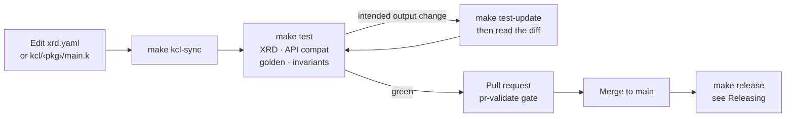

# Development Guide

> How to change W'xOps Core safely. The canonical detail stays next to the code it describes. This
> page puts it in order and holds the hooks and make targets in one place.

**Table of Contents**
- [Development Guide](#development-guide)
  - [Where the detail lives](#where-the-detail-lives)
  - [The change loop](#the-change-loop)
  - [Rules that bite](#rules-that-bite)
  - [Pre-commit hooks](#pre-commit-hooks)
  - [Make targets](#make-targets)

---

## Where the detail lives

| Topic | Canonical doc |
|---|---|
| Setup, the change loop, commit messages, the new-package checklist | [`CONTRIBUTING.md`](../../CONTRIBUTING.md) |
| Architecture, KCL conventions, the working model, the reference stack | [`CLAUDE.md`](../../CLAUDE.md) |
| KCL source, `make kcl-sync`, wiring a module into a package | [`kcl/README.md`](../../kcl/README.md) |
| The offline test suite and what it cannot catch | [`tests/README.md`](../../tests/README.md) |
| Versioning, the API-compat rule, cutting a release | [Releasing](releasing.md) |
| Writing release notes | [`release-notes/README.md`](../../release-notes/README.md) |
| What is planned, deferred and rejected | [`ROADMAP.md`](../../ROADMAP.md) |
| What each Kind takes and composes | [API reference](../api-reference/README.md) |

## The change loop



The step-by-step version, including what a new package owes the test suite, is in
[`CONTRIBUTING.md`](../../CONTRIBUTING.md#the-loop).

## Rules that bite

| Rule | Why | Recorded in |
|---|---|---|
| No hand-written controllers | A kubebuilder controller was built, rejected and removed; Crossplane v2 with providers is the architecture | [`ROADMAP.md` — Not a controller](../../ROADMAP.md#not-a-controller) |
| Compositions never emit Kubernetes RBAC | Makes the provider a privilege-escalation vector; the composition publishes the ServiceAccount and GitOps binds it | [`ROADMAP.md` — Decided and rejected](../../ROADMAP.md#decided-and-rejected) |
| A released XRD only grows | Crossplane has no conversion between XRD versions without a webhook server | [Releasing](releasing.md#a-released-xrd-only-grows) |
| `kcl/<pkg>/main.k` is the source of truth | `crossplane xpkg build` only packages `package/`; `make kcl-sync` embeds the KCL there | [`kcl/README.md`](../../kcl/README.md) |
| Never hand-write `expected.yaml` or `observed.yaml` | A golden accepted without reading its diff is not a test | [`tests/README.md`](../../tests/README.md) |
| Never hand-edit `VERSIONS.yaml` `current` or `package/install/` pins | `make release` writes both, and the `release-state-check` hook fails a hand edit | [Releasing](releasing.md) |

## Pre-commit hooks

Install once, as in [`CONTRIBUTING.md`](../../CONTRIBUTING.md#setup):

```bash
pre-commit install --install-hooks
pre-commit install --hook-type pre-push --hook-type commit-msg
```

| Stage | Check |
|---|---|
| commit-msg | Conventional commit format. Types: `feat`, `fix`, `perf`, `refactor`, `docs`, `test`, `chore`, `revert`; CI changes are `chore(ci)`. |
| commit | YAML lint and kubeconform schema validation |
| commit | `crossplane xpkg build` for every package |
| commit | KCL drift: `composition.yaml` matches `kcl/<pkg>/main.k` |
| commit | Package pins: `VERSIONS.yaml` `current` agrees with `package/install/` |
| commit | README packages table in sync with `VERSIONS.yaml` |
| commit | XRD conformance, API compatibility, composition invariants |
| pre-push | Golden render tests (about 90 s) |

```bash
pre-commit run --all-files      # every commit-stage hook, without committing
```

CI runs the same gates on every pull request. Pre-commit can be bypassed with `--no-verify`; CI
cannot.

## Make targets

| Target | What it does |
|---|---|
| `make test-deps` | Install the test suite's Python dependencies (once) |
| `make test` | The merge gate: XRD conformance, API compat, golden, invariants |
| `make test-xrd` · `test-api-compat` · `test-golden` · `test-invariants` | One check at a time |
| `make test-update` | Regenerate goldens after an intentional change; read the diff |
| `make test-structural` | Advisory third-party schema check, never gates |
| `make kcl-sync` · `kcl-check` | Embed KCL into `composition.yaml` · fail if it drifted |
| `make readme-sync` · `readme-check` | Regenerate · verify the root README packages table |
| `make lint` · `make render` · `make validate` | yamllint + kubeconform · render every example offline · `xpkg build` without pushing |
| `make build` · `make push` | Build OCI packages · build and push (`REGISTRY=`, `VERSION=`) |
| `make providers` · `install` · `install-dev` | Install providers · packages from the registry · XRDs and Compositions directly ([setup](../user-guide/setup.md)) |
| `make uninstall` · `uninstall-dev` | Remove what the matching install applied |
| `make release` · `release-notes` · `release-check` | Cut a release · scaffold notes · verify pins ([releasing](releasing.md)) |
| `make changelog` · `changelog-preview` | Regenerate `CHANGELOG.md` · print it without writing |
| `make clean` · `make help` | Remove `.xpkg` artifacts · list every target |
