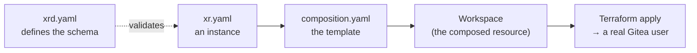

# Crossplane in Five Minutes

> Four concepts, walked through one real package — `gitea-user`, the smallest in this repo. By the
> end you'll be able to point at any file in `package/gitea-user/` and say what it's for.

**Table of Contents**
- [The four pieces](#the-four-pieces)
- [Walking gitea-user](#walking-gitea-user)
- [What actually runs this](#what-actually-runs-this)
- [Next](#next)

---

## The four pieces

Crossplane lets you define your own Kubernetes API, then wire it to real infrastructure. Four
things make that up:

| Piece | What it is | In this repo |
|---|---|---|
| **XRD** (`CompositeResourceDefinition`) | The schema — what fields your API accepts | `package/<name>/xrd.yaml` |
| **XR** (composite resource) | An instance of that API — the thing a user creates | `examples/<name>/xr.yaml` |
| **Composition** | The template that says what to build for a given XR | `package/<name>/composition.yaml` |
| **Composed resource** | What the Composition actually creates — a real object in the cluster | Not a file; it exists only at runtime |

You write the first three. Crossplane's reconcile loop produces the fourth, continuously, for as
long as the XR exists.

## Walking gitea-user

**1. The XRD defines the shape.** Open `package/gitea-user/xrd.yaml`. It declares a `Kind`
(`XGiteaUser`) and a schema under `spec.parameters` — `username`, `email`, `admin`, and so on. This
is a real Kubernetes CRD once installed; `kubectl explain xgiteausers.spec.parameters` reads
straight from it.

**2. An XR is one instance of that shape.** `examples/gitea-user/xr.yaml` is about a dozen lines: a
`kind: XGiteaUser` with values for the fields the XRD declared. Applying it is exactly like
applying any other Kubernetes object — `kubectl apply -f examples/gitea-user/xr.yaml`.

**3. The Composition says what to build.** Open `package/gitea-user/composition.yaml`. Strip away
the YAML wrapper and it says, in effect: *"for an `XGiteaUser`, create one Terraform `Workspace`
that runs this HCL module, with these fields patched in from the XR."* That's it — one composed
resource, one patch list. Bigger packages (`tenant-app`) compose a dozen resources conditionally;
the mechanism is identical, just longer.

**4. Crossplane keeps it that way.** Once you apply the XR, Crossplane doesn't just run this once —
it reconciles continuously. Change the XR, and the Composition re-renders and patches the
`Workspace` in place. Delete the XR, and the `Workspace` (and the Gitea user it manages) is deleted
too.

## What actually runs this

Two more names worth knowing:

- **Provider** — the thing that talks to the outside world. `provider-terraform` runs the HCL
  module; `provider-kubernetes` creates plain Kubernetes objects; `provider-sql` runs SQL against a
  database. This repo's packages use one or more of these; see each package's `crossplane.yaml`
  `dependsOn` list.
- **Function** — the thing that decides what to compose, for a given XR. `gitea-user` uses
  `function-patch-and-transform` — a static list of resources plus field patches, no real logic.
  Bigger packages use `function-kcl` — a real language, for when the resource list depends on
  conditions. That's the whole reason two techniques exist in this repo; see
  [KCL, the way this repo uses it](03-kcl-here.md).

## Next

- Touching a `gitea-*` package? → [Terraform, the way this repo uses it](02-terraform-here.md)
- Touching `platform-database-clusters`, `tenant-database` or `tenant-app`? →
  [KCL, the way this repo uses it](03-kcl-here.md)
- Ready to make a real edit? → [Your first change](04-your-first-change.md)
