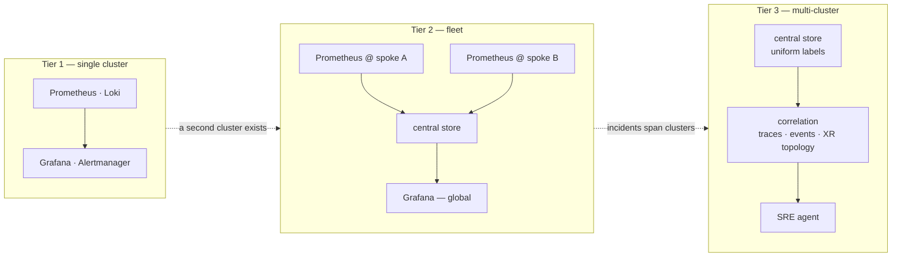
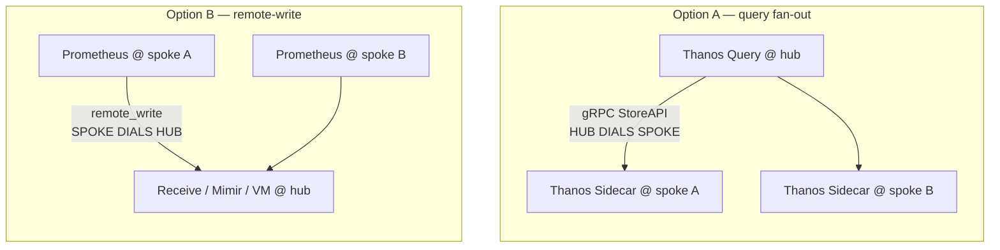
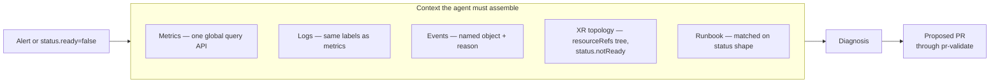

# Observability — emission contract and collection architecture

This document has two halves, at different maturities.

| | Scope | Status |
|---|---|---|
| **[Part 1 — Emission](#part-1--emission-servicemonitor--podmonitor)** | How one `XTenantApp` exposes metrics on one cluster | ✅ **Implemented** in `package/tenant-app/` as `spec.parameters.monitoring` |
| **[Part 2 — Collection](#part-2--collection-architecture-single-cluster-fleet-multi-cluster)** | Where signals go once there is more than one cluster, and what an SRE agent needs to diagnose across a fleet | 📋 **Option space, nothing implemented** |

> **Part 1 deviation from the design below:** the app Service port is still unnamed, so the emitted
> endpoint targets `targetPort` rather than a port name. That was the zero-risk option — see
> [What changes](#what-changes).
>
> The dashboard that consumes these metrics lives in `wxops-gitops-infrastructure`; the toggle that
> sets these fields lives in the portal.

---

# Part 1 — Emission: ServiceMonitor & PodMonitor

## Why CRDs and not annotations

`XTenantApp` today expresses monitoring as pod annotations — `prometheus.io/scrape`,
`prometheus.io/port`, `prometheus.io/path` (see the commented block in
[`examples/tenant-app/xr.yaml`](../examples/tenant-app/xr.yaml)).

**Those annotations do nothing.** They are a Prometheus *convention*, honoured only by a
`kubernetes_sd_config` job with relabel rules that read them. The platform runs
kube-prometheus-stack, whose `additionalScrapeConfigs` is empty — so nothing reads them
and the toggle silently no-ops.

The Prometheus Operator path is a CRD the Operator watches and turns into scrape config
for you. Beyond simply working, it buys things annotations cannot express at all:

| Capability | Annotations | Monitor CRD |
|---|---|---|
| Scrape at all (this platform) | ✗ | ✓ |
| Per-target `sampleLimit` | ✗ | ✓ |
| `metricRelabelings` — drop series at ingest | ✗ | ✓ |
| Per-target interval / timeout | ✗ | ✓ |
| TLS, auth, `honorLabels` | ✗ | ✓ |
| Schema-validated at apply time | ✗ | ✓ |
| Discoverable (`kubectl get servicemonitor -A`) | ✗ | ✓ |

`sampleLimit` matters most here. Prometheus runs with `sampleLimit`, `targetLimit` and
`labelLimit` all `0` — no guardrail anywhere. A limit set **by the composition** is one
tenants cannot opt out of, because they never author the object.

Lock-in is limited: Alloy can consume these same CRDs via
`prometheus.operator.servicemonitors`, so choosing them does not bind the platform to
the Operator forever.

## Why both kinds

The two are not interchangeable, and the difference is operational rather than cosmetic.

| | ServiceMonitor | PodMonitor |
|---|---|---|
| Targets | Endpoints behind a Service | Pods directly, by label |
| Needs a Service | **Yes** | No |
| Needs a named port | Yes (or `targetPort`) | No — container port by name or number |
| Scrapes a pod failing readiness | **No** | **Yes** |

That last row is the one that decides real incidents. A ServiceMonitor scrapes only
endpoints the Service considers `Ready`. A pod stuck failing its readiness probe drops
out of the endpoint list and **stops being scraped — exactly when its metrics matter
most.** A PodMonitor keeps scraping it.

So:

- **ServiceMonitor** is right for the ordinary load-balanced web service, and inherits
  the Service's view of healthy endpoints.
- **PodMonitor** is right for workloads with no Service at all — queue consumers, batch
  workers, anything scaffolded with `service.enabled: false` — and for cases where
  per-pod visibility through a readiness failure is worth more than endpoint semantics.

Supporting only ServiceMonitor would leave every Service-less workload unmonitorable.

## Proposed `spec.parameters.monitoring`

```yaml
monitoring:
  enabled: false          # master toggle
  kind: auto              # auto | ServiceMonitor | PodMonitor
  port: <int>             # no default — falls back to containerPort
  path: /metrics
  interval: 30s
  scrapeTimeout: 10s
  sampleLimit: 5000
  honorLabels: false
  metricRelabelings: []   # escape hatch for cardinality control
```

`port` deliberately carries **no XRD default** — `darlane.telemetryPort` sets that
precedent, with the fallback supplied by `_get` in KCL rather than by the schema.

### `kind: auto` resolution

| `service.enabled` | Emitted |
|---|---|
| `true` | ServiceMonitor |
| `false` | PodMonitor |

Auto keeps the common case configuration-free while leaving the override for teams that
know they want per-pod scraping despite having a Service. `monitoring.enabled: false`
emits neither.

## Emission requirements

Four things the generated manifest must get right. Each has failed silently in testing
elsewhere, so none is optional.

**1. The `release: kube-prometheus-stack` label.** Prometheus is deployed with
`serviceMonitorSelectorNilUsesHelmValues: true`, which makes the Operator filter
discovered monitors on the Helm release name. The release name comes from the directory
basename `base/observability-plane/kube-prometheus-stack/` in
`wxops-gitops-infrastructure`.

> **Cross-repo coupling worth knowing:** renaming that directory silently breaks every
> monitor this composition emits. There is no error — targets simply never appear.

**2. `selector.matchLabels` must include `app.kubernetes.io/component: app`.** The
Darlane twin's Services share `app.kubernetes.io/name` and `app.kubernetes.io/instance`
with the main app. Selecting on those alone scrapes the debug twin as well, mixing its
metrics into the service's own series.

**3. A named Service port, or `targetPort`.** A ServiceMonitor's `endpoints[].port`
references the Service port **by name**, and the Service emitted at
[`kcl/tenant-app/main.k:663`](../kcl/tenant-app/main.k) has an unnamed port. Two ways
out, and the choice is a genuine trade-off — see [What changes](#what-changes) below.

**4. Provider RBAC.** `providers/rbac-provider-kubernetes.yaml` enumerates every API
group composed `Object` manifests may touch, and `monitoring.coreos.com` is absent.
Without it every emitted monitor fails `forbidden` at reconcile time.

## Cardinality

The metric contract the templates will emit (`http_requests_total`,
`http_request_duration_seconds`, `http_requests_in_flight`) is low-cardinality **only if
the `path` label is the route pattern** — `/users/:id`, never `/users/12345`.

With no global limits configured, one tenant emitting raw URLs as labels degrades
Prometheus for every tenant on the cluster. Two defences, both belonging in the
composition rather than in tenant hands:

- `sampleLimit` defaulted by the composition and hard to remove
- `metricRelabelings` available as an escape hatch when a specific series misbehaves

## What changes

Classified against the [change taxonomy](../ROADMAP.md#change-taxonomy).

| Change | File | Tier |
|---|---|---|
| Add `monitoring` optional object with defaults | `package/tenant-app/xrd.yaml` | `safe` |
| Add ServiceMonitor, conditional emit | `kcl/tenant-app/main.k` | `safe` |
| Add PodMonitor, conditional emit | `kcl/tenant-app/main.k` | `safe` |
| Grant `monitoring.coreos.com` to the provider | `providers/rbac-provider-kubernetes.yaml` | prerequisite — not a composition change |
| Add `tenant-app` to the validation array | `.gitea/scripts/validate-packages.sh` | CI only |
| **Name the existing Service port `http`** | `kcl/tenant-app/main.k:663` | **`careful`** |

The `careful` row is the only one carrying risk. It edits the contents of a live composed
resource, so Crossplane applies an in-place patch. Adding a name to a *single-port*
Service is accepted by Kubernetes and restarts nothing — the Service spec changes, pods
do not. Low risk, but it is a mutation of something already running, and the taxonomy
says classify honestly.

**A zero-risk alternative exists.** A ServiceMonitor can target `targetPort: 8080`
instead of a port name, and a PodMonitor never needs one. Naming the port is the cleaner
long-term choice — it is what every Prometheus example assumes, and it survives a later
move to multiple ports — but it is a preference, not a requirement. If the port naming is
deferred, everything else here still works.

Release chores: bump `VERSIONS.yaml` (`tenant-app.package.current`), run `make kcl-sync`,
and commit `main.k` and `composition.yaml` together — `kcl-drift-check` is a pre-commit
hook.

---

# Part 2 — Collection architecture: single cluster, fleet, multi-cluster

> Part 1 above is the **emission** contract: what one `XTenantApp` exposes, on one cluster. Part 2 is
> the **collection** question that starts the moment a second cluster exists — where signals go, who
> queries them, and what an SRE (or an agent acting as one) needs in order to diagnose across a
> fleet. Nothing in Part 2 is implemented; it is the option space, written to be argued with.

## The three tiers, and what breaks between them

These are not "small, medium, large". They are three different problems, and the transition
between each is triggered by a specific failure rather than by a cluster count.

| Tier | Shape | What you are asking of it | What breaks, forcing the next tier |
|---|---|---|---|
| **1 — Single cluster** | One Prometheus, one Loki, one Grafana, all local | "Is this app healthy?" | Retention outgrows local disk; a second cluster appears and *"which cluster?"* has no answer because no series carries one |
| **2 — Fleet** | N mostly-independent clusters, one place to look | "Which of my clusters is unhealthy?" | An incident spans clusters — a shared database, a regional failover — and co-located data is not correlated data |
| **3 — Multi-cluster** | Clusters as one logical system | "What is wrong with *this tenant's* service, wherever it runs?" | Nothing — this is the end state; the risk is arriving without Tier 1's cardinality discipline |



**The common failure is skipping Tier 1's discipline and buying Tier 3's tooling.** A central
store fed by clusters with inconsistent labels and unbounded cardinality is more expensive and
*less* answerable than the per-cluster Prometheus it replaced. The label contract below is the
prerequisite, and it costs almost nothing if done first.

W'xOps is at **Tier 1, done properly**: `sampleLimit` is composition-enforced (Part 1), and
`status.created`/`ready` already crosses clusters natively because `Object` status flows back
regardless of target cluster. That last property means the *state* half of Tier 3 partly exists
before the *metrics* half has started.

---

## The decisive fork: push or pull

Every metrics-aggregation product resolves to one of two topologies, and they have **opposite
network requirements**. This is the single most consequential choice in Part 2, and it is not
primarily a metrics decision — it is a security decision that happens to be about metrics.



| | **Pull — query fan-out** | **Push — remote-write** |
|---|---|---|
| Products | Thanos Sidecar + Query | Thanos Receive, Mimir, VictoriaMetrics, Cortex |
| Direction | **Hub → spoke**, gRPC to each sidecar | **Spoke → hub**, HTTP outbound |
| New inbound on spokes | **Yes** — a port per spoke the hub must reach | **No** |
| Storage | Data stays where produced; no duplication | Duplicated centrally; egress cost per sample |
| Freshness | Queries hit live Prometheus | Bounded by `remote_write` queue latency |
| Failure mode | One unreachable spoke degrades that spoke's data only | Central ingest is a write bottleneck and a SPOF for *ingest* |
| Scaling pain | Query fan-out latency grows with spoke count | Ingest throughput and per-tenant limits |

**Push is the right default here, and the reason is not in this document.** The connectivity
architecture is built on spokes never accepting inbound connections — the tunnel is dialled
outbound precisely so `6443` and everything else stays private. Thanos Sidecar's query fan-out
asks the hub to dial each spoke on a new port, which either punches a second hole in that posture
or must be routed through the tunnel, making observability availability depend on the tunnel's.
`remote_write` asks nothing new of the network: it is one more outbound HTTPS stream from a spoke
that already dials out.

Pull is still the better answer where spokes are on a trusted flat network and storage cost
dominates — it is genuinely cheaper at rest, and it avoids a central ingest tier entirely. It is
simply not the shape this platform has chosen elsewhere.

> **The rule that survives either choice: alerting stays local.** Per-cluster Prometheus and
> Alertmanager must be able to evaluate rules and page without the hub. Centralising *evaluation*
> means a hub outage is an alerting outage — the correlation you least want. Centralise **query**,
> never **alert evaluation**. This is also what keeps the fleet answer compatible with the edge rule:
> report up, never query down.

---

## The signal matrix — what to collect, per tier

Eight signal classes. Most observability discussions cover two of them and then wonder why root
cause is still manual.

| Signal | Answers | Tier 1 | Tier 2 / 3 option | W'xOps state |
|---|---|---|---|---|
| **Metrics** | "Is it slow / erroring / saturated?" | Prometheus + the Part 1 monitors | `remote_write` → Mimir / VM / Thanos Receive | ✅ emission shipped (v0.4.0); ❌ no aggregation |
| **Logs** | "What did it say when it broke?" | Loki + **Alloy** (not Promtail — EOL March 2026) | Same agent, central Loki; also Guardian's audit sink | ❌ platform infra, undecided |
| **Traces** | "Which hop in the request was slow?" | OpenTelemetry SDK → Tempo | Central Tempo; per-app opt-in | ❌ deferred; `darlane.telemetryPort` is the hook |
| **Events** | "What did Kubernetes *do* just before?" | `kube-state-metrics` + an event exporter | Ship events as logs or OTel to the central store | ❌ **the cheapest missing signal** — see below |
| **Topology / state** | "What does this XR own, and what is unhealthy?" | XR tree: `resourceRefs` → `Object`s → `status` | Native across clusters already | ✅ structurally present; 🔶 `status.notReady` proposed |
| **Network flows** | "Who is talking to whom, and what got dropped?" | Hubble (a Cilium flag) → flow metrics + flow logs | Flow *metrics* pushed like any other; **not** central Relay | ❌ not collected — but the CNI is already Cilium, see [the kernel plane](#the-kernel-plane--flows-and-runtime-security) |
| **Runtime security** | "Did a process do something it should not?" | Falco / Tetragon / KubeArmor DaemonSet | Detections pushed as events into the log store | ❌ not started; **owned by the threat model, not this page** |
| **Profiles** | "Why is it burning CPU?" | Pyroscope, per-app opt-in | Central Pyroscope | ❌ not started, low priority |

**Events deserve promoting.** Most incidents that reach a human are visible in Kubernetes events
before they are visible in metrics — `FailedScheduling`, `ImagePullBackOff`, `FailedMount`,
`Unhealthy` probe failures, evictions. They are also the signal an agent can act on with the
least ambiguity, because they name a specific object and reason. They are cheap to ship (low
volume, already structured) and they are currently not collected anywhere. For an
SRE-intelligence goal specifically, **events are a better second investment than traces.**

---

## The kernel plane — flows and runtime security

The six classic signals all describe what a *process* reported about itself. eBPF adds a second
vantage point: what the *kernel* observed it actually doing. That is a genuinely different source
of truth — it needs no cooperation from the workload — and it is the reason this section exists
rather than being three more rows in a tool table.

### Three different things wear the "eBPF" label

Conflating them is the main reason these discussions go badly.

| Use | Question it answers | Representative tools | Relationship to Part 1 |
|---|---|---|---|
| **Network flow observability** | "Who is talking to whom, and what got dropped?" | Hubble, Retina, Pixie | **New signal** — nothing else produces it |
| **Runtime security** | "Did a process do something it should not?" | Falco, Tetragon, KubeArmor | **New signal** — detections, not telemetry |
| **Auto-instrumentation** | "RED metrics and traces without touching the app" | OBI (ex-Beyla), Pixie | **Not a new signal** — an alternative *producer* of metrics and traces we already have a contract for |

The third is the one to be careful with, because it is the only one that overlaps Part 1. It is
attractive precisely where Part 1 is weakest — an app whose owner will never add an SDK — but it
produces series that must obey the same `sampleLimit` and label discipline, and it does not
replace the `ServiceMonitor` contract so much as sit beside it. Treat it as a fallback for
un-instrumentable workloads, not as a strategy.

### Why Hubble is unusually cheap here, and Falco is not

**This argument is conditional, and the condition is not yet met.** Cilium appears in this repo in
exactly one place: `cni-cilium` in the *proposed* spoke bootstrap `ClusterResourceSet` in
[`multi-cluster.md`](multi-cluster.md#layer-3--data-plane), with Cluster Mesh as the named
data-plane option. That is a design-doc example for spokes that do not exist yet
([M2](solution-matrix.md#domain-2--multi-cluster--multi-region) is not started), **not** a decided
platform fact, and the CNI of the cluster running today is not recorded anywhere in this repo.

*If* Cilium is the CNI, Hubble is a flag on a component that is already there — no new DaemonSet,
no second kernel-touching supply chain, no additional privileged workload per node — whereas Falco,
Tetragon and KubeArmor are each a *new* privileged DaemonSet fleet-wide. That asymmetry, not a
feature comparison, should drive sequencing: **take the signal that is already paid for before
buying one that is not.** It inverts the usual ordering advice, which treats network observability
as advanced and runtime security as table stakes.

*If it is not*, O13 is an ordinary medium-cost item competing on its merits, and the sequencing
below loses its cheapest step. **Confirm the CNI before quoting Hubble as near-free** — this is a
one-command check (`kubectl -n kube-system get ds`), and the whole cost argument rests on it.

The mixed-fleet caveat holds either way: a spoke this platform did **not** provision — the managed,
opaque clusters in [M3b](multi-cluster-connectivity.md#path-e--existing-clusters) — may not be on
Cilium regardless, and Hubble is unavailable there. That is where a CNI-agnostic option such as
Retina becomes the question, and why "flows" cannot be assumed uniform across a fleet.

### The push/pull rule applies unchanged

Hubble Relay is a **query fan-out** surface: the hub dials each spoke's Relay to observe flows.
That is structurally the same hub → spoke shape as Thanos Sidecar and it fails for the same
reason — the connectivity posture is spokes-never-inbound. The fleet answer for flows is Hubble's
*Prometheus metrics*, scraped locally and `remote_write`-n out, plus flow logs shipped through the
same log agent. A central Relay is the wrong shape here even though it is the documented one.

The same rule catches runtime security: `falcosidekick` pushes detections outbound to a webhook or
Loki, which is right. Exposing a Falco gRPC endpoint for the hub to poll is the Thanos-Sidecar
mistake wearing a different hat.

### Flow data is the worst cardinality offender on this page

Hubble's metric labels are configurable (`sourceContext` / `destinationContext`), and setting them
to pod or identity granularity produces a series **per talking pair** — which grows with the square
of the workload count, not linearly, and then multiplies again by cluster count once external
labels are added. This is the fastest way to make the central store more expensive than everything
Part 1 emits combined.

The discipline that makes it affordable:

- Flow **metrics** at namespace or workload granularity only — never pod, never identity.
- Pod-level detail lives in flow **logs**, with short retention, queried during an incident rather
  than dashboarded.
- Never `remote_write` raw flows. Aggregate at the edge — this is the [L2 rung](#cost-and-cardinality-control-ladder)
  applied before the signal is ever enabled.

### Detect versus enforce is the real axis

Not feature count. This is the distinction that determines blast radius:

| Tool | Posture | Note |
|---|---|---|
| **Falco** | Detect only | CNCF-graduated, by far the largest rule ecosystem. The low-risk entry point |
| **Tetragon** | Detect **and** in-kernel enforcement (can kill a process) | Cilium ecosystem, but a separate DaemonSet — it is not free the way Hubble is |
| **KubeArmor** | Enforce, policy-first (LSM: AppArmor / BPF-LSM) | Starts from allowed behaviour rather than from detections |

Enforcement is a production-outage risk in a way detection is not: a bad rule kills a tenant's
workload, and the tenant has no way to see why. For a platform at Tier 1 the answer is **detect
only, advisory** — the same stance Guardian already takes with its Phase 1 scans, which never
interrupt the developer's process.

The cost of Falco is not installing it. Default rulesets are noisy, tuning is the actual project,
and an untuned Falco produces enough alert fatigue to degrade the *rest* of the alerting. Budget
for the tuning or do not start.

### The honest counter-argument

Every tool in this section is a privileged, kernel-accessing DaemonSet on every node. The thing
installed to watch for compromise is itself a high-value target with fleet-wide reach — that is a
real blast radius and a real supply-chain surface, not a rhetorical one. Kernel and distro coupling
remains an operational tax that CO-RE has reduced rather than removed. None of this argues against
adoption. It argues against adopting it at Tier 1 for its own sake, before the label contract and
event collection that cost nothing are in place.

### Where this pays off for the SRE-agent goal

The [SRE intelligence section](#what-sre-intelligence-needs-beyond-dashboards) argues that
W'xOps's structural advantage is topology: the XR tree gives the *declared* dependency graph for
free. Flow data gives the *observed* one.

**The interesting artefact is the delta between them** — an egress connection no XR declared, a
tenant app reaching a database it does not own, a dependency that exists in production and in no
manifest. Neither metrics nor the XR tree can answer that alone, and it is simultaneously an
operations signal and a security signal. That is the strongest argument for flows on this platform,
and it is a better one than the usual "see dropped packets" pitch, because it exploits something
W'xOps has that most platforms do not.

### Ownership: what belongs here and what does not

Runtime security **detections** are the threat model's subject — what is worth detecting, and why,
belongs in [`security-threat-model.md`](security-threat-model.md). This page owns only how those
detections reach the store: the same push path, the same label contract, the same cardinality
ladder as every other signal.

Holding that split is what stops "security tooling" from quietly becoming a second, parallel
observability stack with its own agent, its own store and its own dashboards — which is the common
outcome and the expensive one.

---

## Tool options, in detail

Rows are grouped by signal. "Direction" is the network direction the spoke sees, which is the
column that interacts with the connectivity posture.

### Metrics — aggregation backends

| Option | Topology | Direction | Ops cost | Multi-tenancy | Choose when | Avoid when |
|---|---|---|---|---|---|---|
| **Prometheus standalone, per cluster** | none | n/a | Lowest | none | Tier 1; always keep it as the local alerting brain | You need a cross-cluster query |
| **Prometheus federation** | pull, hierarchical | hub → spoke | Low | none | Pulling a *small set of aggregates* upward | ⛔ Wholesale metric copying — it is documented as unsuitable and will melt at fleet scale |
| **Thanos — Sidecar + Query** | pull fan-out | **hub → spoke** | Medium | via labels | Trusted flat network; storage cost dominates; want no central ingest | Spokes must accept no inbound — i.e. this platform |
| **Thanos — Receive** | push | spoke → hub | Medium-high | via tenant header | Want Thanos's object-store model with outbound-only spokes | Small fleet where Receive's HA/hashring is overkill |
| **Grafana Mimir** | push | spoke → hub | High | **native, first-class** | Per-tenant isolation, limits and quotas matter — maps onto the tenancy tiers | Team is small and metrics-only; the ops surface is real |
| **VictoriaMetrics** (`vmagent` + `vmcluster`) | push | spoke → hub | **Lowest of the three** | via tenant ID in path | Metrics-only, ops-light, cost-sensitive; highest ingest per core | You need Loki/Tempo in one ecosystem |
| **Cortex** | push | spoke → hub | High | native | — | Effectively superseded by Mimir; new adoption hard to justify |
| **Managed** (Grafana Cloud, AWS AMP, Google Managed Prometheus) | push | spoke → vendor | Lowest run cost | vendor | Team capacity is the binding constraint | Data residency, egress cost, or a self-hosted mandate |

### Collection agents

| Option | Signals | Notes |
|---|---|---|
| **Prometheus Operator** (current) | metrics | Already in use; the Part 1 monitors target it. Keep — it is the emission contract |
| **Grafana Alloy** | metrics, logs, traces, profiles | The consolidation play: one agent, and it **consumes `ServiceMonitor`/`PodMonitor` CRDs** via `prometheus.operator.servicemonitors`, so Part 1's emission contract survives the switch unchanged |
| **Promtail** | logs | ⛔ **EOL 2 March 2026.** Do not start here; `alloy convert` migrates existing config |
| **OpenTelemetry Collector** | metrics, logs, traces | The vendor-neutral choice; strongest when traces are first-class. Heavier config surface than Alloy |
| **`vmagent`** | metrics | Pairs with VictoriaMetrics; very light, good at spotty-network buffering |

### Logs, traces, events, profiles

| Option | Signal | Notes |
|---|---|---|
| **Loki** | logs | Label-first: cheap because it does not index content. Punishes high-cardinality labels exactly like Prometheus — same discipline applies |
| **VictoriaLogs** | logs | Lighter alternative; coherent if VictoriaMetrics is already chosen |
| **OpenSearch / ELK** | logs | Full-text search when investigations demand it; substantially heavier to run |
| **Tempo** | traces | Object-store backed, cheap at rest; pairs with Grafana and exemplars |
| **Jaeger** | traces | Mature, standalone; less integrated with the Grafana query surface |
| **`kube-state-metrics`** | state | Already standard in kube-prometheus-stack; the "how many replicas *should* exist" source |
| **Event exporter** (`kubernetes-event-exporter`, or OTel `k8sobjects` receiver) | events | The missing cheap signal. Ships events into Loki or OTel |
| **Pyroscope** | profiles | Continuous profiling; defer until CPU-cost questions are actually being asked |

### Kernel plane — flows, runtime security, auto-instrumentation

Grouped by the three uses separated [above](#three-different-things-wear-the-ebpf-label). Every row
except Hubble adds a privileged DaemonSet to every node.

| Option | Use | Ops cost | Notes |
|---|---|---|---|
| **Hubble** (Cilium) | flows | **~zero if Cilium** | A flag on a component already in the spoke bootstrap. Flow logs, Prometheus metrics, service map. Ship the *metrics*; ⛔ do not centralise Relay |
| **Microsoft Retina** | flows | Medium | CNI-agnostic — the answer for a spoke that is not on Cilium (the M3b managed-cluster case) |
| **Pixie** | flows + auto-instr | Medium-high | Protocol-level data with no instrumentation, but ships its own store and query surface, which cuts against the one-endpoint requirement |
| **Falco** | runtime security | Medium | CNCF-graduated, largest rule ecosystem, detect-only. `falcosidekick` pushes outbound. **Tuning is the cost, not install** |
| **Tetragon** | runtime security | Medium | Detect **and** in-kernel enforcement. Cilium ecosystem but a separate DaemonSet — not free the way Hubble is |
| **KubeArmor** | runtime security | Medium | LSM-based (AppArmor / BPF-LSM) enforcement, policy-first rather than detection-first |
| **OBI** — OTel eBPF Instrumentation (ex-Grafana Beyla) | auto-instr | Low-medium | RED metrics and traces with no code change, over OTLP. A fallback for un-instrumentable workloads; does not replace the Part 1 contract |

### Query and visualisation

| Option | Notes |
|---|---|
| **Grafana** | Already deployed; the assumed surface. Datasource-per-tier keeps Tier 1 dashboards working unchanged after aggregation lands |
| **Perses** | CNCF, GitOps-native dashboards-as-CRDs — interesting because dashboards could then be *composed* per tenant. Immature relative to Grafana |

---

## The label contract — the cheap prerequisite

**Do this before choosing any backend.** Cross-cluster queries are impossible without a uniform
identifying label set, and labels cannot be retrofitted onto data already stored.

```yaml
# per-spoke Prometheus, via kube-prometheus-stack values
prometheus:
  prometheusSpec:
    externalLabels:
      cluster: spoke-prod-sgn      # must equal spec.parameters.cluster on the XR
      region: sgn
      environment: production
```

The binding rule that makes the whole thing work: **`cluster` must be exactly the value the XR
uses in `spec.parameters.cluster`.** That one equality is what lets a portal error card, an XR
status, a metric series and a log line be joined without a translation table — and it is free
today, because the field already exists and is already threaded through every
`providerConfigRef`.

Tenant identity comes free as well: the composition already labels every emitted resource, so
`app.kubernetes.io/instance` and the tenant namespace are on the series without new work.

Two honest costs. External labels become series labels, so **total cardinality multiplies by
cluster count** — a 200k-series cluster is 2M series at ten spokes, before any tenant growth. And
changing an external label later creates a discontinuity in every dashboard and recording rule
that used it, so these names are close to an API. Name them once, deliberately.

---

## What SRE intelligence needs beyond dashboards

Dashboards serve a human who already knows where to look. An agent does not, and the gap is
specific:



Five requirements, in dependency order:

1. **One query endpoint, not N.** An agent that must iterate clusters cannot answer "where is this
   tenant unhealthy?" in bounded time. This is the whole argument for Tier 2.
2. **Uniform labels** — the contract above. Without it, joining metrics to logs to an XR is guesswork.
3. **Topology, not only time series.** This is W'xOps's structural advantage and it is already built:
   the XR tree gives an agent the *causal graph* — this app owns this Deployment, this Certificate,
   this database — which is exactly the input that makes root-cause reasoning tractable rather than
   correlational. Most platforms have to construct this; here it falls out of Crossplane.
4. **Events as a first-class signal**, for the reason given above.
5. **Correlation keys** — exemplars linking a metric to a trace, and `trace_id` present in log lines.
   Cheap if designed in, near-impossible to add later.

Requirement 3 is worth restating as the strategic point: **the expensive part of SRE intelligence
is knowing what depends on what, and the platform already knows.** Everything in Part 2 is about
giving that graph enough signal to be useful.

---

## Cost and cardinality control ladder

Applied in this order; each rung is cheaper than the one below it and buys more.

| Rung | Control | Where | Status |
|---|---|---|---|
| **L0** | `sampleLimit` per target | Composition-enforced, tenants cannot remove | ✅ shipped |
| **L1** | Metric allowlist on ship | `writeRelabelConfigs` on `remote_write` — send what is queried, not everything | ❌ |
| **L1b** | Flow-label granularity | Hubble `sourceContext`/`destinationContext` at namespace or workload level, never pod — decided *before* enabling flows, not after | ❌ |
| **L2** | Recording rules at the edge | Evaluate locally, ship aggregates; the biggest single reduction for fleet dashboards | ❌ |
| **L3** | Downsampling | Thanos compactor / VM: 5m and 1h resolutions for long ranges | ❌ |
| **L4** | Per-tenant limits and quotas | Mimir natively; otherwise per-cluster discipline | ❌ |
| **L5** | Storage tiering | Object storage for warm/cold; retention per tier | ❌ |

L1 and L2 together typically remove an order of magnitude before any backend choice matters,
which is why they belong above the backend decision rather than after it.

---

## Sequenced recommendation

Each step is useful alone and none forecloses the next:

1. **Label contract** — `externalLabels` on every cluster's Prometheus, `cluster` matching the XR
   field. Free, and required by everything else.
2. **`status.notReady`** — the `safe`-tier core change proposed in
   [`self-service-operations.md`](self-service-operations.md#whats-missing). Cheapest rung of the
   ladder; serves portal, runbooks and agent from one field.
3. **Event collection** — an event exporter into whatever log store is chosen. The best
   signal-per-effort on this page.
4. **Hubble flow metrics — only where Cilium is already the CNI.** Namespace-granularity metrics
   into the local Prometheus (L1b before enabling, not after). Out of order relative to the usual
   advice, and it earns the place because it is the one signal on this page that needs no new
   component. Skip it entirely on non-Cilium spokes rather than adding Retina just for uniformity.
5. **Pick a push backend** — VictoriaMetrics if ops-light dominates, Mimir if per-tenant isolation
   dominates, Thanos Receive if the object-store model and ecosystem familiarity dominate. **Not
   Thanos Sidecar fan-out**, for the network reason above.
6. **Alloy as the agent**, replacing per-signal agents and keeping the Part 1 CRD contract intact.
7. **L1/L2 cardinality controls** before the bill arrives, not after.
8. **Traces, profiles, and runtime-security detection** last. The first two per-app opt-in; the
   third detect-only, budgeted for tuning, and driven by
   [`security-threat-model.md`](security-threat-model.md) rather than by this page.

Steps 1–4 need no backend decision at all, which is the useful property: **the highest-value work
is not blocked on the biggest choice.**

---

## Open decisions

**Should the Darlane twin be scraped?** Requirement 2 above excludes it, which is right for
keeping a service's own metrics clean. But Darlane exists partly for A/B testing, and comparing
stable-versus-twin metrics is exactly what makes an A/B test measurable. A future
`darlane.monitoring` block emitting a second monitor scoped to `component: darlane` would enable
that, with a distinguishing label so the two series never merge. Not in scope for the first pass.

**Should `monitoring` move to a shared KCL module?** `XTenantDatabase` will eventually want the
same block. The repo has no shared-library mechanism yet — see
[`kcl/README.md`](../kcl/README.md) — so the first implementation duplicates rather than waits
for one.

**(Part 2) Which push backend?** VictoriaMetrics, Mimir and Thanos Receive are all defensible;
the decision hinges on whether per-tenant isolation or operational lightness dominates.
Deliberately deferrable — steps 1-4 of the sequencing above need no answer.

**(Part 2) Who owns the `externalLabels` values?** They must equal `spec.parameters.cluster`,
which means the GitOps repo's Prometheus values and the platform's cluster naming are coupled.
Worth an invariant or a CI check once a second cluster exists — the failure is silent, exactly
like the `release:` label coupling in Part 1.

**(Part 2) Does the Darlane twin ship metrics to the fleet store?** The Part 1 answer excludes it
from the app's own series. At fleet scale the A/B comparison case gets stronger, but so does the
cardinality cost of a per-developer, short-lived workload writing into a central store. Likely
answer: scrape locally, do not `remote_write`.

**(Part 2) What happens to flows on a spoke that is not Cilium?** Hubble is free on clusters this
platform provisions and unavailable on the managed ones it merely joins
([M3b](multi-cluster-connectivity.md#path-e--existing-clusters)). Either the fleet accepts a
non-uniform signal — flows where the CNI allows, none elsewhere — or it adds Retina for uniformity
and pays a DaemonSet everywhere to make a dashboard consistent. **The non-uniform answer is
probably right**, and it is worth stating explicitly so nobody re-opens it as a bug.

**(Part 2) Is runtime security in scope for this page at all?** Split as written above: the threat
model owns what to detect and why; this page owns how the detection reaches the store. The risk if
that line blurs is a second parallel stack — its own agent, its own store, its own dashboards —
which is the common outcome. Worth re-checking whenever a runtime-security tool is actually
proposed.

**(Part 2) Does eBPF auto-instrumentation undercut the Part 1 contract?** OBI produces RED metrics
with no `ServiceMonitor` and no app change, which is genuinely attractive for workloads whose
owners will never instrument them. It is also a second path to the same series with none of Part
1's composition-enforced guardrails. Current position: fallback for un-instrumentable workloads,
never the default — but this deserves a real decision before anyone deploys it, not after.

## See also

- [`tenant-app.md`](tenant-app.md) — the full `XTenantApp` schema
- [`ROADMAP.md`](../ROADMAP.md) — §0.7 for the work item, §Change taxonomy for the tiers
- [`multi-cluster.md`](multi-cluster.md) — per-cluster observability endpoints, later
- [`multi-cluster-connectivity.md`](multi-cluster-connectivity.md#observability-plane) — the
  observability plane in the four-plane architecture, and why the push topology follows from the
  connectivity posture
- [`self-service-operations.md`](self-service-operations.md) — how these signals feed runbooks and the diagnosis/intelligence layer
- [`security-threat-model.md`](security-threat-model.md) — owns *what* runtime security should
  detect; this page owns only how the detections are collected
- [`guardian.md`](guardian.md#phase-2--audit-and-compliance) — the other place eBPF appears, as a
  per-session capture method rather than a fleet-wide plane
- [`solution-matrix.md`](solution-matrix.md) — rows O1-O15 index this material
