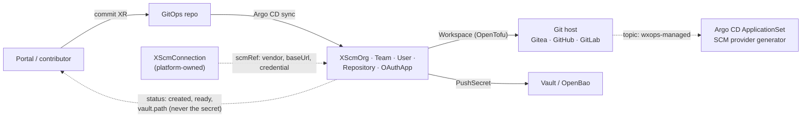

# RFC-003: SCM connections and resources — Gitea, GitHub and GitLab behind one API, with Vault-tracked credentials

## Status
<!-- Draft | In review | Accepted | Declined | Withdrawn | Implemented — and the GitHub issue that carries the discussion, e.g. "Draft · #42" -->
Draft

## Summary

Replace Core's Gitea-only Git coverage with one API family, `XScm*`, that reads and writes Gitea, GitHub and GitLab. A platform-owned
**`XScmConnection`** registers one hosting service — its vendor, base URL and where its credential lives — and every other resource points
at it with **`scmRef`**, so tenants never write a vendor, a URL or a credential. The resources are **`XScmOrg`**, **`XScmTeam`**,
**`XScmUser`**, **`XScmRepository`** and **`XScmOAuthApp`**. Each works in one of two modes: `managed` (Core creates and owns the object) or
`observed` (Core only reads it, through a data source), so the same manifest can start a new in-cluster Gitea or embed an existing hosted
service. Gitea is the first implementation, since the repo already drives it; GitLab follows on the same model through the official
`gitlabhq/gitlab` provider, and GitHub after. The `gitea-*` kinds are superseded, with a written migration path off them and, later, between
hosts. OAuth apps publish their client id and secret to Vault (OpenBao after migration) at a fixed path, the contract the next RFC (Dex) and
OAuth2 Proxy build on.

## Motivation

Today Core can create a Gitea repository, org, team and user ([`gitea-*`](../api-reference/README.md)) and nothing else. Four gaps
follow from that:

1. **Vendor lock.** GitHub and GitLab tenants cannot use the golden path. A repository is the first thing a scaffolded service
   needs, so the portal cannot offer "new service" to them at all. The Gitea packages are also frozen behind an archived instance
   ([`ROADMAP.md`](../../ROADMAP.md)), which leaves the repository API with no active reference vendor.
2. **Every XR carries its own credential.** Each `gitea-*` XR has a tenant-writable `credentialsSecretRef`. A field that names a Secret
   lets whoever writes the XR use any credential the provider can read, and repeats the URL and secret on every resource.
3. **OAuth clients are hand-made.** Every login integration — Dex's upstream connectors, OAuth2 Proxy in front of an app — needs an
   OAuth application registered at a Git host, and its client id and secret carried to wherever they are used. Today that is a
   click-through in a vendor UI and a secret pasted somewhere. Nothing records that the application exists, who owns it, or when its
   secret last changed, and rotating it means repeating the click-through and hoping every consumer is updated.

4. **The host is hard-wired.** Every `gitea-*` XR is bound to Gitea by its kind. Moving to, or adding, another host means rewriting every
   XR, with no declared path between the two — the lock-in this family exists to remove.

Vault already holds every other generated credential Core creates (database superuser and app creds, connection strings), mirrored by
an ESO `PushSecret`. OAuth client credentials are the same shape of problem and should follow the same pattern.

## Detailed Design

### Scope

| Kind | What it does | Can Core write it? |
|---|---|---|
| **`XScmConnection`** | Registers one hosting service and its credential. Platform-owned. | — |
| **`XScmOrg`** | An org (Gitea, GitHub) or group (GitLab): the container that owns repositories | Gitea, self-managed GitLab (CE included): yes. GitHub.com, and a top-level group on GitLab.com: observe only |
| **`XScmTeam`** | A named set of members with a permission on repositories | Gitea, GitHub: yes. GitLab: not in v1 |
| **`XScmUser`** | An account: in practice a bot or service account, since people sign in through Dex | Gitea, self-managed GitLab (CE included): yes. GitHub, GitLab.com: observe only |
| **`XScmRepository`** | A repository | All three |
| **`XScmOAuthApp`** | The host-side OAuth application, with credentials published to Vault | Gitea, self-managed GitLab (CE included): yes. GitHub, GitLab.com: observe only |

The full per-host matrix, and why it is uneven, is under *What each host lets Core write*.

Not in scope: Dex itself and its clients (RFC-004), OAuth2 Proxy deployment, cluster-access identity (Pinniped, per
[`multi-cluster-proposal.md`](../core-ideas/multi-cluster-proposal.md)), moving repository *content* between hosts (see *Migration*),
and host features beyond the neutral field sets.

### The two kinds of OAuth application

This RFC covers one of two, and the split matters for what follows:

- **Upstream** — an application registered *at a Git host*, so a login system can authenticate people against that host. Dex's
  GitHub/GitLab/Gitea connectors need exactly this. **This RFC.**
- **Downstream** — a client registered *in Dex*, so an application or OAuth2 Proxy can authenticate against Dex. **RFC-004.**

Both end as a `client_id` / `client_secret` pair in Vault at the same path convention, so a consumer reads the same shape whether the
issuer is a Git host or Dex.

### API surface

Six new XRDs, `v1alpha1`, in the `platform.wxops.cloud` group. `XScmRepository` is the one repository kind for all three hosts,
**Gitea included**: it is the recommended kind from the release it ships in, and `XGiteaRepository` is documented as superseded. It is
not removed — a released XRD is additive-only and cannot be deleted without a deliberate, allowlisted break — so it stays served and
unmaintained beyond fixes. The same holds for the other `gitea-*` kinds: `XGiteaOrg`, `XGiteaTeam` and `XGiteaUser` are superseded by
`XScmOrg`, `XScmTeam` and `XScmUser`, and *Migration* says how to move off them without destroying anything.

```yaml
apiVersion: platform.wxops.cloud/v1alpha1
kind: XScmConnection
metadata:
  name: github-wxops
spec:
  parameters:
    vendor: github               # gitea | github | gitlab
    baseUrl: https://github.com  # required for self-hosted Gitea/GitLab, in-cluster Gitea included; defaulted for the SaaS hosts
    access: write                # write | read — a `read` connection can only serve `mode: observed`
status:
  created: true
  ready: true                    # the credential Secret is synced; the token itself is not checked
```

```yaml
apiVersion: platform.wxops.cloud/v1alpha1
kind: XScmRepository
metadata:
  name: team-alpha-api-service
  labels:
    wxops.cloud/owner: team-alpha
spec:
  parameters:
    scmRef: {name: github-wxops}  # the connection; tenants name it, never a credential
    mode: managed                 # managed | observed
    owner: team-alpha             # a flat org (Gitea, GitHub) or top-level group (GitLab); no `/` — see Vendor alignment
    repoName: api-service
    description: Alpha squad API service
    visibility: private           # private | public; `private` is the default, unlike XGiteaRepository's public one
    defaultBranch: main
    autoInit: true
    hasIssues: true
    hasWiki: false
    topics: [wxops-managed]       # the tag GitOps discovery selects on
    retain: true                  # default: removing the XR leaves the repository; false deletes it
status:
  created: true
  ready: true
  exists: true
  cloneUrl: https://github.com/team-alpha/api-service.git
```

```yaml
apiVersion: platform.wxops.cloud/v1alpha1
kind: XScmOAuthApp
metadata:
  name: dex-gitlab
spec:
  parameters:
    scmRef: {name: gitlab-internal}
    mode: managed                 # managed | observed
    name: dex
    redirectUris: [https://dex.example.com/callback]
    confidential: true
    scopes: [openid, read_user]   # GitLab only; rejected elsewhere
    owner: platform               # picks the Vault store and path; see below
    rotation:
      generation: 1               # bump to rotate; managed mode only
status:
  created: true
  ready: true
  clientId: 7b4c…                 # not secret; the secret never appears in status
  vault:
    path: platform/oauth/dex-gitlab/credentials
```

```yaml
apiVersion: platform.wxops.cloud/v1alpha1
kind: XScmOrg
metadata:
  name: team-alpha
  labels: {wxops.cloud/owner: team-alpha}
spec:
  parameters:
    scmRef: {name: gitea-internal}
    mode: managed                 # managed | observed
    orgName: team-alpha           # immutable; the flat org / top-level group
    displayName: Team Alpha
    description: Alpha product squad
---
apiVersion: platform.wxops.cloud/v1alpha1
kind: XScmTeam
metadata:
  name: team-alpha-backend
  labels: {wxops.cloud/owner: team-alpha}
spec:
  parameters:
    scmRef: {name: gitea-internal}
    mode: managed
    owner: team-alpha             # the org
    teamName: backend
    permission: write             # read | write | admin — on the repositories below
    repositories: [api-service]   # names; `all` is not supported on every host, see Vendor alignment
    members: [alice, bob]         # usernames that must already exist on the host
---
apiVersion: platform.wxops.cloud/v1alpha1
kind: XScmUser
metadata:
  name: ci-bot
spec:
  parameters:
    scmRef: {name: gitea-internal}
    mode: managed
    username: ci-bot
    email: ci-bot@example.com
    owner: platform               # picks the Vault path for the generated password
    mustChangePassword: true
```

All six expose `status.created` and `status.ready` per the [status contract](../api-reference/status-contract.md). The common fields
are the intersection all three hosts support; host-only options are not part of v1. **There is no `admin` flag on `XScmUser`:** the
existing `XGiteaUser` has one, and a tenant-writable field that mints site administrators does not belong in a neutral kind. The
password of a managed user is generated, never written in an XR, and pushed to Vault.

### `XScmConnection` and `scmRef`

A connection is one hosting service the platform has been given a credential for. It is **platform-owned**: tenants do not create or
edit it, which plain RBAC can express because it is a distinct kind. In-cluster Gitea is simply a connection with `vendor: gitea` and
the in-cluster service URL as `baseUrl`; Core does not install it, which stays platform GitOps like Dex.

- **The credential** is a token stored by a platform operator in OpenBao at `platform/scm/{name}/credentials` (`remoteKey`
  `scm/{name}/credentials`, key `token`). The connection's composition emits an `ExternalSecret` that renders it into a Secret in
  `crossplane-system`, in the tfvars form the Workspaces already read. Core cannot mint this token — it is the bootstrap secret — so
  its creation and rotation are the operator's.
- **Consumers resolve it by name.** `XScmRepository` and `XScmOAuthApp` compositions fetch the connection with
  `function-extra-resources`, the same first pipeline step `tenant-database` uses to find shared clusters, and read its `vendor`,
  `baseUrl` and `access`. A tenant XR therefore never contains a URL or a Secret name. Whether the pinned function version can look
  up by name, or needs a label selector on the connection, is a spike item.
- **`access: read`** exists for least privilege: a read-scoped token serves observation only. A `managed` request against a read
  connection ends `ready: false` with an explicit message, not a failed Workspace.
- **Which vendor a tenant is using is no longer in its own XR**, so any rule tying a field to a vendor cannot be checked by the XRD
  schema. Rules involving only the XR's own fields (`rotation` with `mode: observed`) stay in the schema; rules involving the vendor
  (`mode: managed` on GitHub OAuth, a `/` in a GitLab owner) are enforced by the composition and reported in status. See *Testing*.

The Portal reads connections to offer the vendor choices, so it needs read access to `XScmConnection`.

### Observed mode — a data source, not a resource

`mode: observed` means Core **reads** the object and never writes or deletes it. In the Workspace it is a data source instead of a
resource: `gitea_repo` (which the Gitea provider ships alongside `gitea_org`, `gitea_team` and `gitea_user`), `github_repository` and
`gitlab_project` — the last two are not verified in this RFC's research. The outputs are the same neutral set as managed mode
(`id`, `clone_url`, `ssh_url`, `html_url`), plus `status.exists`; a repository that is not found ends `ready: false` with a clear message
and is never created silently.

This lets a tenant point at a repository that already exists on an external host, or at one on a connection Core does not manage, and
lets the same manifest be used against a new in-cluster Gitea (`managed`) or an existing hosted service (`observed`) by changing one
field. In observed mode the fields that only make sense for creation — `description`, `visibility`, `defaultBranch`, `autoInit`,
`hasIssues`, `hasWiki`, `topics`, `retain` — are **rejected by the schema**, so nothing is silently ignored.

There is deliberately no "create if missing, otherwise adopt" mode. It would silently take over an object with different settings and
then begin updating it. Taking an existing object under management is an explicit, one-shot `import: true` on a `managed` resource
(OpenTofu supports import blocks), described under *Migration*.

`XScmOAuthApp` uses the same word for the same idea. In `observed` mode an operator registers the application by hand, places its client
id and secret in a Kubernetes Secret, and the XR publishes that to Vault; Core does not create it and cannot rotate it.

### Composition

One `function-kcl` composition per kind, reading the connection from the extra-resources step and branching on its `vendor`. It emits a
`provider-opentofu` `Workspace` running the matching Terraform provider (`go-gitea/gitea`, `integrations/github`, `gitlabhq/gitlab`) —
the same inline-HCL approach every `gitea-*` package uses. The engine is whatever [RFC-002](002-migrate-terraform-to-opentofu.md)
settles on (OpenTofu); this RFC is written to land after it, so the new packages start on the final engine instead of being migrated
later. It adds no Crossplane provider beyond that one, so it adds no provider RBAC. KCL is chosen over `function-patch-and-transform`
because the vendor branch is conditional composition, which is what the
[KCL rule of thumb](../../CLAUDE.md#two-composition-engines) reserves it for.

| Vendor | Repository (`managed` / `observed`) | Org (`managed` / `observed`) | Team | User (`managed` / `observed`) | OAuth app (`managed`) |
|---|---|---|---|---|---|
| Gitea | `gitea_repository` / `data.gitea_repo` | `gitea_org` / `data.gitea_org` | `gitea_team` (+ membership) / `data.gitea_team` | `gitea_user` / `data.gitea_user` | `gitea_oauth2_app` — returns `client_id` and a sensitive `client_secret` |
| GitLab | `gitlab_project` (+ `data.gitlab_group`) / `data.gitlab_project` | `gitlab_group` / `data.gitlab_group` | none in v1 | `gitlab_user` / `data.gitlab_user` | `gitlab_application` — instance-wide, administrator token only |
| GitHub | `github_repository` (+ `github_branch_default`) / `data.github_repository` | observe only: `data.github_organization` | `github_team` (+ membership, + repository access) | observe only: `data.github_user` | **none** — observe only |

The data-source names other than Gitea's are this RFC's expectation from the providers' documentation and are confirmed in the spike; the
Gitea provider is known to ship data sources for org, repo, team and user.

### Kind matrix — what each provider gives us

**What Core can write is decided by the Terraform provider and the credential, not by the neutral kind.** The providers are
`go-gitea/gitea`, `gitlabhq/gitlab` (GitLab's own, published on the registry under `gitlabhq`) and `integrations/github`. A different
provider, or a token with more reach, changes a cell; the kinds do not. Gitea is implemented first; GitLab follows on the same model and
is expected to work end to end on self-managed instances, **Community Edition included** — the provider's documentation attaches
administrator-token requirements to the user and application resources, not an enterprise licence (the only licence note found is for
the user resource's auditor option).

| Kind | Gitea — `go-gitea/gitea` | GitLab — `gitlabhq/gitlab` | GitHub — `integrations/github` |
|---|---|---|---|
| **`XScmOrg`** | `gitea_org` · data `gitea_org` | `gitlab_group` · data `gitlab_group` | data `github_organization` only |
| **`XScmTeam`** | `gitea_team` (+ members) · data `gitea_team` | none in v1 | `github_team` (+ membership, + repository access) |
| **`XScmUser`** | `gitea_user` · data `gitea_user` | `gitlab_user` · data `gitlab_user` | data `github_user` only |
| **`XScmRepository`** | `gitea_repository` · data `gitea_repo` | `gitlab_project` · data `gitlab_project` | `github_repository` (+ `github_branch_default`) · data `github_repository` |
| **`XScmOAuthApp`** | `gitea_oauth2_app` | `gitlab_application` | none |

Data-source names other than Gitea's are this RFC's expectation from the providers' documentation and are confirmed in the spike; the
Gitea provider is known to ship data sources for org, repo, team and user.

### What each host lets Core write

The kinds are uniform; what each host's API allows is not, and that is stated here rather than hidden behind the neutral names. Where a
host offers no creation API, the kind is **observe only** on that host — still useful, because it confirms the object exists, exposes its
identifiers, and lets other resources depend on it. GitLab is split in two because the two behave differently.

| | Gitea | GitHub.com | GitLab self-managed (CE or EE) | GitLab.com |
|---|---|---|---|---|
| **Org / group** | write | observe — GitHub.com's REST API does not create organizations (only Enterprise Server's admin API does) | write | **top-level: observe** — the provider's own documentation says a top-level group cannot be created with the resource on GitLab.com and must be created in the UI and imported. **Subgroups: write** (`parent_id`) |
| **Team** | write | write | none — GitLab has groups and membership access levels, not teams | none |
| **User** | write (admin token) | observe — there is no API to create a user | write (administrator token) | observe — no instance administrator |
| **Repository** | write | write | write | write |
| **OAuth app** | write | observe — no creation API | write (administrator token, instance-wide) | observe — instance-wide, needs an administrator |

Cells that say *observe* are exactly the places where `mode: managed` is rejected by the composition with an explicit message. GitLab's
`gitlab_group` and `gitlab_application` limits above are from the provider's own documentation; the GitHub cells and the rest of the
GitLab column rest on documentation and search, and every cell is confirmed against its provider in the spike.

### Vendor alignment

**GitLab uses the same strategy as Gitea and GitHub** — one Workspace, one credential Secret, one repository resource, and outputs
mapped to the same neutral names (`id`, `clone_url`, `ssh_url`, `html_url`). It differs in a short, specific list of places. This
section names each one and the decision that keeps it from spreading into the API. The rule behind every decision: **`XScmRepository`
contains only fields that mean the same on all three hosts; a host difference is absorbed inside that host's HCL branch, or the
field is left out.** A field that would need a host-specific meaning is not added until two hosts support it or a tenant asks.

| Concern | Gitea | GitHub | GitLab | Decision |
|---|---|---|---|---|
| **Owner** | `username` on the resource, an org or user | not on the resource: set as `owner` on the *provider* | a numeric `namespace_id`, resolved from a group's `full_path`; groups nest to 20 levels | `owner` is one **flat** string: an org, or a **top-level** GitLab group. GitLab needs one extra data source to resolve it; the neutral field is unchanged |
| **Nested groups** | none | none (orgs are flat) | subgroups, addressed as `parent/child` | **Not in v1.** A `/` is rejected. This also keeps `wxops.cloud/owner` ([RFC-005](005-git-mapped-authorization.md)) a legal label value, which cannot contain `/`. **This sits badly with GitLab.com**, where the usual shape is one top-level group with a subgroup per team; see open question 8 |
| **Visibility** | `private` boolean | `visibility` (public, private, internal on Enterprise) | `visibility_level`: private, internal, public | `visibility: private \| public`, **default `private`**. `internal` exists on GitLab and GitHub Enterprise but not Gitea, so it is left out until asked for |
| **Default branch** | an attribute on the repository | the attribute is deprecated; a separate `github_branch_default` resource, which needs the branch to exist first | an attribute on the project, plus `initialize_with_readme` to create it | `defaultBranch` stays neutral. GitHub's branch resource and its ordering live in the GitHub branch of the composition |
| **Feature toggles** | issues, wiki, projects, pull requests | issues, wiki, projects (no pull-request toggle) | issues, merge requests, wiki (differently named) | Only **`hasIssues` and `hasWiki`** are neutral. `hasProjects` and `hasPullRequests` do not mean the same thing everywhere, so they are not in the new kind |
| **Credential** | token | token (or an app credential) | token, and a base URL for self-managed | held by the `XScmConnection`; the composition builds each provider block from it |
| **Deletion** | destroys the repository | destroys the repository | can hold a deleted project for a retention period and reserve its path | `retain: true` by default on all three, so an XR deletion never deletes source code |
| **Team permission** | a team-wide permission, optionally over all repositories | no team-wide permission: access is granted per repository | no teams | `permission` plus an explicit `repositories` list. `all` is Gitea-only and rejected elsewhere, since enumerating every GitHub repository into a team is brittle |
| **Team on GitLab** | — | — | groups and subgroups with per-user access levels | `XScmTeam` is **not supported on GitLab in v1**. Mapping a team to a subgroup would need the nested-owner design v1 declines; revisited with open question 8 |
| **User credentials** | initial password, `admin` flag | cannot be created | initial password, admin flag | password generated and pushed to Vault, `mustChangePassword` true, **no `admin` flag** in the neutral kind |

Two of these are things to confirm rather than assume, and both are spike items: the GitLab Terraform provider has an open report of
project settings such as the README and default branch not being applied on create
([terraform-provider-gitlab#6309](https://gitlab.com/gitlab-org/terraform-provider-gitlab/-/work_items/6309)), and whether each provider
exposes topics — the discovery mechanism below depends on them.

**OAuth applications are where GitLab genuinely differs, and it is a capability difference, not a naming one.** GitLab's Applications
API manages **instance-wide** applications and requires an **administrator**; it cannot manage group or user applications. So a GitLab
connection can create and rotate an application only on a **self-managed** instance with an administrator token — a much more powerful
credential than a repository token, so it belongs on its own connection under the platform-only rule. On GitLab.com there is no
instance administrator, so it is no different from GitHub, whose OAuth Apps have no creation API at all. (Gitea's `gitea_oauth2_app` is,
as far as this RFC found, created for the token's own user; that ownership needs confirming.) Rather than a rule per vendor, this is
expressed once, as `mode`:

- **`managed`** — Core creates the host-side application, publishes its credentials, and can rotate them. Available for Gitea and
  self-managed GitLab.
- **`observed`** — described above. Available everywhere, and the only mode for GitHub and GitLab.com.

What both modes provide is the single tracked location in Vault, which is what Dex and OAuth2 Proxy consume.

### Credentials in Vault

Output flow is the one `platform-database-clusters` already uses: the Workspace writes a connection Secret, an ESO `PushSecret` mirrors
the whole Secret to Vault as a single write, `deletionPolicy: Delete` so removing the XR removes the entry. Paths follow the
[Vault path convention](../../CLAUDE.md#vault-path-convention) — `remoteKey` omits the KV mount prefix:

| `owner` | Store | `remoteKey` | Full logical path |
|---|---|---|---|
| `platform` | platform store, scoped to `platform/` | `oauth/{name}/credentials` | `platform/oauth/{name}/credentials` |
| a tenant | tenant store, scoped to `tenants/` | `{owner}/oauth/{name}/credentials` | `tenants/{owner}/oauth/{name}/credentials` |

A managed `XScmUser`'s generated password follows the same flow, at `{owner}/scm-users/{username}/credentials` (or `scm-users/...` under
`platform`).

The OAuth entry carries `client_id`, `client_secret`, `vendor`, `base_url`, `redirect_uris` and `generation`. **OpenBao:** it keeps the Vault
API and KV v2, so the `ClusterSecretStore` changes its server URL and nothing in the composition or the path convention changes.
External Secrets Operator documents OpenBao as supported through its Vault provider (tested upstream with ESO v0.16.1 and OpenBao
v2.2.0); running it against this repo's own stores is still a spike.

### Rotation

Rotation applies to `managed` OAuth apps and is explicit and Git-driven: bumping `spec.parameters.rotation.generation` makes the
composition replace the host-side application (new client id and secret), the `PushSecret` writes a new KV v2 version, and the previous
versions stay in Vault as the history that answers "when did this last change, and to what". The bump is a normal commit, so it appears
in the audit trail like any other change.

Known limits, stated up front:

- **Replacement is not zero-downtime.** For `gitea_oauth2_app` and `gitlab_application` the old secret stops working when the
  application is replaced. Consumers (an ESO `ExternalSecret` feeding Dex, say) pick up the new value on their refresh interval and,
  unless something restarts them, need a rollout. Overlapping secrets would need host support that these two do not offer.
- **The OpenTofu state is a second copy.** `provider-opentofu` keeps state as a Secret in the cluster, and that state contains the
  client secret. Vault is the tracked, rotatable copy; the state Secret is the one to keep under RBAC review.
- **Scheduled rotation** (rotate every *N* days without a commit) could be done with a `time_rotating` trigger in the HCL. It depends
  on how often `provider-opentofu` re-plans, so it is a spike, not part of the first cut.
- **The connection's own token** is the operator's to rotate; this RFC does not automate it.

### Migration — off `gitea-*`, and between hosts

A declared, portable shape is what removes the lock-in; moving the *content* of a host is a separate job. Two migrations are covered.

**From `XGiteaOrg` / `Team` / `User` / `Repository` to `XScm*`, on the same Gitea.** Nothing is destroyed at any step, and each step
before the handover is reversible:

1. Add an `XScmConnection` for the Gitea.
2. Declare each existing object as an `XScm*` resource in **`observed`** mode. It reads the object the old kind manages and changes
   nothing, which proves the new kinds see the same identities.
3. Hand over management. On the old kind's composed Workspace set `deletionPolicy: Orphan`, exactly as
   [RFC-002](002-migrate-terraform-to-opentofu.md) does for its engine swap, then switch the `XScm*` resource to `managed` with a one-time
   **`import: true`**, so its first apply *adopts* the existing object instead of failing with "already exists". Once it has reconciled,
   remove the flag.
4. Delete the old XR. Because its Workspace was orphaned, the Gitea object is left alone.

`import` is explicit and one-shot by design. There is still no silent "create if missing, otherwise adopt": adoption always happens
because a person set `import: true` on one resource.

**Between hosts, for example Gitea to GitHub.** Core moves the declared shape; the content moves out of band:

1. Add an `XScmConnection` for the target host.
2. Declare the org, teams and repositories on the target as new `XScm*` resources (`managed` where the host allows, `observed` where
   the object already exists — a GitHub org, say).
3. Move repository content with the host's own tools (a mirror push preserves history); issues, pull requests and CI are host-specific
   and outside Core.
4. Switch consumers — Argo CD ApplicationSets, Dex connectors — to the target.
5. Retire the source resources with `retain: true`, so nothing on the old host is deleted.

**`scmRef` is immutable** (enforced by the schema). Repointing an existing managed resource at another host would make its Workspace
plan a destroy of the object on the old host; a migration is always a *new* resource beside the old one, never an edit.

### GitOps streaming

"Streaming" here means the one path every Core resource already takes, extended to connections, repositories and OAuth apps:



Secrets never travel through Git: a commit carries only the XR, the portal reads `status.vault.path` and the host-side result, and the
credential itself moves Workspace → Secret → Vault. Created repositories carry a topic so an Argo CD ApplicationSet with an SCM provider
generator (which supports GitHub, GitLab and Gitea) can discover them across hosts without a per-repository Application. This design
works under every model in [open decision 3](../../ROADMAP.md#open-decisions) (portal → Git, portal → API, hybrid) and does not
pre-empt it.

### Compatibility and change tier

Six new packages, one per kind: `scm-connection`, `scm-org`, `scm-team`, `scm-user`, `scm-repository` and `scm-oauth-app`. Each has
`current: unreleased` in `VERSIONS.yaml`. Adding a package is `safe` under `tests/api_compat.py`; no released XRD changes. All would be
labelled `channel: stable` per [ADR-001](../adr/001-package-channel-label.md).

### Testing

Per the [testing rules](../../CLAUDE.md#testing), each conditional branch needs a case. Because the vendor now comes from the connection,
every case supplies one through `required.yaml`, the harness's existing extra-resources input.

- a golden case per vendor for each kind, in both `managed` and `observed` where applicable, plus owner `platform` vs a tenant for the
  Vault path
- an `observed.yaml` case for the ready/unready derivation, generated with `mkobserved.py`
- schema-level negative cases under `_invalid/`: `rotation` or any create-only field with `mode: observed`, unknown `mode`, a `/` in
  `owner`, `visibility: internal`
- **composition-level negative cases**, for the rules that need the vendor: `mode: managed` on a GitHub OAuth app, `managed` against an
  `access: read` connection, `scopes` on a non-GitLab app. The harness today has schema negatives only, so this needs a small
  extension: a render-time failure case carrying an `# expect:` message, like the existing ones
- observe-only cells in the host matrix: `managed` `XScmOrg` on GitHub.com or GitLab.com, `managed` `XScmUser` on GitHub, and any
  `XScmTeam` on GitLab must each end with the documented message
- `import: true` on a `managed` resource renders an import block; on an `observed` resource it is rejected; `scmRef` is immutable
- an `XScmUser` never renders an `admin` attribute, and its password reaches Vault, never an XR field or status
- an invariant that the `PushSecret` `remoteKey` never starts with the KV mount prefix, and that no composition emits RBAC
- **a field-matrix invariant**: every neutral field either renders on all three hosts or is explicitly rejected for those that cannot
  honour it, so no field is ever silently ignored on one host. This is what keeps GitLab from drifting away from the others

This proves the rendered output only. Whether the host API accepts the HCL, and whether the OpenBao store behaves like Vault, need a
cluster and a live host — the kind-based e2e tier in the roadmap. An in-cluster Gitea (MIT-licensed, one container) is the natural first
target, and doubles as RFC-002's acceptance environment.

## Drawbacks

- **This is a large RFC.** Six kinds across three hosts, with a migration path. The phasing makes each piece shippable alone, but if
  review load is a problem it splits cleanly at the connection-plus-OAuth-app pieces (which unblock RFC-004) and the rest.
- **The matrix is uneven and stays uneven.** Org and user are observe-only on the SaaS hosts, and teams do not exist on GitLab. The
  neutral names promise a shape, not that every host can be *written* — the price of not pretending otherwise.
- **A neutral API is a lowest common denominator.** Anything host-specific (GitHub branch protection, GitLab subgroups and `internal`
  visibility, project and pull-request toggles) is left out of v1. That is deliberate, and the price is that a tenant who needs one has
  to ask for a field.
- **`scmRef` moves vendor rules out of the schema.** A tenant learns that `managed` is unsupported on GitHub from a status message
  after applying, not from a rejected manifest. The price of keeping URLs and credentials out of tenant hands.
- **A connection is a shared dependency.** Deleting one that is in use breaks every resource that references it; Crossplane's `Usage`
  resource could guard that, and is not designed here.
- **GitHub and GitLab.com are second-class for OAuth apps** — observe only, no rotation — because of the hosts' APIs, not ours.
- **Managed GitLab OAuth needs an instance-administrator token.** It can create applications for the whole instance, which makes it
  the single most powerful credential in this RFC.
- **Three Terraform providers to keep pinned and tested**, where today there is one. Each has its own release cadence and
  authentication model.
- **Inline HCL grows per vendor** inside one composition, and the offline suite cannot validate any of it against the host.
- **Client secrets live in OpenTofu state** as well as Vault (see Rotation).
- **The archived Gitea instance** means the Gitea branch has no live environment to be checked against until an in-cluster Gitea is
  running.

## Alternatives

- **`credentialsSecretRef` on every XR**, as the `gitea-*` kinds do. Simplest and needs no connection kind, but each tenant XR can name
  any Secret the provider can read, and repeats the vendor, URL and credential.
- **Per-vendor kinds** (`XGitHubRepository`, `XGitLabProject`, …), matching the `gitea-*` precedent. Simpler to build and no
  lowest-common-denominator problem, but the portal and Dex need one shape and would branch per vendor themselves; that is the cost
  this RFC moves into the platform.
- **One polymorphic kind for every Git resource** (repositories, orgs, teams, users behind a `type:` field). It needs conditional
  schemas and a status that differs by type; one kind per noun, sharing vendor logic in the KCL library, stays clearer.
- **Native Crossplane providers instead of Workspaces** — community providers exist for GitHub and GitLab. They would avoid the
  Workspace layer and its state Secret, but bring their own maturity and RBAC surface, and the repo has so far chosen a Workspace-based
  provider for vendor APIs for consistency. Worth re-checking the maturity of each before implementation.
- **Vault as the generator.** Have Vault mint or hold the client credentials. Neither host issues an OAuth application from a Vault
  secrets engine that this RFC found, so Vault stays the tracked store, not the source.
- **Do nothing.** Keep registering OAuth applications by hand. The cost is the one in *Motivation*: no record, no owner, no rotation,
  and RFC-004 has nothing to build on.

## Rollout Plan

Each phase is useful alone and can ship as its own release. The work is **focused on Gitea first** (Phases 1–3), because it is the host the repo
already drives and an in-cluster instance is the
acceptance environment; GitLab follows, then GitHub. The kind matrix is confirmed against each provider in the same spike.

- [ ] **Phase 1 — `scm-connection` and Gitea `managed` OAuth app.** The connection, the extra-resources lookup, and `scm-oauth-app` for a
  Gitea connection only, publishing to the platform store. Goldens and invariants. Proves the connection and credential contract on a
  host the repo already drives.
- [ ] **Phase 2 — `observed` mode for OAuth apps, every host.** Publish an operator-registered application (GitHub, GitLab.com, or any
  other) to Vault; the schema rejects `rotation` in this mode. This is what the first Dex connectors need, since GitHub cannot be created.
- [ ] **Phase 3 — Gitea parity.** `scm-org`, `scm-team`, `scm-user` and `scm-repository` for Gitea, `managed` and `observed`, plus
  `import: true`. Enough to run the same-host migration off `gitea-*` end to end and prove it destroys nothing.
- [ ] **Phase 4 — GitLab.** `gitlabhq/gitlab` on a **self-managed CE** instance first, with an administrator token on its own connection:
  repository, org, user and `managed` OAuth app. The provider's field quirks are found here (see *Vendor alignment*). Then GitLab.com,
  with its top-level group `observed` and, if question 8 says so, subgroups `managed`. First host with a second provider, so this is also
  where the field-matrix invariant and the composition-level negative-case harness extension earn their keep.
- [ ] **Phase 5 — GitHub.** Repository and team `managed`; org and user `observed`. The discovery topic and an ApplicationSet
  SCM-generator example. The old `gitea-*` kinds are documented as superseded.
- [ ] **Phase 6 — rotation.** `rotation.generation`, the KV v2 history, and the spike on scheduled rotation.
- [ ] **OpenBao spike** — run Phase 1 against an OpenBao-backed `ClusterSecretStore`. Runs alongside, not after, so the store
  migration never blocks a phase.
- [ ] **A host-to-host migration rehearsal** — Gitea to GitHub on a scratch pair, following *Migration*, before it is described as
  supported.

On acceptance, the decisions this settles are recorded as ADRs — the connection-and-`scmRef` indirection, the `XScm*` family and
neutral kinds over per-vendor kinds, `managed | observed` as the one mode vocabulary with `import` as the explicit adoption step, and the
Vault credential path.

## Open Questions

1. **GitHub Apps.** GitHub Apps are the vendor's preferred integration model and can be created through a manifest flow, but that flow
   needs a person to confirm in a browser. Is observe-only for OAuth Apps enough, or should this RFC cover Apps too?
2. **"GitOps streaming".** This RFC reads it as the Git → Argo → Crossplane → host path plus ApplicationSet discovery. If the intent
   also includes something else — webhooks back to Argo, or streaming host events into status — that is additional scope.
3. **Which tenants may use which connection.** A tenant can name any connection. Is that limited by the token's own reach, by an
   `allowedOwners` list on the connection, or by [RFC-005](005-git-mapped-authorization.md)'s policies?
4. **How the connection is looked up.** By name or by label selector, depending on what the pinned `function-extra-resources` supports.
   A label needs the platform to set it on the connection's manifest, since a composition cannot label its own XR.
5. **Consumer reload.** After a rotation, consumers such as Dex need a restart. [RFC-004](004-dex-identity-and-portal-authentication.md)
   proposes Reloader for exactly this; does this RFC's rotation just rely on that, or does it need its own statement?
6. **GitLab.com OAuth applications.** GitLab also documents a separate *User Applications* API. Does it cover a case the instance-wide
   Applications API cannot, so that GitLab.com could be `managed` rather than observe-only?
7. **Topics per vendor.** Does each of the three Terraform providers expose repository topics, and does Argo CD's SCM provider generator
   filter on them for all three? Discovery is only as uniform as its weakest host.
8. **Subgroups and where a tenant lives.** On GitLab.com, and on many self-managed instances, the normal shape is one top-level group with a
   subgroup per team, and that is exactly what the provider *can* create there. A flat top-level-only owner would rule that shape out. One
   option: an optional `rootNamespace` on the `XScmConnection` (a GitLab top-level group, a GitHub org), with `owner` a flat slug *relative to
   it* — a subgroup under the root on GitLab — which keeps the owner label legal (no `/`) and makes GitLab.com writable for teams. It also
   forces the tenant-identity answer in question 11, since GitHub's equivalent is a team inside the root org rather than a namespace. Which
   way should this go before Phase 4?
9. **`internal` visibility.** Worth adding once GitLab or GitHub Enterprise tenants ask, with the schema rejecting it on Gitea?
10. **`import` safety.** `import: true` adopts an existing object and then manages it, including changing its settings to match the XR.
    Should the first apply after an import be plan-only, needing a second explicit step to write?
11. **Tenant identity.** The existing `XGiteaOrg` documents *one organization per tenant*, and this RFC's `owner` is that org or top-level
    group. [RFC-005](005-git-mapped-authorization.md) speaks of a Git **team** slug as the owner. With `XScmOrg` and `XScmTeam` both in
    the family, which is the tenant — the org, or a team inside a shared org? The two RFCs need to say the same thing.
12. **GitLab teams.** Is "not supported in v1" acceptable, or does the design map a team to a subgroup, which needs an answer to
    question 8 first?
13. **Users that do not exist yet.** A GitHub team can list a member who has not joined the org; the host sends an invitation and the
    membership stays pending. Does `ready` wait for acceptance, or report the pending state?
