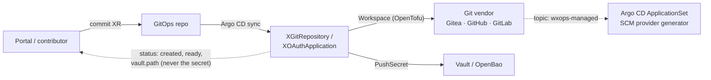

# RFC-003: Vendor-neutral repositories and OAuth applications, with Vault-tracked credentials

## Status
<!-- Draft | In review | Accepted | Declined | Withdrawn | Implemented — and the GitHub issue that carries the discussion, e.g. "Draft · #42" -->
Draft

## Summary

Extend Core's Git-vendor coverage from Gitea alone to Gitea, GitHub and GitLab behind one API shape, and add a managed
**OAuth application** resource for each vendor whose client id and secret are published to Vault (OpenBao after migration) at
a fixed path. Repositories stream from Git to the vendor through the same GitOps path as every other XR. The Vault-held
credential is the contract the next RFC (Dex) and OAuth2 Proxy build on, so creation, tracking and rotation of an OAuth
client is one mechanism rather than a per-vendor manual step.

## Motivation

Today Core can create a Gitea repository, org, team and user ([`gitea-*`](../api-reference/README.md)) and nothing else. Two
gaps follow from that:

1. **Vendor lock.** GitHub and GitLab tenants cannot use the golden path. A repository is the first thing a scaffolded service
   needs, so the portal cannot offer "new service" to them at all. The Gitea packages are also frozen behind an archived
   instance ([`ROADMAP.md`](../../ROADMAP.md)), which leaves the repository API with no active reference vendor.
2. **OAuth clients are hand-made.** Every login integration — Dex's upstream connectors, OAuth2 Proxy in front of an app —
   needs an OAuth application registered at a Git vendor, and its client id and secret carried to wherever they are used.
   Today that is a click-through in a vendor UI and a secret pasted somewhere. Nothing records that the application exists,
   who owns it, or when its secret last changed, and rotating it means repeating the click-through and hoping every consumer
   is updated.

Vault already holds every other generated credential Core creates (database superuser and app creds, connection strings),
mirrored by an ESO `PushSecret`. OAuth client credentials are the same shape of problem and should follow the same pattern.

## Detailed Design

### Scope

Two new capabilities, deliberately separate:

| Capability | Vendors | Result |
|---|---|---|
| **Repository** — create and configure a repository, with the topics/labels GitOps discovery keys on | Gitea, GitHub, GitLab | Repo exists; clone URL in status |
| **OAuth application** — create the vendor-side application, publish its credentials, rotate on demand | Gitea, GitLab; GitHub *adopt-only* (see below) | `client_id` / `client_secret` in Vault at a fixed path |

Not in scope: Dex itself and its clients (RFC-004), OAuth2 Proxy deployment, cluster-access identity (Pinniped, per
[`multi-cluster-proposal.md`](../core-ideas/multi-cluster-proposal.md)), and org/team/user management on GitHub and GitLab.

### The two kinds of OAuth application

This RFC covers one of two, and the split matters for what follows:

- **Upstream** — an application registered *at a Git vendor*, so a login system can authenticate people against that vendor.
  Dex's GitHub/GitLab/Gitea connectors need exactly this. **This RFC.**
- **Downstream** — a client registered *in Dex*, so an application or OAuth2 Proxy can authenticate against Dex.
  **RFC-004.**

Both end as a `client_id` / `client_secret` pair in Vault at the same path convention, so a consumer reads the same shape
whether the issuer is a Git vendor or Dex.

### API surface

Two new XRDs, `v1alpha1`, in the `platform.wxops.cloud` group. Existing `XGiteaRepository` and the other `gitea-*` kinds are
untouched (released XRDs are additive-only); whether they are eventually deprecated in favour of the neutral kind is an open
question, not part of this change.

```yaml
apiVersion: platform.wxops.cloud/v1alpha1
kind: XGitRepository
metadata:
  name: team-alpha-api-service
spec:
  parameters:
    vendor: github            # gitea | github | gitlab
    baseUrl: https://github.com   # required for self-hosted Gitea/GitLab, defaulted for the SaaS hosts
    owner: team-alpha         # org / group / namespace that owns the repository
    repoName: api-service
    description: Alpha squad API service
    private: true
    defaultBranch: main
    topics: [wxops-managed]   # the tag GitOps discovery selects on
    credentialsSecretRef: {name: github-credentials, namespace: crossplane-system}
```

```yaml
apiVersion: platform.wxops.cloud/v1alpha1
kind: XOAuthApplication
metadata:
  name: dex-gitlab
spec:
  parameters:
    vendor: gitlab            # gitea | github | gitlab
    baseUrl: https://gitlab.example.com
    name: dex
    redirectUris: [https://dex.example.com/callback]
    confidential: true
    scopes: [openid, read_user]        # GitLab only; ignored elsewhere
    owner: platform           # picks the Vault store and path; see below
    rotation:
      generation: 1           # bump to rotate
    credentialsSecretRef: {name: gitlab-credentials, namespace: crossplane-system}
status:
  created: true
  ready: true
  clientId: 7b4c…             # not secret; the secret never appears in status
  vault:
    path: platform/oauth/dex-gitlab/credentials
```

Both kinds expose `status.created` and `status.ready` per the [status contract](../api-reference/status-contract.md). The
common fields are the intersection all three vendors support; vendor-only options are the open question below.

### Composition

Both use the existing pattern rather than introducing a new engine: one `function-kcl` composition per kind that branches on
`vendor` and emits a `provider-opentofu` `Workspace` running the matching Terraform provider (`go-gitea/gitea`,
`integrations/github`, `gitlabhq/gitlab`) — the same inline-HCL approach every `gitea-*` package uses. The engine that runs
the Workspace is whatever [RFC-002](002-migrate-terraform-to-opentofu.md) settles on (OpenTofu); this RFC is written to land
after it, so the new packages start on the final engine instead of being migrated later. It adds no Crossplane provider
beyond that one, so it adds no provider RBAC. KCL is chosen over `function-patch-and-transform` because the vendor branch
is conditional composition, which is what the [KCL rule of thumb](../../CLAUDE.md#two-composition-engines) reserves it for.

Terraform resources per vendor:

| Vendor | Repository | OAuth application |
|---|---|---|
| Gitea | `gitea_repository` | `gitea_oauth2_app` — returns `client_id` and a sensitive `client_secret` |
| GitLab | `gitlab_project` | `gitlab_application` — returns the application secret |
| GitHub | `github_repository` | **none** — see below |

**GitHub OAuth applications cannot be created through the API.** As far as this RFC's research found, GitHub exposes no REST
endpoint to create an OAuth App and the Terraform GitHub provider has no resource for one; they are registered in the GitHub
UI. This should be re-verified before implementation begins. So for `vendor: github`, `XOAuthApplication` is **adopt-only**:
an operator registers the app once, places the client id and secret in a Kubernetes Secret, and the XR reads that Secret and
publishes it to Vault at the standard path. Core does not create the application and cannot rotate it — `rotation` is
rejected for `vendor: github` at schema level. What Core still provides is the single tracked location, which is what Dex
and OAuth2 Proxy consume.

### Credentials in Vault

Output flow is the one `platform-database-clusters` already uses: the Workspace writes a connection Secret, an ESO
`PushSecret` mirrors the whole Secret to Vault as a single write, `deletionPolicy: Delete` so removing the XR removes the
entry. Paths follow the [Vault path convention](../../CLAUDE.md#vault-path-convention) — `remoteKey` omits the KV mount prefix:

| `owner` | Store | `remoteKey` | Full logical path |
|---|---|---|---|
| `platform` | platform store, scoped to `platform/` | `oauth/{name}/credentials` | `platform/oauth/{name}/credentials` |
| a tenant | tenant store, scoped to `tenants/` | `{owner}/oauth/{name}/credentials` | `tenants/{owner}/oauth/{name}/credentials` |

The entry carries `client_id`, `client_secret`, `vendor`, `base_url`, `redirect_uris` and `generation`. **OpenBao:** it keeps
the Vault API and KV v2, so the `ClusterSecretStore` changes its server URL and nothing in the composition or the path
convention changes. External Secrets Operator documents OpenBao as supported through its Vault provider (tested upstream with ESO v0.16.1 and OpenBao v2.2.0); running it against this repo's own stores is still a spike.

### Rotation

Rotation is explicit and Git-driven: bumping `spec.parameters.rotation.generation` makes the composition replace the vendor
application (new client id and secret), the `PushSecret` writes a new KV v2 version, and the previous versions stay in Vault
as the history that answers "when did this last change, and to what". The bump is a normal commit, so it appears in the audit
trail like any other change.

Known limits, stated up front:

- **Replacement is not zero-downtime.** For `gitea_oauth2_app` and `gitlab_application` the old secret stops working when the
  application is replaced. Consumers (an ESO `ExternalSecret` feeding Dex, say) pick up the new value on their refresh
  interval and, unless something restarts them, need a rollout. Overlapping secrets would need vendor support that these two
  do not offer.
- **The OpenTofu state is a second copy.** `provider-opentofu` keeps state as a Secret in the cluster, and that state
  contains the client secret. Vault is the tracked, rotatable copy; the state Secret is the one to keep under RBAC review.
- **Scheduled rotation** (rotate every *N* days without a commit) could be done with a `time_rotating` trigger in the HCL. It
  depends on how often `provider-opentofu` re-plans, so it is a spike, not part of the first cut.

### GitOps streaming

"Streaming" here means the one path every Core resource already takes, extended to repositories and OAuth applications:



Secrets never travel through Git: a commit carries only the XR, the portal reads `status.vault.path` and the vendor-side
result, and the credential itself moves Workspace → Secret → Vault. Created repositories carry a topic so an Argo CD
ApplicationSet with an SCM provider generator (which supports GitHub, GitLab and Gitea) can discover them across vendors
without a per-repository Application. This design works under every model in
[open decision 3](../../ROADMAP.md#open-decisions) (portal → Git, portal → API, hybrid) and does not pre-empt it.

### Compatibility and change tier

Two new packages, `git-repository` and `oauth-application`, each with `current: unreleased` in `VERSIONS.yaml`. Adding a
package is `safe` under `tests/api_compat.py`; no released XRD changes. Both would be labelled `channel: stable` per
[ADR-001](../adr/001-package-channel-label.md).

### Testing

Per the [testing rules](../../CLAUDE.md#testing), each conditional branch needs a case:

- a golden case per vendor for both kinds (`gitea`, `github`, `gitlab`), plus owner `platform` vs a tenant for the Vault path
- an `observed.yaml` case for the ready/unready derivation, generated with `mkobserved.py`
- negative cases under `_invalid/`: unknown `vendor`, `rotation` on `vendor: github`, missing `baseUrl` for self-hosted
- an invariant that the `PushSecret` `remoteKey` never starts with the KV mount prefix, and that the composition emits no RBAC

This proves the rendered output only. Whether the vendor API accepts the HCL, and whether the OpenBao store behaves like
Vault, need a cluster and a live vendor — the kind-based e2e tier in the roadmap.

## Drawbacks

- **A neutral API is a lowest common denominator.** Anything vendor-specific (GitHub branch protection, GitLab group
  hierarchy) either goes into per-vendor option blocks that erode the neutrality, or is left out.
- **GitHub is second-class for OAuth applications** — adopt-only, no rotation — because of the vendor's API, not ours.
- **Three Terraform providers to keep pinned and tested**, where today there is one. Each has its own release cadence and
  authentication model.
- **Inline HCL grows per vendor** inside one composition, and the offline suite cannot validate any of it against the vendor.
- **Client secrets live in OpenTofu state** as well as Vault (see Rotation).
- **The archived Gitea instance** means the Gitea branch has no live environment to be checked against until GitHub or GitLab
  cases are running.

## Alternatives

- **Per-vendor kinds** (`XGitHubRepository`, `XGitLabProject`, …), matching the `gitea-*` precedent. Simpler to build and no
  lowest-common-denominator problem, but the portal and Dex need one shape and would branch per vendor themselves; that is the
  cost this RFC moves into the platform.
- **Native Crossplane providers instead of Workspaces** — community providers exist for GitHub and GitLab. They would avoid the
  Workspace layer and its state Secret, but bring their own maturity and RBAC surface, and the repo has so far chosen
  a Workspace-based provider for vendor APIs for consistency. Worth re-checking the maturity of each before implementation.
- **Vault as the generator.** Have Vault mint or hold the client credentials. Neither vendor issues an OAuth application from a
  Vault secrets engine that this RFC found, so Vault stays the tracked store, not the source.
- **Do nothing.** Keep registering OAuth applications by hand. The cost is the one in *Motivation*: no record, no owner, no
  rotation, and RFC-004 has nothing to build on.

## Rollout Plan

Each phase is useful alone and can ship as its own release.

- [ ] **Phase 1 — Gitea OAuth application to Vault.** `oauth-application` for `vendor: gitea` only (`gitea_oauth2_app`),
  `PushSecret` to the platform store, goldens and invariants. Proves the credential contract on a vendor the repo already
  drives.
- [ ] **Phase 2 — GitLab.** `vendor: gitlab` for `oauth-application`; first vendor with a live environment to test against.
- [ ] **Phase 3 — GitHub adopt-only.** Publish an operator-registered GitHub OAuth App to Vault; schema rejects `rotation`.
- [ ] **Phase 4 — `git-repository`**, all three vendors, with the discovery topic and an ApplicationSet SCM-generator example.
- [ ] **Phase 5 — rotation.** `rotation.generation`, the KV v2 history, and the spike on scheduled rotation.
- [ ] **OpenBao spike** — run Phase 1 against an OpenBao-backed `ClusterSecretStore`. Runs alongside, not after, so the store
  migration never blocks a phase.

On acceptance, the decisions this settles are recorded as ADRs — most likely the neutral-kind-over-per-vendor-kinds choice and
the Vault credential path.

## Open Questions

1. **Vendor-specific options.** Are they accepted as optional per-vendor blocks (`github: {…}`, `gitlab: {…}`) on the neutral
   kind, or is anything beyond the common fields out of scope until asked for?
2. **Fate of `gitea-*`.** Keep alongside the neutral kinds indefinitely, or deprecate `XGiteaRepository` once `XGitRepository`
   covers it? Released XRDs cannot be removed without a deliberate break.
3. **GitHub Apps.** GitHub Apps are the vendor's preferred integration model and can be created through a manifest flow, but
   that flow needs a person to confirm in a browser. Is adopt-only for OAuth Apps enough, or should this RFC cover Apps too?
4. **"GitOps streaming".** This RFC reads it as the Git → Argo → Crossplane → vendor path plus ApplicationSet discovery. If
   the intent also includes something else — webhooks back to Argo, or streaming vendor events into status — that is
   additional scope.
5. **Where a tenant's vendor credentials live** (`credentialsSecretRef`): a hand-made Secret as the `gitea-*` packages do
   today, or an `ExternalSecret` from Vault so nothing is created by hand?
6. **Consumer reload.** Is restarting Dex and OAuth2 Proxy after rotation a documented manual step, or should the design
   assume a reloader? Depends on RFC-004.
