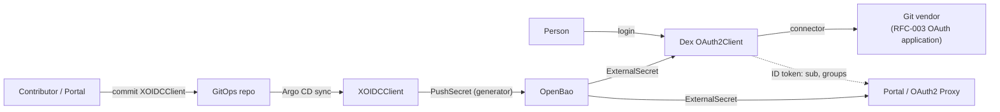

# RFC-004: Dex as the identity provider — OIDC clients, OpenBao-held secrets and rotation, Portal authentication

## Status
<!-- Draft | In review | Accepted | Declined | Withdrawn | Implemented — and the GitHub issue that carries the discussion, e.g. "Draft · #42" -->
Draft

## Summary

Adopt [Dex](https://dexidp.io) as the platform's OpenID Connect issuer, federating to the Git vendors ([RFC-003](003-vendor-repos-and-oauth-applications.md)),
and add a Core resource that registers an **OIDC client** in Dex with its secret held and rotated through OpenBao. The Portal
authenticates its users through Dex with one such client; OAuth2 Proxy in front of tenant apps uses the same resource. Dex
itself remains platform infrastructure installed through GitOps, as CloudNativePG and Vault are; Core owns the per-client
registration and the secret lifecycle, not the Dex deployment. The claims Dex issues are the input to the authorization
model in RFC-005.

## Motivation

The Portal is a separate repository that will sit in front of every Core API ([`portal-integration.md`](../user-guide/portal-integration.md)),
and nothing today answers who a user is. Three gaps:

1. **No single login.** People already have identities at their Git vendor. Without an issuer between the vendor and each
   application, every application either integrates with each vendor separately or is left unauthenticated.
2. **OIDC clients would be hand-made.** Each application that authenticates against Dex needs a registered client with an id,
   a secret and redirect URIs. Created by hand, they have the same problems [RFC-003](003-vendor-repos-and-oauth-applications.md)
   describes for vendor-side apps: no record, no owner, no rotation.
3. **Authorization has no input.** The next RFC maps authorization to Git state — who is in which org or team. That is only
   possible if a person's Git memberships arrive as claims in a token the platform can verify, which is what an issuer in
   front of the Git vendors provides.

## Detailed Design

### Scope

| In this RFC | Not in this RFC |
|---|---|
| The `XOIDCClient` resource: register a client in Dex, hold its secret in OpenBao, rotate it | Installing and operating Dex itself (platform GitOps) |
| The credential path and rotation mechanism | Dex **connectors** as a Core resource (see below — deliberately deferred) |
| The claim contract Portal and OAuth2 Proxy rely on | The authorization model — Kyverno, ABAC, RBAC mapping to Git (RFC-005) |
| The Portal registered as the first client | Deploying OAuth2 Proxy or the Portal |

### How Dex is configured, and what that means for Core

Dex has two kinds of configuration with different shapes, and the design follows from that difference:

| | Where it lives | Changeable at runtime? |
|---|---|---|
| **Connectors** (GitHub, GitLab, Gitea upstreams) | Dex's config file | **No** — a change means regenerating config and restarting Dex. A dynamic connector API has been proposed upstream ([dexidp/dex#1472](https://github.com/dexidp/dex/issues/1472)); this RFC found no released one. |
| **OAuth2 clients** | Dex's storage: the `oauth2clients.dex.coreos.com` custom resources when the storage backend is `kubernetes`; SQL rows otherwise | **Yes** — Dex reads storage per request |

Clients can therefore be reconciled like any other Kubernetes object; connectors cannot. So this RFC gives clients a Core
resource and leaves connectors in the platform's Dex Helm values. What Core contributes to connectors is the credential: each
connector's vendor OAuth application is an [`XOAuthApplication`](003-vendor-repos-and-oauth-applications.md), its
`client_id`/`client_secret` sit in OpenBao, and an `ExternalSecret` feeds them into Dex's config. A connector-rendering
resource can be added later if hand-maintained connector config becomes the pain; it would generate a config Secret and
trigger a restart, which is a config generator rather than a reconciler, and not worth building before that.

**Prerequisite:** Dex runs with `kubernetes` storage. Core does not support SQL-backed Dex in the first cut — there is no
Kubernetes object to reconcile and no provider to do it (see Alternatives).

### API surface

```yaml
apiVersion: platform.wxops.cloud/v1alpha1
kind: XOIDCClient
metadata:
  name: portal
spec:
  parameters:
    clientId: wxops-portal
    name: W'xOps Portal
    redirectUris: [https://portal.example.com/auth/callback]
    public: false               # true = no secret, PKCE only, for browser-only apps
    owner: platform             # platform | a tenant; selects the OpenBao store and path
    rotation:
      interval: 2160h           # ~90 days; omit to never rotate on a schedule
      generation: 1             # bump to rotate now
    dex:
      namespace: dex            # where Dex's oauth2clients live
status:
  created: true
  ready: true
  clientId: wxops-portal        # the secret never appears in status
  vault:
    path: platform/oidc-clients/wxops-portal/credentials
```

Both `status.created` and `status.ready` follow the [status contract](../api-reference/status-contract.md). A `public: true`
client has no secret and skips everything under *Secrets and rotation*.

### Composition

One `function-kcl` composition, per the repo's rule for multi-resource compositions. It emits, all wrapped as
`provider-kubernetes` `Object`s like every other KCL package:

1. an ESO **`PushSecret`** with a **Password generator** as its source, writing the client secret to OpenBao — the generated
   value never exists in Git and is never composed into an XR field;
2. an ESO **`ExternalSecret`** that reads it back from OpenBao into a Kubernetes Secret, so OpenBao stays the single source of
   truth and every consumer reads it from the same place;
3. the Dex **`OAuth2Client`** custom resource, its `secret` filled from that Secret through the `Object`'s `references`
   mechanism instead of being written into the manifest.

The Portal, or OAuth2 Proxy, gets its copy the same way — an `ExternalSecret` from the same OpenBao path in its own namespace.
No Crossplane provider is added. `provider-kubernetes` does need permission to write `oauth2clients.dex.coreos.com`; that is
one more entry in the reviewed static grant in `providers/rbac-provider-kubernetes.yaml`, exactly as the CNPG and ESO grants
already are. It is **not** composition-emitted RBAC — the [decided rejection](../../ROADMAP.md) stands.

Two points about Dex that need confirming in a spike before this can be built: the `OAuth2Client` object's *name* is derived
by Dex from the client id rather than chosen freely, so the composition has to reproduce that derivation or Dex will not find
the client; and whether writing these CRs directly, instead of going through Dex's gRPC API, is a supported way to manage
clients.

### Secrets and rotation in OpenBao

Paths follow the [Vault path convention](../../CLAUDE.md#vault-path-convention) — `remoteKey` omits the KV mount prefix:

| `owner` | `remoteKey` | Full logical path |
|---|---|---|
| `platform` | `oidc-clients/{clientId}/credentials` | `platform/oidc-clients/{clientId}/credentials` |
| a tenant | `{owner}/oidc-clients/{clientId}/credentials` | `tenants/{owner}/oidc-clients/{clientId}/credentials` |

The entry holds `client_id`, `client_secret`, `issuer` and `generation`. **OpenBao works here** — External Secrets Operator
documents it as a supported provider through its HashiCorp Vault provider, tested with ESO v0.16.1 and OpenBao v2.2.0 — so the
store definition changes and the composition and the paths do not.

**OpenBao does not rotate a KV secret by itself.** What it provides is the store of record: versioned KV v2 (every rotation is
a new version, the history answers *when did this change*), per-path ACLs, and an audit log. The rotation is *driven* by ESO:
the `PushSecret`'s Password generator produces a new value on each `refreshInterval`, which `rotation.interval` sets, and
`generation` forces one on demand. Both are visible in Git, as a value or a commit.

Rotation is also not seamless. A Dex client has exactly one secret, so between OpenBao receiving the new version and both
sides (the Dex `OAuth2Client` and the consuming application) having refreshed, logins for that client can fail. Refresh
intervals are set to match so the window is minutes, not hours, and rotation is meant for quiet hours; a real dual-secret
overlap would need Dex support this design does not assume. Applications that read the secret at start-up need a restart to
pick up the new value, which is either a documented manual step or an add-on (a reloader) — an open question below.

One behaviour to verify: an ESO generator produces a new value each time it is evaluated, so the spike must show that a
controller restart or an unrelated edit to the `PushSecret` does not rotate the secret when nobody asked it to.

### Identity for the Portal

The Portal logs users in with the authorization-code flow against Dex, using the `portal` client above. The contract the
Portal and the later authorization layer rely on is the claims in the ID token:

| Claim | Source | Note |
|---|---|---|
| `sub`, `email`, `name` | The Git vendor, via the connector | `sub` is Dex's connector-scoped id, stable for a person per connector |
| `groups` | The vendor's orgs and teams | The input to RFC-005. Its exact format is decided below |
| `federated_claims.connector_id` | Dex | Which vendor the person authenticated through |

Two things about that contract matter to RFC-005 and are stated now rather than discovered there:

- **Claims are a snapshot taken at login.** A person removed from a team keeps the old `groups` in a token until it expires
  or is refreshed, so "1-to-1 with Git" has a bounded lag equal to the token and refresh lifetimes. Those lifetimes are a
  security setting, not a default to accept.
- **A group name is only unique within a vendor.** The same team name can exist on GitHub and GitLab. The claim format should
  carry the connector so the two cannot be confused; the normalised form is an open question.

### GitOps streaming



The secret moves only between OpenBao and the two Kubernetes Secrets; a commit carries the client's declaration and never its
value, and `status` carries only the vault path.

### Compatibility and change tier

One new package, `oidc-client`, `current: unreleased` in `VERSIONS.yaml`; adding a package is `safe`. It depends on
`function-kcl` and the ESO CRDs already in the reference stack, and on Dex being present at runtime, which the composition
cannot check — the failure is a client that never becomes `ready`.

### Testing

- goldens for: confidential vs `public`, `owner: platform` vs a tenant, with and without `rotation.interval`
- `observed.yaml` cases for readiness, generated with `mkobserved.py`
- negative cases: `public: true` combined with `rotation`, `redirectUris` empty, an `http://` redirect outside localhost
- invariants: `remoteKey` carries no KV mount prefix; the composition emits no RBAC; no secret value in any XR field or status

Offline tests prove only the rendered objects. Whether Dex accepts a client written as a CR, and whether rotation behaves as
described, needs a cluster with Dex and OpenBao — the kind-based e2e tier.

## Drawbacks

- **The client secret exists in three places**: OpenBao, a Kubernetes Secret, and the `OAuth2Client` object's own `secret`
  field, where anyone allowed to read that resource can see it. It is as sensitive as a Secret and needs the same RBAC review.
- **Connectors stay hand-maintained**, so part of the identity setup is outside Core's reconcile loop, and a connector change
  is a Dex restart.
- **Rotation is not seamless** and leans on ESO generator behaviour that needs verifying (above).
- **It ties Core to Dex's Kubernetes storage.** That storage is fine for a modest number of users and clients; Dex's own
  documentation cautions it is not intended for a large number of users.
- **Managing clients by writing Dex's CRDs** rather than through Dex's API relies on an internal storage format, which Dex
  could change.
- **Dex is one more component on the login path.** If it is down, no one signs in to the Portal.

## Alternatives

- **Drive Dex's gRPC API** to create and update clients. The supported management path, and it works with SQL storage too. It
  needs a component that speaks gRPC to Dex — a controller or a Job — which no existing Core package resembles, and a
  Crossplane provider for it does not exist. Worth reconsidering if the CRD route fails the spike.
- **Static clients in Dex's config file**, with secrets from OpenBao by environment-variable expansion. Simplest, no CRDs. But
  every client change is a config change and a Dex restart, which is the opposite of self-service.
- **A community Dex operator** (several publish CRDs for clients and connectors). That would be a new controller in the
  control plane, which this project has chosen not to write or depend on.
- **OpenBao as the OIDC provider** instead of Dex. It can issue tokens, but it is not a federation layer over Git vendors, and
  the Git-membership claims RFC-005 needs come from those connectors.
- **Keycloak** or a hosted IdP. Heavier, and the value here is the thin federation layer over the vendors already in use.
- **Do nothing.** No login for the Portal, and every future application decides its own.

## Rollout Plan

- [ ] **Spike, before acceptance.** Four checkable questions: how Dex derives the `OAuth2Client` object name from a client id;
  whether managing clients through the CRs is supported; that an ESO generator does not rotate on a restart or unrelated edit;
  that `Object` `references` can inject a secret value into a manifest field.
- [ ] **Phase 1 — `oidc-client` for the Portal.** `owner: platform`, confidential clients, no scheduled rotation. Against a
  scratch Dex and OpenBao.
- [ ] **Phase 2 — rotation.** `rotation.interval` and `generation`, with the overlap window measured rather than assumed.
- [ ] **Phase 3 — tenant clients.** `owner` set to a tenant, and the cross-store question below settled.
- [ ] **Phase 4 — OAuth2 Proxy** consuming the same credential contract for a first tenant app.
- [ ] **Connector rendering** — deferred; revisit only when the hand-maintained connector config becomes a real cost.

On acceptance, ADRs for: Dex over the alternatives, clients as CRs over the gRPC API, and OpenBao as the record with ESO as the
rotation driver.

## Open Questions

1. **Group claim format.** `org:team` alone collides across vendors. Something like `github:org:team`, prefixed by the
   connector id, needs deciding before RFC-005 keys on it.
2. **Token and refresh lifetimes.** They set how stale Git membership can be. What is the acceptable bound?
3. **Tenant clients and store scope.** A tenant's client secret would sit under `tenants/…`, but Dex, a platform component,
   must read it. Does a platform `ExternalSecret` reading from the tenant store cross a boundary the store scoping was meant to
   hold, or should Dex-side secrets always live under `platform/`?
4. **Consumer reload.** After rotation, do consumers restart via a documented manual step or a reloader component?
5. **API server trust.** Should the Kubernetes API server accept Dex-issued tokens directly (structured authentication, as
   [`multi-cluster-proposal.md`](../core-ideas/multi-cluster-proposal.md) describes), or only the Portal? That decides how much
   of RFC-005 can lean on Kubernetes's own user info. How Dex relates to Pinniped is part of the same question and is not
   decided here.
6. **Who registers clients?** Any tenant able to create an `XOIDCClient` can ask for arbitrary redirect URIs. Restricting that
   is an authorization question for RFC-005, not this one.
7. **SQL-backed Dex.** Is `kubernetes` storage an acceptable permanent prerequisite?
