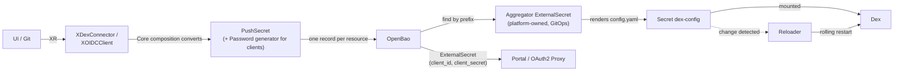

# RFC-004: Dex as the identity provider — Core-rendered configuration, OpenBao-held secrets, Portal authentication

## Status
<!-- Draft | In review | Accepted | Declined | Withdrawn | Implemented — and the GitHub issue that carries the discussion, e.g. "Draft · #42" -->
Draft — targeted for the next release (Phases 0–2 of the rollout plan)

## Summary

Adopt [Dex](https://dexidp.io) as the platform's OpenID Connect issuer and manage its **configuration entirely through Core**, with no
operator and no call to Dex's API. Two new resources, `XDexConnector` (an upstream Git vendor) and `XOIDCClient` (an application that
logs in through Dex), each convert their parameters into one record in OpenBao. A single platform-owned External Secrets `ExternalSecret`
gathers every record, renders Dex's `config.yaml` into a Secret, Dex mounts it, and Reloader restarts Dex when it changes. The Portal
authenticates its users through Dex as the first client; OAuth2 Proxy is the second consumer of the same contract. Dex itself stays platform
infrastructure installed through GitOps. The claims Dex issues are the input to the authorization model in
[RFC-005](005-git-mapped-authorization.md).

## Motivation

The Portal is a separate repository that will sit in front of every Core API ([`portal-integration.md`](../user-guide/portal-integration.md)),
and nothing today answers who a user is. Three gaps:

1. **No single login.** People already have identities at their Git vendor. Without an issuer between the vendor and each application,
   every application integrates with each vendor separately or is left unauthenticated.
2. **Dex configuration would be hand-maintained.** Connectors and clients are entries in one file. Edited by hand, they have the problems
   [RFC-003](003-scm-connections-and-resources.md) describes for vendor-side apps: no record of what exists, who owns it, or when its
   secret last changed, and a mistake in one entry affects every login.
3. **Authorization has no input.** The next RFC maps authorization to Git state — who is in which org or team. That is only possible if a
   person's Git memberships arrive as claims in a token the platform can verify.

## Detailed Design

### Scope

| In this RFC | Not in this RFC |
|---|---|
| `XDexConnector` and `XOIDCClient` resources and the OpenBao record each writes | Installing and operating Dex itself (platform GitOps) |
| The aggregating `ExternalSecret` that renders Dex's config, and Reloader | The authorization model — Kyverno, ABAC, RBAC mapping (RFC-005) |
| The claim contract Portal and OAuth2 Proxy rely on | Deploying OAuth2 Proxy or the Portal |
| Rotation of client secrets | **Tenant-owned** clients (Phase 4, gated on a store-scope question below) |

### Why configuration, not an operator or Dex's API

Dex reads its connectors and its static clients from one config file. Managing them through Dex's gRPC API or its Kubernetes storage
objects would tie Core to Dex internals — an API that cannot manage connectors at all (a dynamic connector API has only been proposed
upstream, [dexidp/dex#1472](https://github.com/dexidp/dex/issues/1472)), or a storage format Dex may change — and would need either a
controller or a stack of hand-derived objects. Managing the **config file** uses the one interface Dex documents as its configuration
contract, works with any Dex storage backend, and treats connectors and clients identically. The price is that a change restarts Dex.
That price is accepted (see Drawbacks) and bounded (see Rollout safety).

### The flow



The UI never talks to OpenBao or ESO. It writes an XR — through Git or the API, per
[open decision 3](../../ROADMAP.md#open-decisions) — and Core does the conversion. A commit carries a declaration, never a secret value,
and `status` carries only the OpenBao path.

### Records in OpenBao

One record per resource, all under the platform store, and `remoteKey` omits the KV mount prefix per the
[Vault path convention](../../CLAUDE.md#vault-path-convention):

| Resource | `remoteKey` | Full logical path |
|---|---|---|
| Connector | `dex/connectors/{connectorId}` | `platform/dex/connectors/{connectorId}` |
| Client | `dex/clients/{clientId}` | `platform/dex/clients/{clientId}` |

A **client record** holds `client_id`, `client_secret`, `name`, `redirect_uris` (JSON array), `public`, `owner` and `generation`. A
**connector record** holds `type`, `id`, `name`, `client_id`, `client_secret` (the vendor OAuth application's credentials), and `config`,
a JSON object of the connector's non-secret settings. The same record serves two readers: the aggregator reads all fields, and a consuming
application's own `ExternalSecret` reads just `client_id` and `client_secret`.

External Secrets Operator documents OpenBao as supported through its Vault provider (tested upstream with ESO v0.16.1 and OpenBao v2.2.0),
so the store definition changes and nothing else does. All records are in the platform store in this RFC by design — see *Tenant clients*.

### API surface

```yaml
apiVersion: platform.wxops.cloud/v1alpha1
kind: XDexConnector
metadata:
  name: github
spec:
  parameters:
    connectorId: github
    type: github                 # github | gitlab | gitea
    name: GitHub
    issuer: https://dex.example.com     # builds the connector's callback URL
    baseUrl: ""                  # GitHub Enterprise / self-hosted GitLab / Gitea; empty for the SaaS host
    organizations:               # github: restrict to orgs, and optionally teams
      - name: wxops
        teams: []
    groups: []                   # gitlab: restrict to groups
    credentialsSecretRef: {name: dex-github-oauth, namespace: dex}   # the vendor OAuth application's client_id / client_secret
status:
  created: true
  ready: true
  vault: {path: platform/dex/connectors/github}
```

```yaml
apiVersion: platform.wxops.cloud/v1alpha1
kind: XOIDCClient
metadata:
  name: portal
spec:
  parameters:
    clientId: wxops-portal
    name: W'xOps Portal
    redirectUris: [https://portal.example.com/auth/callback]
    public: false                # true = no secret, PKCE only, for browser-only apps
    owner: platform              # platform only in this RFC; see Tenant clients
    rotation:
      interval: 2160h            # ~90 days; omit to never rotate on a schedule
      generation: 1              # bump to rotate now
status:
  created: true
  ready: true
  clientId: wxops-portal         # the secret never appears in status
  vault: {path: platform/dex/clients/wxops-portal}
```

Both expose `status.created` and `status.ready` per the [status contract](../api-reference/status-contract.md). **What `ready` means here is
narrower than it sounds:** the record is written to OpenBao. Whether Dex has *loaded* it is a property of the aggregator and Dex, not of
the XR, and Core cannot observe it. That is a stated limitation, not an oversight.

The vendor OAuth application behind a connector is an [`XScmOAuthApp`](003-scm-connections-and-resources.md) once RFC-003 lands.
Until then it is created by hand, and its credentials placed in OpenBao and pulled into `credentialsSecretRef` by an `ExternalSecret` in
GitOps. **This RFC does not depend on RFC-003**; it only needs the credentials to exist.

### Compositions

Each is a `function-kcl` composition, per the repo's rule for multi-resource compositions, emitting `provider-kubernetes` `Object`s:

- **`XOIDCClient`** — a Password generator; a `PushSecret` sourcing it and using `spec.template` to build the whole record in one write
  (the same technique `platform-database-clusters` uses for its pooler connection strings). The generated secret never exists in Git or in
  an XR field. For `public: true` there is no generator and no `client_secret`.
- **`XDexConnector`** — a `PushSecret` sourcing `credentialsSecretRef`, with a template that merges in the connector's non-secret
  configuration.

Neither adds a Crossplane provider or any RBAC: `provider-kubernetes` already holds the grant for `externalsecrets`, `pushsecrets` and
`passwords` in `providers/rbac-provider-kubernetes.yaml`, and the compositions still emit no RBAC.

### The aggregator

One `ExternalSecret`, platform-owned, in GitOps beside Dex — deliberately not a Core resource, since Dex is infrastructure Core does not own.
It is shipped as `providers/dex-config.yaml`. It collects every record under `dex/connectors/` and `dex/clients/` and renders Dex's file. The
shape (not the final syntax — how `dataFrom.find` and `rewrite` behave on OpenBao KV v2 is the spike's first question):

```yaml
# illustrative shape
spec:
  refreshInterval: 1m
  target:
    name: dex-config
    template:
      engineVersion: v2
      data:
        config.yaml: |
          issuer: https://dex.example.com
          storage: {...}                 # fixed platform settings live here, in GitOps
          connectors:
            # for each connector record: type, id, name, config + client_id/client_secret
          staticClients:
            # for each client record: id, name, secret, redirectURIs, public
  dataFrom:
    - find: {path: dex/connectors/, name: {regexp: ".*"}}
    - find: {path: dex/clients/,    name: {regexp: ".*"}}
```

Dex's fixed settings — issuer, storage, web listener, token expiry — are part of this template, reviewed in Git like everything else.
Each change to a record changes the rendered Secret at the next `refreshInterval`, so Dex restarts at most once per interval however many
records changed.

### Reloader

Stakater's [Reloader](https://github.com/stakater/Reloader), an open-source controller, restarts a workload when a Secret or ConfigMap it
uses changes. The annotation naming `dex-config` goes on Dex's Deployment in the Helm values, once. Consumers (Portal, OAuth2 Proxy) carry
the annotation for the Secret their own `ExternalSecret` produces. This is the only add-on beyond what the stack has; it is not an
operator for Dex and holds no Dex-specific logic.

### Secrets and rotation in OpenBao

**OpenBao does not rotate a KV secret by itself.** It is the store of record: versioned KV v2 (every rotation is a new version, so the
history answers *when did this change*), per-path ACLs, and an audit log. Rotation is *driven* by ESO — the client's Password generator
produces a new value on each `refreshInterval` of the `PushSecret`, which `rotation.interval` sets, and `generation` forces one on demand.
Both are visible in Git, as a value or a commit.

A rotation flows: new record in OpenBao → the aggregator renders a new config → Reloader restarts Dex; in parallel the consumer's
`ExternalSecret` refreshes and Reloader restarts the consumer. A Dex client has exactly one secret, so between those two changes landing,
logins for that client can fail. Matching refresh intervals keep that window to minutes, and rotation is meant for quiet hours; a real
overlap would need dual-secret support Dex does not offer.

One behaviour to verify: an ESO generator produces a new value each time it is evaluated, so the spike must show that a controller restart
or an unrelated edit to the `PushSecret` does not rotate a secret nobody asked to rotate.

### Rollout safety

The design's failure mode is one entry breaking everyone's login, so it is defended in layers:

1. **Core validates before it writes.** The XRD schema and the composition reject malformed entries, so an invalid record never reaches
   OpenBao. Kyverno ([RFC-005](005-git-mapped-authorization.md)) adds ownership rules at admission.
2. **A rendering error leaves the last good config.** If the aggregator's template fails on a malformed record, ESO does not overwrite
   the existing Secret, so Dex keeps running the previous configuration.
3. **A semantically bad config stalls instead of taking Dex down.** A duplicate client id or an invalid connector would crash a new Dex pod;
   with at least two replicas and `maxUnavailable: 0`, the failing pod never becomes ready and the old pods keep serving. The change is
   stuck rather than an outage, and a stuck rollout is visible.
4. **Dex needs persistent storage.** In-memory storage would lose in-flight logins on every restart; `kubernetes` or SQL storage does not.

### Identity for the Portal

The Portal logs users in with the authorization-code flow against Dex, using the `portal` client. The contract the Portal and the
authorization layer rely on is the claims in the ID token:

| Claim | Source | Note |
|---|---|---|
| `sub`, `email`, `name` | The Git vendor, via the connector | `sub` is Dex's connector-scoped id, stable for a person per connector |
| `groups` | The vendor's orgs and teams | The input to RFC-005. The connector's team-name setting decides whether groups carry a team's display name or its slug; the slug is what RFC-005's owner rule expects, and the exact option is confirmed in the spike |
| `federated_claims.connector_id` | Dex | Which vendor the person authenticated through |

Two properties matter to RFC-005 and are stated now:

- **Claims are a snapshot taken at login.** A person removed from a team keeps the old `groups` until the token expires or is refreshed, so
  "1-to-1 with Git" has a lag equal to the token and refresh lifetimes. Those are a security setting, not a default to accept.
- **A group name is only unique within a vendor.** The same team name can exist on GitHub and GitLab, so the claim format should carry the
  connector; the normalised form is an open question.

### Tenant clients

Tenant-owned clients are **out of the next release**. A tenant's OAuth2 Proxy client needs its secret readable by the tenant's namespace, but
the aggregator must find every client under one prefix. Putting tenant records in the platform store makes the platform store readable by
whatever `ExternalSecret` a tenant can create in a namespace that store allows; putting them in the tenant store means the aggregator crosses a
store boundary the scoping exists to hold. Neither is settled, and both are RFC-005's territory, so Phase 4 waits on the answer (open
question 3).

### Compatibility and change tier

Two new packages, `dex-connector` and `oidc-client`, each `current: unreleased` in `VERSIONS.yaml`; adding a package is `safe`. Each needs
its own `docs/api-reference/` page, an example, a `package/<name>/README.md`, and test cases. `providers/dex-config.yaml` is new and applied
with `make providers`. Reloader and Dex are added to the reference stack and `NOTICE` when this lands. They depend on `function-kcl` and the
ESO CRDs already in the stack, and on Dex and Reloader being present at runtime, which a composition cannot check.

### Testing

- goldens: each connector type; confidential vs `public` client; with and without `rotation.interval`; the rendered record contents
- `observed.yaml` readiness cases via `mkobserved.py`
- negative cases: `public: true` with `rotation`, empty `redirectUris`, an `http://` redirect outside localhost, an unknown connector type,
  `owner` other than `platform`
- invariants: `remoteKey` carries no KV mount prefix; no secret value in any XR field or status; the compositions emit no RBAC

Offline tests prove the records Core writes. They do **not** prove that the aggregator template renders a valid Dex config, or that Dex
accepts it — reimplementing the template in a test would prove the reimplementation, not ESO. That needs a cluster with ESO, OpenBao and
Dex, which is the kind-based e2e tier and, for the next release, a manual acceptance run.

## Drawbacks

- **Every change restarts Dex.** Adding a client or rotating a secret is a rolling restart, and the restart is bounded to one per refresh
  interval rather than avoided. A busier tenant-client future makes this cost recur.
- **One config, shared blast radius.** A bad entry can affect all logins; the defences above make that a stall rather than an outage, and
  they are defences, not guarantees.
- **The aggregator is hand-owned platform config** outside Core's reconcile loop. Its template is the most delicate file in this design.
- **The client secret exists in three places**: OpenBao, the rendered `dex-config` Secret, and the consumer's Secret. All are Secrets under
  the same RBAC review; none is a plain-text field in an object type made to be read.
- **`ready` does not mean live.** Core cannot see whether Dex has loaded an entry.
- **Rotation is not seamless**, and depends on ESO generator behaviour that needs verifying.
- **Dex is one more component on the login path.** If it is down, no one signs in to the Portal.
- **Reloader is a new dependency**, small and open-source, but a restart controller with access to Deployments.

## Alternatives

- **Write Dex's `OAuth2Client` custom resources** through `provider-kubernetes` (this RFC's earlier design). Clients then need no restart,
  because Dex reads storage per request. But it couples Core to Dex's Kubernetes storage format, does not work with SQL-backed Dex, needs
  the object's name derived the way Dex derives it, puts the secret in the object's own field, and still leaves connectors in Helm values.
  Held in reserve if restart cost proves unacceptable for a high-churn tenant-client future.
- **Drive Dex's gRPC API.** The supported runtime-management path for clients, but it needs a component that speaks gRPC to Dex, cannot
  manage connectors, and no Crossplane provider for it exists.
- **A Dex operator.** Stakater's Dex Config Operator manages connectors, clients and storage through CRDs; its source is not publicly
  reachable and its documentation carries an End User License Agreement, which is at odds with an Apache-2.0 stack. Open-source Dex operators
  exist, and each would be a new controller in a control plane that has chosen not to add one.
- **Static config maintained in the Dex Helm values.** Simplest and it works, but every client change is a manual edit reviewed by hand,
  with no record, owner or rotation — the state of affairs this RFC exists to replace.
- **OpenBao as the OIDC provider** instead of Dex. It can issue tokens, but it is not a federation layer over Git vendors, and the
  Git-membership claims RFC-005 needs come from those connectors.
- **Keycloak** or a hosted IdP. Heavier, and the value here is a thin federation layer over the vendors already in use.
- **Do nothing.** No login for the Portal, and every application decides its own.

## Rollout Plan

The next release covers Phases 0–2.

- [ ] **Phase 0 — spike, before acceptance.** On a scratch cluster with ESO, OpenBao, Dex and Reloader:
  - `dataFrom.find` (with `rewrite`) on OpenBao KV v2: does it return each record's fields so the template can loop over them?
  - Does the Dex Helm chart accept an externally created config Secret, and does Reloader restart a Helm-owned Deployment from an annotation?
  - Can a `PushSecret` template combine a generated password with the client's other fields in a single write?
  - Does an ESO generator rotate on a controller restart or an unrelated edit?
  - Does an aggregator render error leave the previous Secret in place, and does a bad config stall under `maxUnavailable: 0`?
  - Which connector option makes the `groups` claim carry team slugs?
- [ ] **Phase 1 — connectors.** `dex-connector`, the aggregator, `providers/dex-config.yaml`, Reloader on Dex. Connectors move from hand-kept
  Helm values into Core. Against a scratch Dex first, then the real one.
- [ ] **Phase 2 — the Portal's client.** `oidc-client` for `owner: platform`, confidential and public clients, manual rotation through
  `generation`. The Portal registered as `wxops-portal`.
- [ ] **Phase 3 — scheduled rotation.** `rotation.interval`, with the overlap window measured, not assumed.
- [ ] **Phase 4 — tenant clients and OAuth2 Proxy**, after the store-scope question is settled.
- [ ] **Release deliverables** for Phases 1–2: the two packages with tests, `docs/api-reference/` pages and examples, `VERSIONS.yaml`
  entries, the README packages table, the `CLAUDE.md` package list and reference stack, and `NOTICE`.

On acceptance, ADRs for: Dex configured through Core-rendered config rather than an operator or Dex's API, OpenBao as the record with ESO as
the rotation driver, and Reloader as the restart mechanism.

## Open Questions

1. **Group claim format.** `org:team` alone collides across vendors. Something like `github:org:team`, prefixed by the connector id, needs
   deciding before RFC-005 keys on it.
2. **Token and refresh lifetimes.** They set how stale Git membership can be. What is the acceptable bound?
3. **Tenant clients and store scope.** Where do a tenant's client records live, given the aggregator must read all of them and a tenant's
   application must read its own? This gates Phase 4.
4. **Restart tolerance.** Is one rolling restart per refresh interval acceptable for the expected rate of change? If a high-churn future is
   likely, the earlier CRD design is the fallback for clients only.
5. **API server trust.** Should the Kubernetes API server accept Dex-issued tokens directly (structured authentication, as
   [`multi-cluster-proposal.md`](../core-ideas/multi-cluster-proposal.md) describes), or only the Portal? That decides how much of RFC-005 can
   lean on Kubernetes's own user info. How Dex relates to Pinniped is part of the same question and is not decided here.
6. **Who registers clients?** Any tenant able to create an `XOIDCClient` can ask for arbitrary redirect URIs. Restricting that is an
   authorization question for RFC-005, not this one; until tenant clients ship, only `owner: platform` is accepted.
7. **Connector escape hatch.** The connector schema exposes a small set of options per vendor. Is a free-form `extraConfig` object worth
   the risk of an invalid entry reaching Dex, or is anything beyond the schema a request for a new field?
